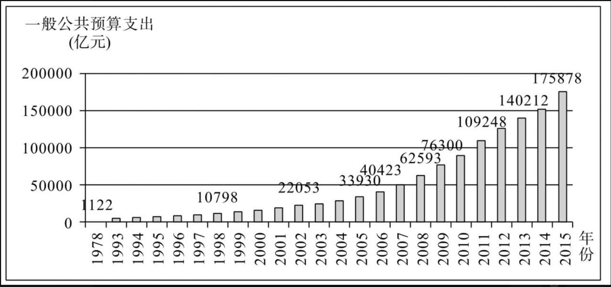
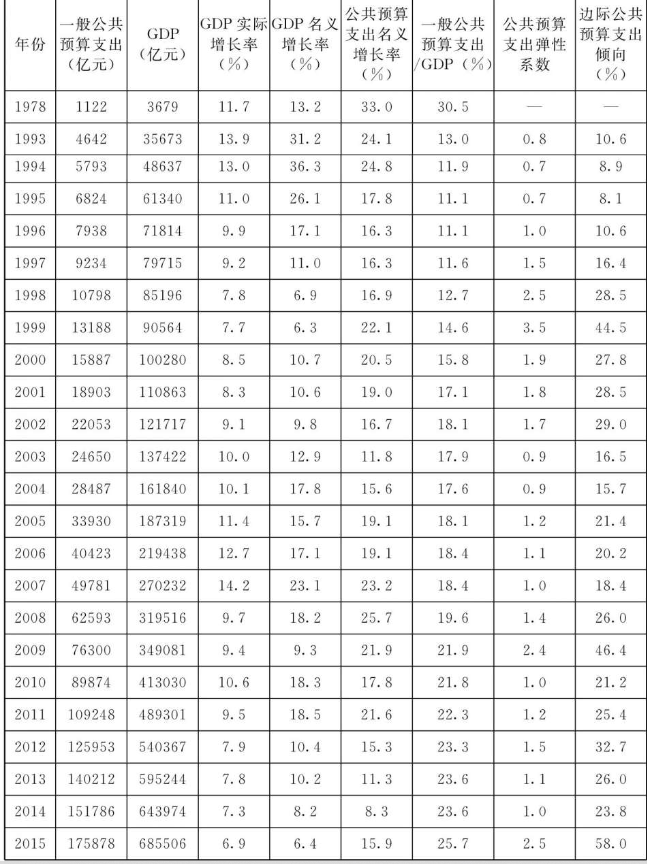
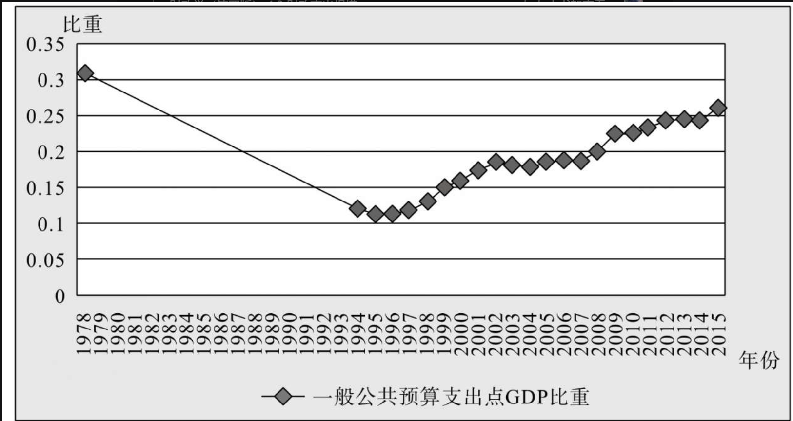
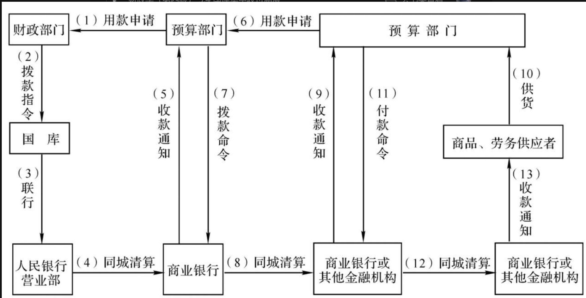
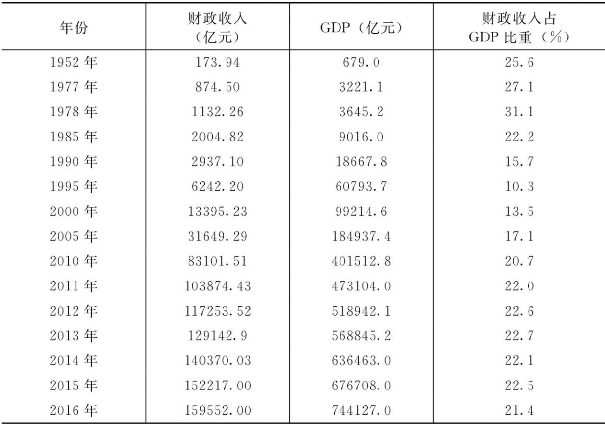

# 《财政学（第四版）》
                    杨明洪主编
## 导论

### 社会公共需要具有以下特征：
    1. **社会成员拥有的共同性**。社会公共需要不是私人个别需要的加总，而是必须由政府集中组织和执行社会职能以维持社会经济生活正常运转的需要，是社会公众的共同需要。
    2. **社会成员在需要得以满足时所得与付出的不对称性**。社会成员在满足社会公共需要时也要付出代价（如交税或付费），但每个社会成员的付出与其所得可能是不对称的，有人付费少甚至不用付费就可以使其需要得以满足。
    3. **满足需要的物质消耗性**。满足社会公共需要必须消耗一定的社会财富。满足公共需要的物质手段，只能来自社会产品的剩余部分，通过政府收税或收费形式获取资金用于支持国家机关和公共部门提供公共物品。

### 关于公共物品，需要注意以下几个问题
    1. 虽然每个人消费的公共物品数量相同，但这并不意味着人们的受益程度是完全相同的，也不是每个人对这种物品的消费评价都一致，不同的人对于某种公共物品的价值是正值还是负值的看法可能不尽相同。
    2. 公共物品的纯度取决于市场条件、技术状况和法律安排。
所以，最好把“公共性”看作一个“度”的问题。完全满足非竞争性和非排他性的物品是纯粹的公共物品，但随着市场条件和技术条件的变化，公共物品的纯度会发生改变。

事实上，公共物品的消费者无法准确说出自己对公共物品的需求价格，而且都想免费搭车享用公共物品。因此，公共物品的市场均衡是一个特殊问题，不可能通过市场上的个人决策方式来决定，必须寻求决定公共物品提供的特殊方式。

私人物品不一定只由私人部门提供，政府也可提供具有竞争性和排他性的物品，这类物品被称为公共提供的私人物品（publicly provided private goods），医疗服务和住房就是典型。我国基本医疗服务和保障性住房主要由政府提供，而其他形式的医疗服务和住房主要由私人部门提供。

决定公共生产还是私人生产，一个关键的因素是市场环境，另一个是与私人部门服务提供者签约的完备程度。如果私人部门的生产成本比公共部门的成本低、效率高，且能够签订比较完备的合同，那么让私人部门生产的理由会更充分些。

### 各国的实践来看，准公共物品的有效提供主要有如下几种方式：
A．政府授权经营。
B．政府参股
C．政府补助。
D．政府购买服务。

### 公共部门的活动范围
    （1）理性而现实的自由主义观点
    持有这种观点的人被称之为古典自由学派。他们的观点的前提是：市场是完善的，竞争是完全的，经济人是理性的。
    19世纪中叶，古典自由主义简单的政府职能论为近代自由主义的政府职能论所取代。最早提出该论点的是英国的穆勒，从不同角度提出自由市场缺陷，需要政府干预。
    一派被称为新古典自由主义派，以索罗、哈耶克、洛齐克等为代表。
    其主要观点是：最好的政府是根本不管的政府，政府管事的最大限度是实现个人自由，只有最弱意义上的政府才体现全部的正义。
    另一派被称为新自由主义派，以弗里德曼为代表。在这一点上，他与前面的学派有一致的看法：政府的主要职责是保护社会的自由，以防备外侵之敌与内部同胞内讧，维护市场秩序的安定等等；同时，他还主张绝对的自由放任是不存在的，市场还需要政府决定、调节和强制执行市场运行中的规则，由于有其他技术和类似原因很难由市场自由引导和操作的事情，应该通过政府做这些事。

    2）乐观而理想的干预主义观点
    市场经济有时会失灵，为了弥补市场失败方面，政府需要在效率、公平和稳定等方面承担职能，同时还要防止市场可能出现的失败。这派理论将政府视为是一种万能的、仁慈的机构，因而在纠正市场失灵方面会实现一种帕累托佳境。

    （3）怀疑而悲观的第三种政府职能论
    这种理论的基本前提是：市场和政府都不是完善而无缺陷的，二者都有失败，关键在于由于政府的特殊地位，政府对市场的干预应该是就市场永久失败的地方而非任何市场的失败都要去干预；同时提出，利用政府弥补市场缺陷，也利用市场克服政府失败。

### 公共支出的结构可以分为两大类：
    第一类是购买性支出，这部分支出是公共部门对经常性的商品和劳务的购买支出；
    第二类是转移性支出，这部分支出是指对于养老金、国债利息、失业救济金、价格补贴等的支出。

## 1.2 财政概念及财政学

1. 财政是政府凭借其政治权力和财产权力，通过集中一部分社会财富来满足社会公共需要的收支活动及其治理，以达到优化资源配置、公平分配、稳定和发展经济等目标。
    （1）财政是以国家为主体的经济活动或分配活动
    （2）财政是满足一定社会公共需要的经济活动
    （3）财政是国家凭借政权力量，强制支配一部分社会财富的经济活动
    （4）财政包括财政收支的治理，是国家治理的基础和重要支柱

## 1.3 市场失灵与政府失灵

1. 市场失灵主要表现在以下几个方面。
    （1）公共物品
    （2）外部效应
    （3）市场垄断
    （4）收入分配不公
    （5）经济波动

2.  政府失灵（government failure）是指政府在对经济、社会生活进行干预的过程中，无法使社会资源配置实现帕累托效率结果或不能以公平的方式再分配收入；或简单地说，政府做出了降低经济效率的决策或不能实施改善经济效率的政策。
政府干预失效的原因和表现可能发生在诸多方面。
    （1）政府决策失误
    （2）寻租行为
    （3）政府职能的越位和缺位

# 2．财政的职能
社会主义市场经济条件下的财政应具有资源配置、收入分配、经济稳定和发展三项职能。

1. 财政配置资源主要有以下手段：
    * 第一，根据社会主义市场经济条件下政府提供公共物品和服务的基本范围，确定财政收入和财政支出占GDP的合理比重。
    * 第二，优化财政支出结构，保证重点支出，压缩一般支出。财政应弱化微观方面的管理职能，积极打造服务型政府，按可持续、保基本原则安排好民生支出，重点向农业、教育、社会保障、公共卫生和就业等经济社会发展的薄弱环节倾斜；向困难地区和群体倾斜；向节能环保、科技创新和转变经济发展方式倾斜，通过完善基础设施和公共服务为市场经济发展营造良好环境。
    * 第三，作为资产所有者管理国有资产，实现国有资产保值、增值，提高国有资本配置和运营效率。国有资本的投资要加快向重要行业、关键领域、重点基础设施集中，向前瞻性战略性产业集中，向产业链关键环节和价值链高端集中，向具有核心竞争力的优势企业集中。政府通过规定价格或收益率来管制垄断，发挥国有资本为全社会提供公共物品、矫正外部效应、保护有效竞争以及在自然垄断行业提供高效、低价产品的优势作用。
    * 第四，合理安排政府投资的规模和结构，调整产业结构和促进地区协调发展。
    * 第五，政府通过税收、财政补贴等手段，引导社会资金流动，对产业结构、地区经济结构进行调控

2. 收入分配职能的涵义
目前我国居民拥有的劳动、资本、技术、管理等生产要素禀赋差异大是引起居民收入差距拉大的重要原因。

3. 财政分配收入的方式和手段
    * 第一，直接方式，即实行高额累进直接税和社会救济、社会保险、财政补贴等各种转移性支出，在高收入者与低收入者之间进行收入的再分配，以实现收入公平分配的目标。
    * 第二，间接方式，即政府可以通过提供公共产品和公共服务的方式进行收入再分配。

4. 财政实现收入分配职能的机制和手段主要有：
    * 第一，划清收入分配领域中市场分配与财政分配的界限和范围
    * 第二，深化企业和机关事业单位工资制度改革，在国民收入初次分配和再分配中都要兼顾效率和公平，包括实行最低工资保障制度、改革国有企业薪酬制度、完善适应机关事业单位特点的工资制度、实行企业工资集体协商制度等
    * 第三，加强税收调节
    * 第四，通过转移性支出，

5. 财政实现经济稳定与发展职能的机制与手段
    * 第一，通过“相机抉择”的财政政策，维持社会总供求平衡，实现充分就业、物价稳定和经济增长等宏观经济政策目标。
    * 第二，通过“自动稳定”机制，起到稳定经济的作用。
    * 第三，运用财政投资、财政补贴（特别是财政贴息）和税收等财政分配杠杆，加快交通运输、邮电通信、农业等公共设施的建设，落实创新驱动发展战略促进产业结构升级和优化，加大节能环保产业的发展以减少环境污染，通过多种方式实现国家产业政策的要求。
    * 第四，通过提供义务教育、公共卫生和基本医疗、社会保险、公共就业服务等基本公共服务项目，保证民生性的社会公共需要，为经济和社会发展提供和平、稳定的环境。

## 2.2 中央与地方政府的财政关系
从公共财政的角度看，地方财政存在的经济基础就在于公共产品提供上的政府间分工原则。换句话说，根据公共产品和公共服务的受益原则理论，虽然公共产品和公共服务是提供给所有公众使用的，但其中的一部分存在受益范围的限制，即一些公共产品和公共服务的享用受到区域的制约。这种受益范围的空间限制，要求财政结构由各级政府的财政所组成，从而有必要设立地方政府，实行分级财政体制。

现代财政的受益空间理论认为，公共产品的受益具有空间层次性，即各种公共产品的受益范围在空间上有所不同。某些公共产品的利益归宿可以遍布于全国，而某些公共产品的受益范围仅波及某个地区，这就涉及不同受益范围的公共产品应该由哪个政府来提供的问题。公共产品的受益范围或利益归宿既然具有上述不同的空间属性，那么根据政府部门的配置理论就可以知道，公共产品的公共提供应该以该产品的利益归宿范围内的居民偏好为依据，而且为了保证人们对公共产品偏好的显示需要有一个政治程序。在这种情况下，某个公共产品的提供应该由其利益归宿范围内的居民来表决并支付其费用。换言之，受益范围是全国性的公共产品，应由中央政府来提供；受益范围是地方性的，则应按其受益范围的大小来确定应主要由哪一级地方政府来提供。

1.财政分权理论
现代财政体制多为分级财政体制，中央与地方政府分别享有一定的税收权力和支出责任，与此相对应的是中央政府与地方政府经济职能边界的划分

    * 乔治·施蒂格勒最优分权论
        从公众需要与更好发挥政府职能的角度对地方政府分权的必要性作了解释。他认为，一国国内不同地区的居民有权对自己需要的公共物品的种类和数量进行选择；就公共产品而言，消费者的意愿一般具有明显的地域性，而地方政府更了解管辖范围内的公民的效用与需求，恰好能敏感地顺应其需求。因此，事关满足居民公共需要的决策，应当在最低行政层次的政府部门进行，以利于实现资源配置的有效性和分配的公平性。所以，不同种类与不同数量的服务要求由不同级次、不同区域的政府来提供。

    * 蒂伯特的“用脚投票”理论
    解决了财政分权理论的两个难题：一是在公共产品的供给问题上是否存在“市场均衡解”的难题；二是人们是否会自愿聚集在一个地方政府的周围，要求这个政府为居民提供最大福利。蒂伯特在人口流动不受限制、存在大量辖区政府、辖区间无利益外溢、信息完备等假设条件下，论证了地方政府提供公共产品存在最优的市场均衡解。由于各辖区政府提供的公共产品和税负组合不尽相同，所以各地居民可以根据各地方政府提供的公共产品和税负的组合，来自由选择那些最能满足自己偏好的地方定居。居民们可以从不能满足其偏好的地区迁出，而迁入可以满足其偏好的地区。蒂伯特模型充分说明了政府层级对公共产品供给具有显著影响，由地方政府分散提供公共产品不仅可行而且有效，因为“用脚投票”的结果是具有相同偏好的居民聚集到了同一辖区内，地方政府提供公共服务的成本也最小化，实现了公共资源的最优配置。

    * 马斯格雷夫的最佳配置职能分权论
    他认为，政府的基本经济职能是资源配置、收入分配和经济稳定三个方面，但从中央到地方，各级政府财政在实施其职能时的侧重点和范围是不同的，因而在中央政府和地方政府间进行职能的划分是必要的。他指出，在市场经济体制下，地方政府往往缺乏充足的财力和经济主体的流动性，因而收入分配和经济稳定职能主要由中央政府来承担。而资源配置应根据各地居民的偏好不同而有所差别，主要由地方政府来承担该项职能，即地方政府主要提供地方性公共产品或公共服务，更有利于经济效率的提高和社会福利水平的改进。

    * 特里西的“偏好误识”分权论
    特里西是从信息传递存在着距离阻隔，从而使中央政府在了解公众的边际消费替代率时带有随机倾向，即带有偏好误识这个方面提出了地方自治的必要性。他通过模型证明，如果社会能够获得完全信息，并且经济活动也是完全确定的，那么，是由中央政府还是由地方政府来向公众提供公共产品都是无差异的。然而，现实中的社会经济活动信息并非完全确定，在多级政府的情况下，中央政府在提供公共产品的过程中，不是提供过多，就是数量不足。而地方政府显然要比中央政府更具信息优势，更了解本地区居民的需求偏好。因此，回避风险的社会就会偏向于让地方政府来提供公共产品，由此也决定了地方自治和财政分权的必要性。

2. 中央与地方政府间财政职能的分工

    * 资源配置职能的分工
    中央政府与地方政府之间对资源配置职能的分工，是根据公共产品的受益范围来进行的。这是因为按受益范围来确定公共产品的资源配置，可以做到公共产品效益内在化，效益与成本对应化。谁承担了公共产品的费用和成本，谁就享有这些公共产品的效益。
    凡属地方性需要的行政性、公益性和建设性物品（服务）的提供，根据效率原则，应由地方政府来提供。这是因为：一方面地方政府比较了解也容易反映本地区消费者的偏好；另一方面，在假定地方需要此类物品（服务）的生产成本是由该地区居民缴纳的地方税来承担，且居民有流动性居住权利时，会形成符合市场效率的此类地方性物品（服务）的规模经济。
    属全国性需要的行政性、公益性、建设性物品（服务），应由中央政府来提供。这是因为：首先，有些纯粹的全国性需要的物品（服务）必须由中央政府来提供，如国防；其次，有些虽属地方性需要的物品（服务），但其受益面是跨地区的，如各地区边界地带的道路。为了避免各个地方政府的搭便车行为，需要上级政府来协调，包括上级政府对下级政府、中央政府对地方政府进行资源配置时予以协调。

    * 收入分配职能的分工
    中央财政可以通过两条途径促进收入分配趋于社会公正：其一，通过全国统一的个人累进所得税和相应的转移支付政策，缩小贫富差距；其二，通过地区间的收入再分配，改善区域之间的收入差距，即中央政府通过财政管理体制进行地区间的转移支付。
    地方财政除了可以通过地方性税收和转移支付来实现区域性收入再分配、调节本地区内部收入差异、吸引资本和人才流动外，还可以发展捐赠和地方财政信用等其他分配方式，作为对税收、收费、支出等强制性分配的补充。应注意的是，地方政府运用上述手段的力度不宜过大，否则有可能导致全国性资源配置的扭曲，如人才外流、资本转移等。

    * 经济稳定与发展职能的分工
        * 第一，从经济稳定看，经济稳定所要求的总供给与总需求均衡，是相对于整个国民经济而言的，并非某一个区域能够实现。

        * 第二，从经济发展看，经济发展所要求的增加积累和投资，尽管离不开地方各级政府的共同努力，但主导投资与消费比例的仍然是中央政府。调节经济发展速度离不开财政政策和货币政策及两大政策的配合运用。作为地方政府，由于不具备运用货币政策的条件，因而地方政府在促进整个国民经济增长方面的作用也是有限的。

3. 规范中央与地方政府的财政关系

    * 第一，良好的财政关系中必须同时保留一部分中央集权和地方分权，实行多层次分级管理，不同级次的政府机构应被赋予相应不同的财权，使职权划分和资源分配保持良好的对应关系。

    * 第二，不同层次的政府，其财政职能应各有不同的分工和侧重。
    中央财政应侧重于对经济进行宏观调控和进行国民收入再分配，同时保证全国性公共产品的提供；而地方财政则应侧重于进行资源配置，并负担地方性公共产品的提供。

    * 第三，中央财政和地方财政职权的划分与行使，应能保证全体公民都获得最低限度的公共产品，包括公共安全、卫生、教育和福利等。

    * 第四，中央与地方间财政职权的划分和行使，应该有利于经济效益的增进，促进社会福利最大化的形成。具体地说，中央负责保证社会秩序的稳定和国家的安全，保证全国市场的统一，负责跨地区的全国性基础设施建设．承担调整地区之间和产业之间重大经济结构等任务；地方负责与本地区社会经济发展直接有关的事宜，主要是：地区性基础设施建设和环境治理，科技、文教、卫生等社会服务，地区性的社会保障，以及促进商业、金融、信息等第三产业的发展和改善投资环境等。

## 2.3 政府与国有企业的财政关系

我国国有企业被定位为弥补市场缺陷、维护公有制主体地位和体现国民经济主导作用。

* （1）弥补市场缺陷

* （2）维护公有制主体地位

* （3）体现国民经济主导作用

### 2.3.1 政府对国有企业的多重身份
政府与国有企业的关系涉及3个基本概念：租金、税费和利润。这三个概念对应着国家的三重身份：资源所有者、公共管理者和国有资产出资人

尽管我们在理论上可以区分开租金、税费和利润，但三者在实践中则很容易混淆，并产生诸多问题。因为，租金常以税、费的形式来征收，如资源税、城镇土地使用税、耕地占用税、矿产开采费等，很容易与政府为提供公共服务而强制征收的税费混淆。

国家主要是以双重身份参与国有企业收入分配的：政府凭借政治权力强制无偿地征收税收和一些非税收入，凭借对国有资产的所有权从国有资产经营收入中获得经济利益。因此，国有企业主要向国家缴纳税收、非税收入和国有资产经营收益。

税收的征收在我国主要有两个渠道。国税局征收的主要是维护国家权益、实施宏观调控所必需的税种（消费税、关税），以及关乎国计民生的主要税种的部分税收（增值税）；地税局则主要负责适合地方征管的税种，以增加地方财政收入。

### 2.3.2 政府与国有企业分配关系演变的历史

政府与国有企业的分配关系经历了统收统支、放权让利、利润留存和分类上缴4个阶段。

1. 1949-1978统收统支
中华人民共和国成立后至1978年以前，政府和国有企业利润分配关系基本上实行统收统支。国有企业利润几乎全额上交给财政，企业没有自主财力。国有企业利润几乎构成国家的唯一收入来源，国家不征收所得税。这种分配关系严重影响了国有企业和职工的积极性，制约了经济的发展。

2. 1978-1992让权放利
1979年，国务院颁布《关于国营企业实行利润留成的规定》，其主要改革内容为“放权让利”和“承包制”。此后，国务院先后在全国各地实行了放权让利试点工作。1984年10月，党的十二届三中全会作出关于经济体制改革的决定，国有企业改革转向实行“两权分离”，即国家的所有权与企业的经营权分离；将国有企业原来上交的利润改为所得税，并明确了承包经营责任制的内容和形式。在全国范围内对国有企业实行两步利改税后，1988年开始税利分流改革试点。在放权让利阶段，中国国有企业改革被赋予了更多的自主权，利改税在一定程度上增强了员工和国有企业的积极性。企业所有权和企业经营权的分离、国有企业经济责任制，使得国家、企业、职工三者的权责利关系得以明确并有机结合起来。然而，“放权让利”的改革措施并没有改变旧体制的基本格局，企业不是独立的经济实体，政府在国有企业亏损时依旧追加投资，一些赋予企业的权利也没有落实。承包制赋予了企业经营者更多自主权，调动了他们的积极性，但是也造成了一些不良后果。

3. 1992-2007利润留存
1992年党的十四大明确把“转换国有企业特别是大中型企业的经营机制作为建立社会主义市场经济体制的中心环节”。同时，国有大中型企业被明确界定为国家财政收入的重要来源和基本保证。党的十四届三中全会（1993年）对国有企业不再强调“放权让利”，而是将建立“产权清晰、权责明确、政企分开、管理科学”的现代企业制度作为国有企业改革的目标。1994年税制改革后，国有企业统一按国家规定的33%税率交纳所得税，取消各种包税的做法。但在当时，国有企业固定资产投资由拨款改为向银行贷款，还本付息由企业负担，大批国企生存困难，面临破产和脱困，国企分红便无从说起；即或有税后利润，也全部留归企业支配。进入21世纪后，一些国企，尤其是国资委直接监管的中央级特大型企业的利润增长非常快，国企盈利能力大幅提升后一直还延续只向财政上缴税收而没有向国家分红的格局。国企继续不履行上缴“红利”的责任带来了一定的负面影响，国企投资变得频繁而又难以监管。2006年，159家国资委监管的中央企业利润为7546亿元，相当于当年财政收入的1/5，社会各界对这种分配格局进行了强烈的质疑。让国有企业向国家分红的理由是充分的：首先，国有企业资产属于国家所有，国务院和地方人民政府分别代表国家履行出资人职责，有权像其他股东或投资者一样获得资产的所有者权益。其次，国家承担了企业重组的大部分成本帮助国企走出低谷，之前利润留存的经济背景发生改变，国有企业将利润回馈国家和社会也理所应当。再次，国企向政府分配利润能够提高企业留利资金效率。最后，让国有企业分红将是改变消费和投资之间的比例关系，提高消费最有效的方式之一。

4. 分类上缴阶段2007-至今
2007年9月，国务院发布《国务院关于试行国有资本经营预算的意见》，要求收取中央企业国有资本收益并进行国有资本经营预算管理。所谓国有资本经营预算，是国家以所有者身份依法取得国有资本收益，并对所得收益进行分配而发生的各项收支预算。国有资本经营预算制度结束了国企、央企“利润独享”的历史。同年12月，财政部会同国资委发布了《中央企业国有资本收益收取管理办法》，明确国有资本收益收取对象为中央管理的一级企业，应交净利润的比例区别不同行业分3类执行。与此同时，在肯定国家对央企重新征收红利政策的同时，关于红利上缴比例的质疑开始蔓延开来，因为最高征收比例为10%，远小于发达国家国企50%的上缴比例。经过连续几年的调整，国有资本收益收取比例已有所提高。截至2015年，国有资本经营预算已经覆盖了绝大部分央企，纳入资本经营预算编制范围的央企资产总额占全部央企的98.7%。

### 2.3.4 进一步规范政府与国有企业的分配关系
政府与国有企业的利润分配关系变革的重点是适当提高国有企业利润上缴比例和扩大国有企业分红资金的用途范围。国家应强调国有资产收益“全民有”，应该将收取的“红利”纳入公共财政，突出解决社保覆盖不全、公共服务不到位等公共事业薄弱环节，让国有企业利润和国家资源收益更好地为人民谋福利。

    * 1. 适当提高国有企业利润上缴比例

    * 2. 扩大国有企业分红资金使用范围
    总之，国有企业上交的利润应在社会保障和提供基本公共服务方面做出更大的贡献。

    * 3. 完善国有资产管理体制
    将国有企业分为商业类和公益类，其中，主业处于充分竞争行业的商业国有企业，原则上要实行公司股份制改革，引入国有资本和非国有资本，绝对控股、相对控股，也可以参股，着力推进整体上市；主业处于关系国家安全、国民经济命脉的重要行业、主要承担重大专项任务的商业类国有企业，要保持国有资本控股地位，支持非国有资本参股；此外，公益类国有企业则可以国有独资，也可推行投资主体多元化，还可以通过购买服务、特许经营、委托代理等方式，鼓励非国有企业参与经营。
    由于直接管理企业的方式已经不适应国有企业组织形式的深刻变革，必须按照公司治理规则，以管资本为主明确国有资产监管机构职责的定位。
    下一步国企改革的重要方面，就是将原本的国有资产管理架构由目前的两级变为国资监管机构、国有资本投资运营公司和经营性国企三级，真正逐步实现政企分开，将政府和企业剥离开来，以产权管理为纽带，突出国有资本运作，最终实现国资委从“管资产”向“管资本”转变。

# 3．西方财政理论
## 3.1.2  古典学派的财政思想
斯密经济思想的根本点是反对国家干预经济生活，主张自由放任。他认为私人的、自由的经济制度，在市场自发调节下，能保持理想的秩序，每个人在追求最大私利的同时，社会利益也能得以最大限度地实现。相应的，亚当·斯密的财政理论是与这一经济思想一致的，它分别对国家职能、财政收入、税收原则、公债、财政支出等提出了自己的观点。

* 关于国家职能问题，斯密认为，国家的活动属于非生产性劳动，不创造物质财富。在社会资源有限的情况下，国家过多地参与经济活动是一种资源浪费。国家财政特别是国家支出，对经济增长会产生负面影响，所以应尽量压缩政府的规模，国家应把其职能仅仅放在保护国家安全、维护社会治安、抵御外来侵略、建设并维持某些公共事业等一些对社会来说有益而又不可缺少的活动中，充当“守夜人”的作用而已。也就是说，国家的作用只表现在构建安全、有秩序的社会经济生活环境上，而对经济运行本身国家则不应有丝毫干涉，廉价的政府是最好的政府。

* 关于财政收入问题，亚当·斯密提出了以受益者负担为中心的收入理论，即按享受国家经费开支利益的大小和方向来筹集经费。如果政府开支是向全体人民提供服务，那么这部分开支应由享受利益的人来负担。国家财政收入的来源有国有企业收入、国有财产收入和公债收入

* 关于税收问题，斯密最重要的贡献是提出了“平等、确定、便利、最少征收费”的赋税原则。所谓平等，是指一国国民都须在可能范围内，按照各自能力的比例缴纳赋税；所谓确定，是指国民应当交纳的赋税必须是确定的，不得随意变更；所谓便利，是指各种赋税交纳日期及交纳的方法须予纳税者以最大便利；所谓最少征收费，是指一切赋税的征收须设法使人民付出的尽可能等于国家所收入的。基于这些原则以及国家活动属于非生产性劳动的观点，亚当·斯密认为国家征收过重的赋税会阻碍社会生产的发展，而减轻赋税可以提高社会生产能力，增加社会财富。

* 关于公债问题，斯密提出了著名的公债有害论，即不主张发行公债。他认为公债的根源在于君主的奢侈浪费；一国在平时没有节约，到战时就只好迫而借债。同时按照斯密对生产性劳动和非生产性劳动的划分，公债的发行实际上是将生产性费用转入了非生产性费用，把私人的投资转换为公共消费，因而削弱了资本积累能力。在公债积累过多、国家无力还债时，政府就会提高货币的名义价值，造成通货膨胀。因此，公债不仅使政府吸收的产业资本充当非生产性支出，而且给人民大众造成了极大的负担

* 在总体上，斯密极力主张对国家财政经费支出应加以限制。

* 大卫·李嘉图继承和发展了亚当·斯密的财政思想。在1817年出版的《政治经济学和赋税原理》一书中，他同意斯密关于国家职能、公债、财政收支方面的观点，同时又提出了自己的赋税理论和财政补贴理论。他的**税收转嫁**与**归宿理论**在整个理论体系中占有重要的地位。
李嘉图的赋税理论主要体现在赋税总论和赋税各论两个方面。在赋税总论方面，他认为赋税是“一个国家的土地和劳动的产品中由政府支配的部分，它最后总是由该国的资本中或是由该国的收入中支付的”，也就是说，任何形式的赋税都来源于利润、地租或其他形式的收入，都会减少资本积累。因此，为了减轻对生产的破坏，他主张尽量减少对最终由资本来承担的赋税的征收，认为最好的财政计划是节约的财政计划，最好的赋税是负担最轻的赋税

### 3.1.3 历史学派的财政思想
历史学派是19世纪40年代在德国占统治地位的一个经济学流派。其基本的经济理论是：反对古典经济学的自由主义，主张实行社会改良主义；宣传国家有机体学说；强调国家活动的生产性，主张扩大财政职能和财政收支；主张国家干预国民经济。
瓦格纳的财政理论是建立在他的国家职能理论和社会政策思想基础上的。瓦格纳认为，国家是历史的产物，国家的职能应与历史发展的阶段相适应。亚当·斯密以后的时代是推行社会改良和社会政策的阶段，因此，国家的职能应该不断扩大。国家的职能不仅有维持国内的法律秩序和防御外敌的任务，而且还要为社会的经济、文化、福利的发展服务，并且这些目的超越于私人经济目的之上，在一定限度内对私人经济活动进行限制，使之服从于国家目的。在具体做法上，瓦格纳主张扩大国有财产，实行铁路、保险、银行的国有化，施行新的特权及烟草专卖，坚持贯彻煤气、水道、交通等公共设施的公有化。这实际上是主张国有经济的思想。

* 在具体的财政理论方面，瓦格纳首先提出了财政支出膨胀法则。他主张，随着人类社会的发展，国家职能不断扩大，财政支出不断增长，并与经济增长存在一种函数关系，这是固定规律。按照这一法则，只要是对社会经济、文化、福利的发展有益，即使财政支出大于财政收入而出现短暂的赤字也无关紧要。对于公债，瓦格纳认为，只要使用得当，它所带来的国民财产的增加和公共事业的发展，能使国家在将来得到更多的财政收入，在一定限度内是有益的，可以允许发行。

* 在财政收入方面，他提出了“社会政策的赋税”的观点。他认为赋税不应仅仅以满足财政需要为目的，还应当增加社会政策的目的，即赋税应包括纠正分配不公平的积极目的，应通过赋税施加权力对所得和财产分配进行干预和调整。据此，瓦格纳主张在所得税中采用累进税制，对奢侈品、财产等课以重税。

* 以社会政策的赋税理论为基础，瓦格纳还建立了自己的赋税原则：
    * 第一，财政政策原则。要保证税收的充足性，税收量要随经济的增长和财政需要的增加而增加。
    * 第二，国民经济原则。正确选择税源、税种，考虑赋税转嫁和对国民经济影响等问题。
    * 第三，社会公平原则。税收负担应普遍和平等地分配给各个阶级、阶层的纳税人。该项原则包含普遍原则和平等原则。
    * 第四，税务行政原则。课税明确化、课税便利化和最少课税费用。

### 3.1.4 新古典学派财政思想
庇古是新古典经济学派的代表人物，也是福利经济学的创始人。他于1902年出版的《福利经济学》一书创建了福利经济学的完整体系。他主张国家干预经济生活，重视财政在资源配置和收入分配方面的作用。庇古以边际效用价值为基础，从资源配置的合理要求着手，证明了政府在外溢性领域对私人经济干预的必要性和合理性。他运用外部效应这一概念作为区分社会净产品和私人净产品的关键。当参与产品交易的参与者之外的其他人得到好处时，社会净产品就会大于私人净产品。而当市场参与者之外的其他人承担了成本，而这种成本不需要在交易过程中补偿，因而不显示在价格中时，社会净产品就小于私人净产品。当边际社会收益大于边际私人收益时就需要用补贴的方式来使未能在价格中体现的那部分外部效益得以实现。当边际社会成本大于边际私人成本时就需要征税，使得税收成为生产者成本的一个组成部分，从而成为企业的内部成本。这种使外部成本内在化的税收被称之为庇古税（Pigouvian Tax）。这样，政府的财政收支手段就成为调节外部效应的机制了。

* 在收入分配问题上，庇古认为，财政必须具有分配功能。分配如果能够增加国民收入而不损害穷人的绝对份额，或增加穷人的绝对份额而不影响国民收入的总量，都会增进经济福利。因此，减轻收入不均的程度，是使社会经济福利或效用总量极大化的必要条件。

* 关于社会总福利的平衡，庇古提出两大命题：一是国民收入总量越大，社会的经济福利就越大；二是国民收入在个人间的分配越是均等，社会的经济福利就越大。国家可以通过合理的财政活动调整经济运行，以增加国民收入和尽可能均等地分配国民收入，以促进社会经济福利的最大化。

* 关于财政收入，庇古提出了税收最小牺牲原则，即使所有纳税的社会成员边际牺牲均等的原则，主张对边际私人纯产值大于社会纯产值的部门课以重税，对边际私人纯产值小于社会纯产值的部门实行低税或免税，以使资源的配置合乎社会利益的需要，对所得税实行累进税制，对穷人实施低税或减免政策，从而达到收入的均等化，增加社会福利。相应的，对于财政支出，庇古也从福利经济目的出发，主张对某些社会有益的产业予以补贴，增加用于失业人员、贫困家庭补助的社会性福利支出，缩小收入分配差距，以及利用财政支出的变化，促进资源优化配置和充分就业等。

* 庇古还运用边际效用价值去考察支出的效率。他指出，在既定的预算规模之下，财政预算应被调整到各支出项目的边际效用相等时为止；而在既定的预算总规模之下，应以各项公共支出的边际效用与各项私人支出的边际效用相等为标准。只有当财政支出的边际效用与课税的边际负效用相等时，财政支出和收入才达到最佳的总额状态。这里，庇古实际上已提出了公、私两部门资源配置和财政内部资源配置的效率问题。

* 庇古提出以公平和效率两大准则作为社会经济福利这一总目标的评价准则。当政府进行课税时，亦应以这两项准则作为价值判断的标准。公平准则应当是税收课征的首要准则，他把公平原则区分为横向公平和纵向公平。所谓横向公平，即对经济情况相同的人应该课以相同的税收。横向公平主要涉及税基的问题。所谓纵向公平，即对经济情况不同的人课以不同的税收，主要涉及税率结构的问题。通过收入的再分配，最好能缩小贫富差距，从而达到收入均等化的目标。

* 庇古还深入探讨了税收效率问题。他讨论了埃奇沃斯的牺牲法则，同意将最小牺牲作为税收的绝对原则，认为征税含有“宣布效应”，并对此作了明确的分析。所谓“宣布效应”，就是政府在开征一种新的税种或改变一项税收政策（如提高某一税种的税率）时，纳税人会感到他所面临的选择发生了变化，因此会调整他的经济决策行为。这就产生了税收的宣布负担，庇古将其称为消费者剩余和生产者剩余的损失。庇古认为，要实现税收效率就应该采用支出税，当然可以对一些支出项目予以扣除。庇古将效率问题放在税收理论的中心位置的做法为当代最优税制的研究添砖加瓦。

## 3.2 现代西方财政理论的发展

在实践中，1933年罗斯福就任美国总统，开始了著名的“罗斯福新政”，其主要内容有：加强对银行、信用、货币的控制和对工农业生产的干预，大规模建立社会福利体系；
在理论上，1936年凯恩斯出版了他的巨著《就业、利息和货币通论》，提出了完全与古典经济理论不同的观点，提出了国家干预经济生活的基础理论依据，很快引起西方经济学界的轰动。随着凯恩斯主义经济学的兴起，财政理论也发生了重大的变革。
具体来讲，凯恩斯主义财政理论与古典财政理论针锋相对，他提出了以下主要观点：**由于有效需求不足，自由市场经济不能保持总供给与总需求的平衡，常常导致经济萧条和失业，因此国家必须出面来刺激需求，干预经济；在财政活动中，政府无需控制财政收支规模和避免对私有经济的干预，同时也无需刻意追求财政的收支平衡，一切以国民经济稳定发展、价格平稳、充分就业为目标。**
与古典财政理论相比，凯恩斯主义已经完全突破了“纯财政”的基本框架，把财政理论研究的出发点放在与经济运行的关系上，认为财政活动应围绕充分就业和经济增长这一中心来进行，财政的规模和平衡只要不对整个经济产生负的影响，就不再是重要的问题；
并且更进一步，在凯恩斯主义的理论中，财政活动直接参与经济运行，构成了国民经济中不可缺少的一部分。从古典财政理论到凯恩斯主义财政理论，是从纯财政理论到功能财政理论的根本转变。

### 3.2.2 凯恩斯主义财政政策

* 凯恩斯严厉批判了萨伊定理以及新古典主义提出的资本主义经济可以通过自由竞争而自动保持均衡的理论。在他看来，经济危机的原因在于有效需求不足。因此，国家必须出面来刺激需求、干预经济。在财政活动中，政府无需控制财政收支规模和避免对私有经济的干预，同时也无需刻意追求财政的收支平衡，一切以国民经济稳定发展、价格平稳、充分就业为目标。

* 凯恩斯认为，通过财政收入、支出、赤字预算政策来调节社会总需求，实现经济的稳定是主要的方法。仅仅依赖银行政策对利率之影响，似乎还不足以达到最适度的投资量

* 凯恩斯十分强调政府财政支出手段的作用。在凯恩斯看来，要实现充分就业的目标，政府必须提高有效需求。从个人的消费需求函数看，消费倾向是一个比较稳定的函数。尽管政府也可以采取措施提高民间消费倾向，但到底能取得多大的效果令人怀疑。因此，用公共投资政策来提高有效需求，引诱民间投资，就能够给就业水平带来显著的变化。凯恩斯极力主张国家多负起直接投资的责任，设法增加并补充投资引诱。为此，如果税收不足，应发行公债来筹集财源。

* 凯恩斯认为，公债对于一国的经济是有益的，它有利于刺激经济增长，有利于刺激经济复苏，有利于扩大就业，并可以为经济的发展提供有益的外部环境。凯恩斯的公债理论是与其扩大政府支出、提高有效需求的政策主张联系在一起的。公债是解决有效需求不足的一个良策，政府可以通过举债来弥补财政赤字，保证政府用于增加社会消费和投资的资金需求。凯恩斯还指出，即使政府预算收支平衡，只要经济尚未达到充分就业，政府仍然可以发行公债，以举办公共工程。这样做的好处就是可以直接扩大就业量，以政府投资带动私人投资，从而充分利用闲置的劳动力和资本，促进经济繁荣。当然，在实现充分就业以后，就应注意举债的负面效应。

* 推行上述财政政策，必然会带来一个问题，就是破坏财政收支的平衡，导致赤字。对此，凯恩斯主义者也在理论上作了解释。他们认为，不能用财政预算收支平衡的观点来对待预算赤字和预算结余，而应从反经济周期的目的出发来利用预算赤字或结余。根据这一出发点，20世纪五六十年代凯恩斯主义提出了周期预算的概念。所谓周期预算，就是不要求财政收支在每一年度都实现平衡，只要求在一个经济周期中实现平衡就可以。

### 3.2.3 新古典综合学派的财政理论
新古典综合学派的代表人物是美国经济学家萨缪尔森、托宾、索洛等。所谓“新古典综合”，其涵义是将马歇尔的新古典学派的微观经济分析与凯恩斯的宏观分析综合起来，以弥补微观经济学和宏观经济学的巨大裂缝，从而形成一个更为完整的经济学理论体系。

* 新古典综合学派秉承了凯恩斯主义的国家干预论，认为政府应该通过财政政策和货币政策，加强对经济生活的干预，以保证私人经济得到充分的发展。他们认为，从20世纪开始，由于生产手段社会化和消费社会化的倾向日趋明显，国家对经济的影响也日益显著，因而公私混合的经济制度有可能取代自由资本主义制度。在萨缪尔森看来，政府对外防御敌国入侵、对内维持社会治安是当然的职能。此外，政府还具有经济方面的职能，即效率、平等和稳定。他说：“市场机制在许多领域决定价格和产量，而政府却通过税收、支出方案和规章制度来调节市场。市场和政府这两个部分都是必不可缺的。没有政府和没有市场的经济都是一个巴掌拍不响的经济。

* 在财政支出理论方面，新古典综合学派并不完全赞同凯恩斯的财政支出理论，他们认为政府直接投资于公共工程项目往往需花费较长的时间，因而会错过时机，不仅不能起到经济稳定器的作用，反而会成为经济周期的扩大器。所以，他们主张政府的公共投资必须根据经济的实际情况进行较长时期的规划，而不是一种权宜之计。他们还批判了赤字会挤出投资的观点，反对平衡预算，推行赤字预算。

* 新古典综合学派同意庇古关于税收的观点，即征税体现了政府将部分经济资源——社会产品和劳务——从私人手中转移到了政府手中。他们将征税原则归纳为两个：一是利益原则；二是牺牲原则。所谓利益原则，就是认为人们应当根据他们从政府活动中期望得到的收益的大小来纳税；所谓牺牲原则，就是赋税的安排应该使社会的收入再分配是公平合理的。

* 新古典综合学派认为，税收的宏观调节作用表现在两个方面：一是税收的自动稳定器功能；二是有意识地调节税率，实行相机抉择的财政政策。

* 新古典综合学派继承和发展了凯恩斯的理论，主张不仅在经济衰退时推行赤字财政，在经济上升时期也推行赤字财政。萨缪尔森认为，公债是国家贯彻执行补偿性财政政策以稳定经济的有力武器。当政府募集公债用于投资时，它还是有可能造成负担的。

### 3.2.4 供给学派

* 拉弗曲线说明了税率与税收收入和经济增长之间有着紧密关系：
    * 第一，高税率不一定会取得高税收收入，高税收也不一定需要高税率。因为高税率会挫伤生产积极性，削弱经济主体的活力，导致经济的停滞或下降，高税率还往往带来过多的减免和优惠
    * 第二，取得同样多的税收收入可以采用两种不同的税率，政府应选择没有落在禁税区的低档税率。低税负刺激了劳动者的劳动意愿、储蓄意愿和投资意愿，有利于促进经济增长。
    * 第三，税率和税收收入及经济增长之间的最优结合在实践中少见，但在理论上证明是可能的。

* 低税率促进经济增长主要通过两种机制：
    * 一是较低的宏观税率可以导致较高的要素收益率，而较高的收益率会刺激这些生产要素的供给，从而提高总产出水平；
    * 二是低税率国家的各种税收刺激，使资源从低生产率部门或经济活动转向高生产率部门或经济活动，从而提高了资源使用的整体效率。这意味着，减税不仅是某个国家的孤立行为，更是在竞争力量倒逼下相关政策联动的结果。高税负的国家可能在竞争中处于不利地位。

* 基于以上命题，供给学派提出了以下政策主张：
    * 其一，在财政收入方面，主张减税。
    供给学派主张减税不同于上面所提到的凯恩斯主义根据不同经济风向交替使用增税、减税手段的那种暂时的减税，而是大规模的、持久的减税，而且前者主张降低个人所得税的边际税率，后者主张降低个人所得税的平均税率。

    * 其二，在财政支出方面，主张削减政府支出，尤其是社会福利支出，加强私人领域的活动。

### 3.2.5 新政治经济学的财政理论
基本观点是：市场经济是完善的，政府对经济的干预是有害的，应倡导实行竞争性的自由市场经济。“新政治经济学”将经济人行为的假设引入到非市场制度下的经济分析中，对市场和政府作为配置社会经济资源制度的相对优势和弱势都有新的看法、理解。

* 作为公共选择学派的代表人物，布坎南批判了凯恩斯的宏观财政理论，认为其失败的原因在于忽视对政府和政府制度的研究，用一种一时奏效的政策去取代长期存在的经济规则。他虽然赞同有时政府可采用赤字财政政策，但坚决反对中央政府用举债来弥补赤字。布坎南比较了税收和公债这两种政府筹资手段，指出公债将负担转移到了未来，加重了后代纳税人的负担，使现时的政府规模不断扩大。对政府发行公债来弥补财政赤字，布坎南持反对态度。哈耶克是著名的自由主义者，他坚决反对凯恩斯学派的主张。在他看来，应充分尊重消费者主权，充分信任市场机制的自我调节功能，政府用财政政策等手段来配置资源只能降低经济效率，使经济陷于不稳定之中。他还特别反对凯恩斯提出的扩大政府支出、用通货膨胀来医治失业的主张，他认为这种方法不仅无效，而且还给经济带来很大的负面影响。

* 公共选择学派研究了政府的公共经济决策是如何产生的、会导致怎样的经济结果。他们研究了不同类型的几种政府决策机制：直接民主决策机制、集中决策机制、间接民主决策机制

## 4.2 财政支出分类
### 4.2.1 按是否按商品和服务交换为标准的分类
按财政支出项目是否与商品和服务相交换为标准，可以将财政支出分为政府购买性支出和政府转移性支出。
在财政支出规模一定的前提下，政府购买性支出所占比重大一些，就说明政府的财政活动对社会生产和就业有着重大的直接影响，政府财政配置的资源份额就大一些；反之，如果政府转移性支出所占的比重大一些，就说明政府的财政活动对收入分配有着更大的直接影响，通过财政支出所实现的收入分配份额就大一些

### 4.2.2 按财政支出产生收益的时间分类
根据财政支出所产生收益的时间可将财政支出分为经常性支出、资本性支出和净贷款三大类，划分的主要原则是使公共物品的受益与公共物品的付费在时间上保持一致

    * 经常性支出是指维持公共部门正常运转或者保障人们基本生活所必需的支出，主要包括纳入政府预算的工资福利支出、商品和服务支出、对个人和家庭的补助等。这种支出的特点是，它的消耗会使社会直接受益或当期受益，如公务员的工资、差旅费、修缮费等，这些费用的消耗就会形成当期服务的公共物品。经常性支出直接构成当期公共物品的成本。按照公平原则，当期公共物品的受益应与本期公共物品的成本相对应，经常性支出的补偿方式应为税收。

    * 资本性支出是用于购买或生产使用年限在1年以上的耐久品所需的支出，其中有用于修建铁路和公路、购买设备等生产性支出，也有用于建筑办公楼和购买汽车、电脑等非生产性支出

### 4.2.3 按支出功能分类
支出功能分类设置类、款、项三级，类级科目反映政府的某一项职能，款级科目反映为完成某项政府职能所进行的某一方面工作，项级科目反映某一方面工作的具体支出。

## 4.3 财政支出规模
公共预算支出指标，它反映了一定时期财政支出规模的绝对数。从纵向比较上看，即通过不同年份支出规模比较，可了解政府公共预算支出总量的增长趋势。不过，财政支出绝对规模受价格因素影响较大，不同年份的纵向比较需要剔除物价因素。

### 4.3.1 公共预算支出占GDP规模

### 4.3.2 公共预算支出增长趋势理论
* 1. 瓦格纳法则
随着人均收入的提高，财政支出的相对规模随之提高。瓦格纳把导致政府财政支出增长的因素分为政治因素和经济因素瓦格纳把导致政府财政支出增长的因素分为政治因素和经济因素。
    * 所谓政治因素，是指随着经济的工业化，正在扩张的市场与这些市场中的当事人之间的关系更加复杂，市场关系的复杂化引起了对商业法律和契约的需要，并要求建立司法组织来执行这些法律。这样，就需要把更多的资源用于提供保障社会安全和法律秩序的设施上。
    * 所谓经济因素，则是指工业的发展推动了都市化的进程，人口的居住密集化，由此产生拥挤等外部性问题，这样也就需要政府进行管理与调节工作。

* 2. 皮考克和威斯曼的梯度渐近增长理论
在瓦格纳的分析基础上，皮考克（Peacock）与威斯曼（Wisemen）根据他们对1890—1955年间英国公共部门成长情况的研究，提出了导致公共支出增长的内在因素与外在因素，并认为外在因素是说明公共支出增长超过GDP增长速度的主要因素。他们的分析是建立在这样一种假定上：政府喜欢多支出，公民不愿意多缴税。因此，当政府在决定预算的支出规模时，应该密切注意公民关于赋税承受能力的反应，公民所容忍的税收水平是政府公共支出的约束条件。在正常条件下，随着收入水平的不断上升，以不变税率所征得的税收也会上升，这是内在因素作用的结果。但一旦发生了外部冲突，比如战争，政府会被迫提高税率，而公众在危急时期也会接受提高了的税率。这就是所谓替代效应，即在危急时期公共支出会替代私人支出，公共支出的比重将增加。但在危急时期过去以后，公共支出并不会退回到先前的水平。一般情况是，一个国家在结束战争之后，总有大量的国债，公共支出仍然会持续很高。因此，每一次较大的经济社会动荡，都会导致财政支出上一个新的台阶，这种财政支出上升的规律被称为梯度渐进增长理论，又被称为替代-规模效应理论。

* 3. 马斯格雷夫和罗斯托的经济发展阶段论
马斯格雷夫和罗斯托（W.W.Rostow）则用经济发展阶段论来解释公共支出增长的原因。他们认为，在经济发展的早期阶段，政府投资在社会总投资中占有较高的比重，公共部门为经济发展提供社会基础设施，如道路、运输系统、环境卫生系统、法律与秩序、健康与教育以及其他用于人力资本的投资等。这些投资，对处于经济与社会发展早期阶段的国家进入“起飞”阶段，以至于进入发展的中期阶段是不可少的。在经济发展的中期，政府投资还应继续进行，但这时政府投资只是对私人投资的补充。无论是在发展的早期还是在发展的中期，都存在市场缺陷，这阻碍着经济的发展。弥补市场缺陷，需要加强政府干预。马斯格雷夫认为，在整个经济发展进程中，GDP中总投资的比重是上升的，但政府投资占GDP的比重会趋于下降。而罗斯托认为，一旦经济达到成熟阶段，公共支出将从基础设施支出转向不断增加对教育、保健与福利服务的支出，而且这方面的支出增长将大大超过其他方面支出的增长，也会快于GDP的增长速度。

* 官僚行为增长理论
财政是一种政府的经济行为，是经济与政治的汇合点，因而政治决策必然影响财政支出规模。公共选择理论将经济分析工具和方法应用到政治决策过程，研究了政府决策程序和选举制度。公共选择学派认为，官僚是负责执行通过政治制度做出的集体选择的代理人集团。政府机构规模越大，官僚的权力就会越大。官僚关心的是得到额外津贴、权力和荣誉等，而所有这些目标都是与预算规模正相关的。因此，官僚具有追求机构规模最大化的动机，从而导致公共预算支出规模不断扩大，甚至会超过公共产品最优产出水平所需的支出规模。此外，官僚机构通常拥有提供公共产品的垄断权，如环境保护、国防、社会保险等都是由专门机构提供的。在很多情况下，官僚们独家掌握着特殊信息，这就使他们能够让政治家们相信他们确定的产出水平的社会收益比较高，从而导致预算规模超出最优水平。

## 4.4 财政支出结构
衡量一国财政支出结构是否合理，至少应从两个方面来分析：一是该国所处经济发展阶段以及在该阶段上政府追求的主要经济政策目标，二是财政支出中各项目间的相对增长速度。

## 4.5 财政支出效率
* 1. 成本收益法

* 2. 最低费用选择法

* 3. 公共定价法
    在市场经济中，所有经济行为主体都采取使自我利益（企业表现为利润，消费者是福利或效用）最大化的行动，价格成为信号，价格机制是实现最优资源配置的主要机制。由于政府也提供大量的满足社会公共需要的“市场性物品”，那么这些物品（包括服务）也涉及同其他商品和服务一样的问题即价格的确定，这就是所谓公共定价。从定价政策来看，公共定价实际上包括两个方面，一是纯公共定价，即政府直接制定自然垄断行业的价格；二是管制定价或价格管制，即政府规定竞争性管制行业的价格。政府采用公共定价办法，目的不仅在于提高整个社会资源的配置效率，而且更重要的是使这些物品和服务得到最有效的使用，提高财政支出的效益。无论是纯公共定价还是管制定价都涉及两个方面，即定价水平和定价体系。定价水平是指政府提供每一单位“公共物品”的定价（收费）是多少。在管制行业里，定价水平依据正常成本加合理报酬得到的总成本计算。因此，研究定价水平实际上是研究如何确定总成本。定价体系是指把费用结构（固定费用和可变费用的比率）和需求结构（家庭用、企业用，以及少量需求和大量需求等不同种类的需求，高峰负荷和非高峰负荷等不同负荷的需求）考虑进来的各种定价组合。

        * 公共定价法的几种方法
            * 平均成本定价法
            * 二部定价法
            * 负荷定价法 

# 5．政府购买性支出

### 5.1.2 财政投资的形式
* 固定资产投资
    1979年以后，固定资产投资有无偿使用改为有偿使用
    1986年，总结了“拨改贷”，决定国家预算内的基本建设投资实行拨款，贷款两种资金供应制度，即“拨，贷”并举，对部分大型国有企业实行贷款转为国家资本金制度
* 流动资金投资形式
    * A.实行银行信贷参与定额流动资金一定比例的制度，大体在10%～20%。
    * B．实行全额信贷制度。从1959年初到1961年6月，国营企业流动资金改为统一由银行信贷方式供应，对企业还要核定流动资金定额，这部分资金由财政部统一拨给银行，再由银行对企业的全部流动资金发放贷款，所以称为全额信贷。但到后来又恢复到由财政和银行分别供应流动资金的老办法。
    * C．实行流动资金有偿占用制度。1980年，对国营企业进行了清产核资，重新核定了流动资金定额，企业定额资金不足部分，由银行划转一部分贷款补足，减半收息。对国家拨给企业的流动资金，由财政向企业收取占用费

* 财政投资可采取三种形式：
    * 一种是既不收息也不收回本金的财政无偿拨款；
    * 另一种是既收息（一般是低息）又收回本金的财政性贷款；
    * 还有一种是财政投资形成国家资本金并收取资本收益的投资，这时若国家资本金是以股份形式出现的，则国家股份可依收益情况而在企业间流动。后两种形式实际是上面讲的财政资金的有偿使用形式，只不过有偿的形式不同而已。

* 若财政投资于那些不能依靠自身收入进行固定资产投资的部门，应采取无偿拨款的形式，如公共支出领域中的国防、行政管理、科教文卫等，以及公共工程不能以收费形式（若有也是很少，只能用于维修工程）取得收入的城市道路、公园、环境保护、水库、堤坝等工程投资。
* 若财政投资于那些通过收费等形式收回本金甚至获利的部门应采取财政性贷款的形式（或称财政投融资），如交通、供电、通讯等基础设施和新兴产业、高科技产业等的投资。

* 若财政投资于营利性、竞争性企业，则一般运用国家资本金制度的形式。

* 若政府与社会资本合作投资应采取政府和社会资本合作模式，简称PPP，也即是政府和社会资本在基础设施及公共服务领域建立的一种长期合作关系，政府为增强公共产品和服务供给能力、提高供给效率，通过特许经营、购买服务、股权合作等方式，与社会资本建立的利益共享、风险分担的长期合作关系。

### 5.1.3 财政投资的范围
* 1. 在社会主义市场经济条件下，确定政府财政投资的范围，应当从三个方面去思考：
    * 从弥补市场缺陷的角度
    * 从克服市场体系残缺的角度
    * 从我国政治角度

* 2. 现阶段我国政府财政投资的范围如下:
    * 基础产业
    * 农业
    * 战略性新兴产业
        * 选择依据：产品有稳定，发展前景的市场需求，有良好的经济效益，能带动一批产业的兴起
        * 面临的问题：技术风险、体制、组织方式、产业化运用、管理创新。
        * 战略性新兴产业发展的投资方式：一是直接资助科研、中试和进行批量生产（当然可以吸收民间资本进行合作），二是建立风险投资基金等。
    * 教育
    * 环境

##  5.2 社会消费性支出

* 1. 公共服务支出的概念和内涵
公共服务支出是指政府为了保证国家安全，维护社会秩序，进行社会治理而安排的公共预算支出。

* 2. 公共服务支出具有以下特点：
    * 第一，非生产性
    * 第二，连续性
    * 第三，增长刚性
近年来我国不断压缩一般公共服务支出比重，加大民生公共预算支出比重，通过优化公共预算支出结构，实现我国公共预算支出由“吃饭财政”向“民生财政”的转变。

* 3. 民生财政的概念

* 4. 我国医疗卫生事业的发展也面临诸多困难与挑战，主要有以下几点：
    * 第一，城乡居民对医疗卫生服务需求不断增加。如2003年我国调查地区居民两周患病率是14.3‰，慢性病患病率为151.1‰;2013年我国调查地区居民两周患病率是24.1‰，慢性病患病率为330.7‰。
    * 第二，医疗卫生资源分布不合理。东、中、西部地区间财政投入差距明显，东部由于较强的地方经济支撑，西部地区有较高的中央财政转移支付比例，而中部地区两者均未沾，而形成新的“中部塌陷”。
    * 第三，医疗保险基金运行面临风险。我国经济进入新常态发展阶段后，国民经济增长放缓，按工资比例收取的城镇职工基本医疗保险基金收入的增幅也将下降。但与此同时，基金支出却由于继续上涨的医疗费用、进一步释放的医疗服务需求、人口老龄化加速等因素的影响保持增长态势。因此，医疗保险基金正面临巨大风险。* 第四，分级诊疗机制和服务体系尚未形成，分级诊疗制度是优化和完善医疗卫生服务体系的重要举措，由于其涉及卫生计生、医疗保险、物价、发展改革和药品保障等多个部门的长期系统工程，在实施过程中必然会受到政治、社会、经济等多方利益冲突的影响。而且，我国目前推行的分级诊疗制度主要由卫生行政部门主导，采取行政化手段规划配置医疗卫生服务体系，这种行政化分级诊疗制度呈现被动状态，未形成有效的激励机制。

## 5.3 政府采购
实施政府采购制度之前，我国实行的是控制社会集团购买力的办法。所谓社会集团购买力，是指机关、团体、部队、学校、企业、事业单位和农村集体经济组织用公款在市场上购买供集体使用的消费品所形成的货币支付能力。它在性质上属于社会消费基金。从资金来源上看，社会集团购买力既有来自于事业单位的预算拨款，又有来自于厂矿企业的经营收入。
国家对社会集团购买力的管理，实行计划管理、指标控制、专项审批、定额供应的办法。A．国家每年核定社会集团购买力的指标，并将其纳入国民经济发展计划进行管理。
B．国家要将社会集团购买力控制指标下达给各省（自治区、直辖市），再由各省（自治区、直辖市）将其逐级分配到基层单位，作为各单位社会集团购买力的限额。社会集团购买力控制指标分为指令性指标和指导性指标。指令性指标是国家直接管理的部分，在执行中要经过严格审核，不得突破。目前列入指令性指标管理的主要是专项控制商品。指导性指标是国家间接管理的部分，各单位在执行中可根据经费标准或实行定额按照财务管理的要求，实事求是地掌握开支，如有超过必须说明原因。
C．对国家规定的专项控制的商品，单位购买必须经过专项审批，凡未经控购机关批准发给准购证，供货部门不予供货，银行不办理结算，单位的财务部门不予付款或报销。
D．对于国家定额供应的商品，供应部门要按照定额向有关单位供应。实际上，对社会集团购买力进行控制，只是一个过渡性的措施，即由供给制向政府采购制过渡。

* 1. 政府采购机制的评价
    *（1）政府采购的规模偏小、范围窄，品种较为单一
    *（2）部分政府采购存在价格虚高问题
    *（3）政府采购队伍素质不高，缺乏专业化人才
    *（4）政府工程采购监管混乱
    *（5）政府采购领域贪污腐败现象较严重，窝案串案时有发生
中国在加入世界贸易组织（WTO）以后，政府采购市场也必须对外开放。但我国是一个发展中国家，经济技术工业化比较落后，加入WTO就存在一个利用政府采购保护民族产业的问题。

## 5.4 国库集中收付制度
国库集中收付制度，即国际上的国库单一账户制度，是指将政府所有财政性资金集中在国库或国库指定的代理行开设的账户，进行归口管理，所有财政性资金的收支都通过这一账户进行集中收缴、拨付和清算的运作模式。
国库集中收付制度、国库单一账户制度和国库集中支付制度这三个概念常常交替使用

* 1. 我国国库集中收付制度的主要特征
    * 第一，财政部门统一开设国库单一账户。
    * 第二，各预算单位的预算资金统一在国库单一账户下设立的分账户集中管理，不再拨付给各预算单位。
    * 第三，所有财政性资金的支付都必须通过国库单一账户，并且资金直接支付到商品、劳务供应者的账户上，不存在中间的转账支付环节。各预算单位可根据自身的实际需要，在审批的预算范围内自主安排购买商品和劳务的支出，但支付款须由财政部门来运作。
    * 第四，建立规范、合理的国库集中支付体系，具体包括合理的组织机构体系、购销的支付运作体系、科学的信息管理体系和完善的监管体系。
由于各支出部门的支出资金与预算安排之间存在时间差，各预算支出部门尚未使用的财政资则滞留在自己的银行账号上。通过实施国库集中支付制度，可以解决这种政府资金闲置浪费的问题。

* 2. 国库集中收付制度的基础——国库集中账户体系
    * 国库单一账户的概念
    * 国库单一账户体系的内容
    * 国库单一账户体系的设置

* 3. 国库集中收入制度体系
    * 国库集中收入制度的基础——国库单一账户和政府财务信息系统
    * 国库集中收入制度的操作方式
    * 国库集中收入制度的操作过程

* 4. 国库集中支付制度体系
    * 国库集中支付制度的类型
    * 集中性支付。
    * 工资性支付
    * 国库集中支付的工具
    * 国库集中支付的运作程序
我国目前实行的是分级分散国库收付制度，是以财政部门、预算部门和预算单位设立多重存款账户为基础，财政部门根据预算安排，通过层层委托，运用就地汇款、集中汇款等形式收缴预算收入，并直接将财政资金经人民银行拨付到预算部门所开的商业银行账户上，再经预算部门的商业银行账户，将财政资金拨付到各预算单位所开的商业银行账户上，各预算单位根据国家的有关规定和预算单位编制本单位财务决算报表，并报送预算部门，预算部门编制本部门的决算报表并报送财政部门。

* 5. 国库收付制度的特点
    * 财政资金管理分散，重复和分散设置多头账户
    * 由于财政部门及预算单位多头多家开户，相当多的财政资金失去监督控制。
    * 财政资金层层经收、逐层上解
    * 财政资金支付清算环节多

财政部门根据各部门、单位的预算，把资金按进度拨到各个部门在商业银行开设的账户上，此时如图步骤（1）～（5）所示，财政上能监督控制，但在继续进行如上图步骤（6）～（13）所示时，部门如何使用、支付，财政监督已无能为力了。

* 5. 国库收付制度存在的问题
    * 财政监督不力
    * 预算资金一旦拨给了预算部门和单位，就脱离了财政监督。至于预算单位和预算部门何时、如何使用资金，财政部门难以实行事前监督和控制，只能被动地以各预算单位的财务报告进行事后审查监督，从而难以对支出过程实行有效监督。
    * 预算约束软化，无法建立与社会主义市场经济相适应的预算管理制度
    * 财政资金使用效率低下
    * 滋生腐败现象

* 6. 国库集中收付制度的完
    * 加强部门配合，形成改革合力
    * 进一步完善有关制度规定
    * 加快现代化电子网络建设，为国库单一账户高效运转提供技术支持
    * 财政资金实行市场化运作和管理国库资金市场化运作是国际通行做法，是零余额账户存在的基础，也是全面实行国库集中收付制度的必要条件。
    * 加强业务培训与财务管理
    * 进一步落实国库单一账户改革的其他配套措施

## 6.1政府转移性支出

### 1. 社会制度的保障模式
    * 自保公助型
        以保险原则为基础；权力与义务相同一，保险基金以保险费为主，一般税收只起补充作用
    * 福利国家型
        不过分强调保险原则，主张福利的普遍性和统一性，不过分强调权力与义务的对等，税收是一项较为重要的来源。

### 2. 我国社会保障制度的特点与历史
    * 1978-19911978年5月，民政部成立，内设的政府机关人事局主管国家机关工作人员的社会保险业务。同年10月，全国总工会恢复工作，建立生活办公室（后改为生活保险部，1979年改为劳动保险部）。
    1979年7月，国家劳动总局设置保险福利司，各地劳动部门也相继设立了保险福利处（科）。
    1980年3月，国家劳动总局、全国总工会联合发出《关于整顿与加强劳动保险工作的通知》规定：企业行政与基层工会负责基层单位的劳动保险工作，政府劳动部门和各级总工会对基层劳动保险工作进行指导。
    1986年开始探索建立农村养老保险制度，
    1990年7月确立由民政部负责主管农村社会保险业务，
    1991年增设农村社会养老保险办公室。
    1986年，《国营企业待业保险暂行规定》出台。
    1987年开始，国务院陆续批准了铁路、电力、民航、石油天然气等11个行业单独管理职工养老保险。

    * 第二阶段，1991—2000年探索性改革阶段。在这个时期，中国社会保障制度的形成主要由以下4个重要法规文件构成：
    第一，1991年6月，国务院发布《关于企业职工养老保险制度改革的决定》，开始尝试性的社会养老保险结构的改革实践。在养老保险的筹资方面，确定社会养老保险费用由国家、企业和职工三方共同筹资，职工个人按本人工资的3%缴纳养老保险费.
    第二，1997年6月，国务院发布《关于企业职业职工基本养老保险制度的决定》，确定了统一的城镇企业职工养老保险制度，职工养老保险制度由分散走向统一。
    第三，1998年，国务院颁布了《关于建立城镇职工医疗保险制度的决定》，确定了城镇医疗保险制度的基本框架。
    第四，1999年，国务院颁布了《失业保险条例》，失业保险金的征缴收比例提高，基金规模扩大，作用日益增强。
    
    * 第三阶段，2000—2006年“做实”试点阶段。在“社会统筹和个人账户相结合”的制度模型下，由于改革前退休的职工，以及改革前参与工作、改革后才退休的职工缺乏积累，造成统筹账户存在巨大支付缺口，各地社保部门均调用个人账户资金用于当期支付，个人账户有名无实，长年“空转”。挪用个人账户造成的新债，加之远未偿还的“隐性负债”旧债，一起将偿付责任推向了未来。个人账户的长期空转不仅严重打击了个人缴费的积极性，而且背离了统账结合的改革方向。
    
    * 第四阶段，2006年至今“全覆盖”改革阶段。
    2006年中共十六届六中全会从构建社会主义和谐社会的战略高度，明确提出到2020年建立覆盖全民的社会保障体系。2007年中共十七大报告再次提出加快建立覆盖城乡居民的社会保障体系。
    2010年，《中华人民共和国社会保险法》得到通过，标志着我国社会保险改革和建设进入规范化、制度化和法制化的新阶段。
    2014年，国家决定在全国范围内将“新农保”和“城居保”合二为一，并且出台了衔接办法。
    2015年，进行了机关事业单位养老保险制度改革，开始探索建立与城镇职工统一的养老保险制度。
    2017年6月底，推行生育和医疗保险合并的试点工作。同年9月底，医保异地（跨省）结算系统全面启动、联网运行。降低失业保险费率、社保卡多功能开通、全国住房公积金异地转移接续平台建设、养老保险基金入市等工作也在开展。
    到2020年，中国政府要在一个十几亿人口的大国做到全民保障。这不仅是中国人民的福音，也是对世界养老保障制度的一个重大贡献。

### 3. 我国住房保障制度

从现实情况看，我国住房保障制度有以下内容。

    * 住房公积金它是指在职职工按比例缴存、所在单位等额补贴、均归个人所有的长期住房储备金。对公积金免征个人所得税。职工在购买自住住房时可提取使用其个人账户内的公积金，还可申请公积金个人贷款，公积金贷款实行政策性优惠利率等。

    * 住房货币补贴这是国家停止住房实物分配后，为解决无房职工住房问题而实行的住房货币化分配政策，即给无房职工和住房未达标职工的未达标部分发放一定的住房补贴，由这些职工根据自己的经济情况自由选购合适的住房。老职工一次性发放，新职工随工资在20年内发放完毕。
    
    * 经济适用住房经济适用住房是政府针对低收入群体的住房困难户，通过行政划拨土地、减免相关税费等政策扶持的方式，组织统一建设，或者规定在房地产开发建设项目中按比例配套建设的较小面积的政策性商品住房。
    
    * 廉租住房经济适用房毕竟还是让低收入家庭去“买”。对于连经济适用房也买不起的最低收入家庭，由政府实施廉租房保障。保障形式主要有两种：对已经租住住房的，由政府发给其一定数量的租金补贴；对无住房的，由政府建设并提供能够满足其基本居住需要的，面积适当、租金较低的廉租房。
    
    * “二限房”即限制价格、限定面积的普通商品房。“二限房”是国家在商品房价格奇高、面积过大，工薪阶层对此望洋兴叹的情况下出台的宏观调控政策，是国家专门为解决既买不起商品房，又不符合购买经济适用房条件的中收入者尤其是工薪族，即所谓的“夹心层”的住房问题，而强制推行建设的中小套型、中低价位的普通商品房。
    
    * 公共租赁住房这是指政府投资并提供政策支持，限定套型面积和按优惠租金标准向符合条件的家庭供应的保障性住房。2014年，公租房和廉租房“合二为一”，统称为公租房。公租房根据保障对象的支付能力实行差别化租金，对于原来的廉租房等低收入家庭采取租金减免的方式。

## 6.2 财政补贴

### 1. 价格补贴
    * 农副产品价格补贴
    * 农业生产资料价格补贴
    * 日用工业品价格补贴
    * 工矿产品价格补贴

### 2. 我国的财政补贴现状及存在的问题
    * 财政补贴种类多、数额大、规模膨胀。
    * 某些补贴环节多、形式多。
    * 某些补贴的不当，扭曲了价格体系，刺激了不合理消费，加大了宏观调控的难度。

### 3. 我国财政补贴的改革思路
    * 第一，要根据“不可不补，不可多补”的原则，在全国范围内制定统一的、科学的补贴标准，对当前的财政补贴进行清理整顿。由于机制型财政补贴具有弥补市场缺陷、调控经济运行的作用，因而在市场经济中具有存在的必要性；某些体制型财政补贴（如物价补贴），在当前经济改革中仍不可缺少。这就是说，我国的财政补贴有着“不可不补”的特征。当然，财政补贴过多，又会泛滥成灾，适得其反，故“不可多补”。对补贴进行清理和控制，对于那些失去政策性、时效性，已无补贴必要的补贴项目，在改革中应坚决予以取消；而对于那些“不可不补”的项目，也要从严控制，“不可多补”。

    * 第二，调整补贴环节，改革补贴方式。我们主张，应结合我国国情，将财政补贴多集中于消费环节，并相应地将“暗补”改为“明补”（除税式支出外，其他各种形式的补贴都宜“明补”，直接列支）。这样做的好处有：一是有利于逐步理顺价格体系，为价格改革创造条件；二是有利于防止财政补贴在补贴环节中的流失和浪费；三是将补贴与人民的收入联在一起，使人民得到好处，并根据自己的收入水平，选择合理的消费结构。

    * 第三，进一步改革与完善农村经济体制，牢固树立“农业是国民经济的基础”的思想。通过改革，提高农业劳动生产率，解决农业发展后劲乏力的问题，以求得农业长期、稳定的发展。农业发展不稳固，大起大落，是我国财政补贴不断增长的根本原因。靠大幅度提价和大量增加补贴来扶持农业发展的路子已经走到了尽头。今后农业的发展，除了仍然靠政策、科技和靠国家的必要投入外，应主要靠农业生产者的自我积累、自我投入、自我发展。

    * 第四，转换经营机制，加快现代企业制度建设。没有良好的微观基础，企业经营机制不合理，宏观调节手段往往难以奏效。财政补贴相当大的部分就是被企业不合理的经营机制“内耗”掉的。因此，应按照“产权清晰、权责明确、政企分开、管理科学”的原则，加快国有企业建立现代企业制度的步伐，同时转换经营机制，使国有企业真正成为自主经营、自负盈亏、自我积累、自我发展的市场竞争主体。

### 4. 税收支出的形式
    * 税收豁免
    * 税收抵免
    * 税收还贷
    * 优惠税率
    * 优惠退税
    * 延期纳税
    * 盈亏互抵
    * 加速折旧

# 7．财政收入
## 财政收入的规模及影响因素
### 1. 

从表7-1中可以看出，新中国成立以来我国财政收入额除个别年度外，几乎都比上年有大幅增加。财政收入占GDP的比重在改革开放以前，常年保持在27%左右，从1978年到1995年呈直线下滑趋势，从1978年的31.2%下降到1995年的10.7%；从1996年起又开始缓慢上升，2014年达到22.1%。

    * 1978-1995年财政收入占GDP比重下降的原因放权让利的改革使财政收入比重下降。改革开放前的30年，我国基本上实行统收统支的财政管理体制。在高度集中的计划经济体制下，国家把国有企业纳入财政分配体系，对国有企业实行统收统支，企业创造的利润（纯收入）和折旧基金基本上都上缴国家财政。
    * 1978年开始的市场化改革，以财政的放权让利为突破口，我国财政收入体系因之发生重大变革。
    * 1983年我国实行了利改税的第一步改革，1984年第四季度开始进行了利改税的第二步改革。这两步利改税改革的完成使我国的财政收入格局实现了由“税利并存”向“以税代利”的转变，税收收入开始逐渐处于绝对主导地位。
    * 1978年，税收收入占财政收入的比重是45.8%,1993年上升到97.8%。税收份额扩大的另一个重要原因是改革开放以来私营、个体和外商经济的迅速成长，其上缴的税收比例不断增长。而企业收入项目则迅速萎缩，企业收入占财政收入的比重从1978年的50.5%下降到1993年的1.1%。利改税后，国企上缴55%的所得税，一般企业不再上缴利润，税后利润较多的企业上交国家一部分利润。1994年税制改革完成后，国企的税后利润全部归企业支配。预算内收入构成的变动过程也说明我国财政收入的主体结构日益规范化。预算外资金迅速增长，也是预算内收入占GDP的比重偏低的原因之一。改革扩大了地方预算自主权，对企业放权让利，所以预算外资金的增长超过任何一个时期，已经成了经济运行的一个重要特点、也是一个问题。
    * 1982年，全国预算外资金为802亿元，1987年增加到2029亿元，相当于当年财政收入的92%,1992年达到3855亿元，10年间增加了3.8倍，年均增长17%，高于同期预算内收入增幅近6个百分点，名副其实地成为国家的“第二预算”。预算外资金历年增长速度均超过当年的GDP和预算内收入的增长速度，造成资金的严重分散。由于管理不严，财经纪律松弛，化预算内为预算外、化生产资金为消费基金、化公为私等现象有所滋长和蔓延，预算外资金严重挤占预算内资金，一定程度上造成预算内收入占财政收入的比重较低。放权让利在造成财政收入比重日益偏低的同时，也改变了中央财政和地方财政可支配的预算内收入分配格局。这使得财政陷入困境，其中中央政府尤为困难。财政收入占GDP的比重从1978年的31.6%下降到1995年的10.7%。表7-2显示了中央和地方预算内可支配的收入分配格局的变化情况。如果只考察中央和地方经常性预算收入构成的话，1978年到1995年，中央财政本级收入占财政收入的比重从1978年的15.5%上升到1990年的33.8%,1993年则下降到22.0%。单从这个比例看，中央财政收入没有明显的下降，但这并不能说明中央政府预算内可支配财力的比重也是增长的。因为中央聚集的部分财力一般通过刚性的体制退补或其他形式的返还，又回到了地方，形成了地方政府的可支配财力。如1994年扣除税收返还以后，中央预算内可支配财力从55.0%下降到21.2%。如果从预算内支出构成来看，情况却恰好相反。地方财政支出（可支配财力）从1979年的48.9%上升到1993年的71.1%。不仅如此，在日渐缩小的政府可支配财力中，债务构成比重越来越大，最高年份的1994年，用于弥补赤字额的债务占中央财政本级支出的32%，而且用于债务还本付息的支出还未包括在中央政府的经常性支出内，如果将这部分负担考虑在内，中央政府的债务依存度将大大增加。因此，中央财政的收入状况亟待改变。

    * 1995-2014年财政收入占GDP的比重持续上升的原因1994年，我国实行了“分税制”财政体制改革。这次改革的着力点集中在解决改革开放后由于“放权让利”所导致的财政实力过弱、财政体制关系紊乱、中央财政调控能力严重不足等问题，关键内容是构建分税分级财政体制来正确处理政府与企业、中央与地方两大基本经济关系，为适应市场经济客观要求、实现财政职能的转轨奠定基础。分税制是指通过对税种和税收管理权限的划分确立政府间财力分配关系的一种财政管理体制。这次改革在税收制度方面进行了根本性的改革。除了税种设置更合理、征管范围更广泛之外，税制改革统一了内外资企业所得税税率，建立了统一、规范的税基，基本上形成了以流转税和所得税为主体、其他税种相互配合的多环节、多层次调节的复合税制，取消了政府向国有企业征收的能源交通重点建设基金和预算调节基金。20世纪90年代中后期以来，在改革财政体制的同时，我国加强了税收征管工作，其成效十分显著。在每年连续增收的1000多亿税金当中，直接来自于加强税收征管效果的部分占有较高的比重。如1999年，通过打击走私，关税收入猛增8000多亿元，占当年税收增量的50%以上；2001年，强化税收征管增加了收入近700亿元，约占全年税收增量的26%。应该注意的是，随着税收征管制度的规范化和征管技术条件的不断成熟，税收征管因素对税收收入影响的弹性将会大大降低。
    税制改革在建立了较为规范的财政收入来源的同时，强化了财政增收机制，有效阻止了“两个比重”下滑的势头，并逐年稳步回升。从一般公共预算收入规模来看，由1995年的6242.2亿元增长到2016年的159552.0亿元，占GDP的比重由1995年的10.3%提高到2016年的21.4%（见表7-3）。2011年至2016年，我国一般公共预算收入从103873亿元增长到159552.0亿元，占GDP的比重保持在22%左右，其中税收收入从95729亿元增长到115878亿元，占GDP的比重在15.57%。其中税收收入从95729亿元增加到119158亿元，占GDP比重在20%左右。可以看出，这次税制改革使得更多的资源从非政府部门转向政府部门，中央进行宏观调控的财政能力得到了保障。1995年，中央财政本级收入占财政收入的比重为52.2%,2004年则到达54.9%,2008年是53.3%。在税制改革的基础上，中央和地方、地方各级政府之间也逐步建立了较为规范的分税制财政管理体制。这使各级政府收入日渐脱离按企业隶属关系划分收入的旧体制框架，减少了政府对企业的行政性干预；同时，也形成了规范的分级财政体制.

### 2.  影响财政收入规模的因素
    * 经济发展水平对财政收入规模的影响
    51个国家的财政收入占GDP比重平均为40.6%,21个工业化国家的水平为45.3%,30个发展中国家的平均水平为35.9%。其中，50个国家的税收收入占GDP比重的平均水平为25.4%，工业化国家的平均水平为29.5%，发展中国家的平均水平为21.3%。再从几个发达国家的历史发展的纵向比较来看，英、法、美三国1880年的财政收入只相当于GDP的10%左右，到20世纪80年代已上升到20%～40%。可见经济发展水平对财政收入规模具有明显的影响。通过国际比较表明，当前我国政府收入占GDP比重不仅低于发达国家的平均水平，而且还低于发展中国家的平均水平.

    * 生产技术水平也是影响财政收入规模的重要因素。
        * 一是技术进步加快了生产速度、提高了生产质量、增加了国民收入，从而使财政收入的增长有了充分的财源
        * 二是技术进步降低了物耗比例，经济效益提高，产品附加值所占比例扩大。
    
    * 分配政策与分配制度
        * 第一，在经济总量一定的前提下，如果国家财政收入过多，就会直接减少企业和个人的收入，这对企业生产规模的扩大和个人购买力的增加产生不利影响，最终会阻碍经济的发展，反而导致财政收入增加困难。
        * 第二，国家通过财政收支可以调控经济运行，在经济总量一定的前提下，财政收入的多少要因应经济发展的态势。

        我国改革开放初期，财政收入占GDP的比重出现逐年下滑的趋势，直接导因是经济转轨过程中GDP分配格局的急剧变化。据统计，从最终收入分配格局中，政府收入的比重从1978年的31.3%下降为1994年的12.0%，下降了19.3个百分点；企业收入所占比重则从18.2%上升到21.5%，上升了3.3个百分点；个人收入所占比重则从50.5%上升到66.5%，上升了16个百分点。
        当时，GDP分配格局变化的显著特征是向居民个人倾斜。而改革初期这种倾斜带有补偿性质。
        在计划经济时期，国家将包括收入分配在内的社会经济运行过程基本上完全纳入计划管理的框架之内。国有企业没有独立的经济利益，其创造的利润要全部上交政府的财政。居民个人的收入则完全依靠企事业单位发放的工资，基本上没有工资以外的其他收入。在长期的高就业、低工资劳动体制下，居民的个人收入被压低到只能满足自身最低生活需要的水平，GDP的其他部分则被国家财政拿走。1960年，财政收入占GDP的比重达到历史最高水平，有47%的GDP成为国家财政收入。
        1978年之后，我国的经济改革率先在分配领域进行突破，分配政策的重心从高度上收开始下移。为了增加居民的个人收入，提高其消费水平，不仅大幅度提高了农产品的收购价格，而且为城镇职工连续增加工资，推行奖金制度；对国有企业实施放权让利等一系列改革措施，以增强企业自身的经营能力，并为实现政企分离创造条件。因此，新的分配政策实施的结果，必然是在国家财政、企业和个人之间重新分割GDP的份额。
        1995年之后，财政收入比重的反转，同样反映出政府分配政策的改变。
        1994年，国家进行了包括财政体制、税收体制在内的新一轮经济体制改革。考虑到政府应该承担的不断加大的宏观调控功能，在财政收入方面必须能够与之相适应，此轮财政体制改革的一项重要任务就是要改变财政收入占GDP的比重过低、中央财政收入占财政收入比重过低的局面。事实证明，这种改革的思路和成效已经显现出来，财政收入占GDP的比重逐年提高，从1995年的10.7%提高到2008年的19.5%。国家，企业和个人在GDP分配中的份额也所改变。有学者测算了1978-2006年的国民收入分配格局，研究发现：
        1978年以来政府可支配收入份额不断减少，至1995年降至迄今为止的历史最低水平，为15.04%，此后呈平稳增长的态势，2006年这一份额为21.60%；
        企业可支配收入份额总体上是上升的，1978年为13.8%,1978年以来企业可支配收入份额不断减少，至1983年降至迄今为止的历史最低水平，总体上出现亏损局面，为-2.28%，此后呈快速增长的态势，1995年高达35.1%,2002年又下降到28.8%，之后有所回升，2006年则为33.9%;1978年以来居民可支配收入份额不断上升，至1983年上升至迄今为止的历史最高水平，为63.09%,5年间上升18.62个百分点，居民可支配收入份额的快速增长极大地提高了居民的积极性，成为促进经济增长的最重要因素。此后呈逐年下降趋势，2006年这一份额为44.53%。居民可支配收入份额下降导致内需不振，影响了经济的长期增长。为进一步扩大内需，特别是消费需求，国家将加快调整国民收入分配格局，重点是增加居民收入在国民收入初次分配和再分配中的比重，从而不断增强城乡居民的消费能力。

    * 价格对财政收入规模的影响
        * 价格上升对财政收入的影响有以下几种情况
            * A．财政收入增长率高于物价上升率，财政收入名义上正增长同时也是实际正增长，如图7-1中1991年、1992年、1993年、1995年、1996年这5年的情况；
            * B．价格上升率高于财政收入增长率，财政收入名义上正增长而实际负增长，如我国1987年、1988年、1989年这3年的情况；
            * C．财政收入增长率与物价上升率大体一致，财政收入只有名义增长，而实际不增不减，如1994年基本上属于这种情况。

    * 价格稳定对财政收入的影响有以下几种情况：
        * A．物价稳定而财政收入增长。在计划经济时代，我国大多数财政年度都是这种情况。
        8 B．物价稳定而财政收入负增长。这种情况很少，在我国只有1961年、1962年、1967年、1968年、1974年、1976年出现了财政的负增长。C．物价稳定同时财政收入稳定。如1979年、1980年、1981年这3年中，物价稳定，财政收入增长率也低于1.4%

    * 价格变动对财政收入的影响主要取决于两个因素：
        * 一是引发价格总水平上升或下降的原因；
        * 二是现行的财政收入制度。

        * 连年的财政赤字通常是通货膨胀的重要原因
            假如物价总水平的上升主要是由财政赤字引发的，即流通中过多的货币量是因弥补财政赤字造成的结果，则国家财政就会通过财政赤字从国民收入再分配中分得更大的份额；在国民收入只有因物价上升形成名义增长而无实际增长的情况下，财政收入的增长就是通过价格再分配机制实现的。
            财政收入的增量通常可分为两部分：一部分是国民收入正常增量的分配所得；二是价格再分配所得。后者即为通常所说的“通货膨胀税”。
            由于长期实行赤字财政政策，并通过市场机制形成有利于国家的再分配，所以“通货膨胀税”是国家财政的一种经常性的收入来源。在我国，短缺经济是形成通货膨胀的主要原因，价格变动对财政收入的影响，
            供求的总量失衡或结构失衡，导致总供给长期高于总需求，是造成通货紧缩的重要原因。在通货紧缩的条件下，税率保持不变而扩大税基，或提高征税效率，是财政收入增加的主要原因。
        * 决定价格再分配对财政收入影响的另一个因素是现行财政收入制度。
            在物价上涨的情况下，如果是以累进所得税为主体的税制，纳税人适用的税率会随着名义收入的增长而提高，即出现所谓“档次爬升”效应，从而财政在价格再分配中所得份额将有所增加。如果实行的是以比例税率的流转税为主体的税制，税收收入的增长率等同于物价上涨率，财政收入只有名义增长，而不会有实际增长。如果实行的是定额税，在这种税制下税收收入的增长总要低于物价上涨率，所以财政收入即使有名义增长而实际必然是下降的。物价下跌条件下的情况恰好与此相反。西方发达国家的税制是以财产、所得等为征税对象的直接税为主，其中个人所得税占有相当大的比重，如美国的个人所得税收入占税收收入的比重在60%以上，而个人所得税适用累进税率，因此，在这些国家，其价格的升降对财政收入的增减有着重要影响。我国现行税制是以比例税率为主，价格的升降对财政收入的增减影响相对较小。

## 7.3 财政收入的结构
财政收入的来源结构包括财政收入的价值构成、所有制构成和部门构成等三种形式。

### 1. 
    财政收入的形式结构是否合理，主要包括三个方面：税收结构是否合理、非税收入结构是否合理、税收收入和非税收入之间的比例是否合理。
    衡量税收收入和非税收入在财政收入中的比例是否合理的基本标准是：税收应是财政收入的主要形式，非税收入是税收的补充，因此税收的份额应处于绝对优势，非税收入的份额无足轻重。当今世界上绝大多数国家，税收占财政收入的比重都在90%以上。

### 2. 
    财政收入来源于M，主要有三种形式：企业所得税、国有资产投资收益、财政专项基金。
    目前在世界上几乎所有的国家，个人所得税都适用超额累进税率，如果在其他因素不变的情况下，财政收入（主要是税收）来源于V的部分发生变动，则对税收总额的增减会产生明显影响，当然这还取决于个人所得税收入占财政收入的比重的高低，比重越高，影响越大，反之亦然。
    如果财政收入较多地来源于C和V，实际上是增加了企业的投资成本，不利于投资的增长。在短缺经济悄然过去、投资增长乏力、消费启而不动、面临通货紧缩的压力下，我国在通货膨胀时期建立的以流转税为主体的税制，已在一定程度上起到了抑制投资和消费的负面作用
    新中国成立初期，个体和私营经济在国民经济中占有相当的比重，来自于两者的财政收入占40%以上。随着社会主义改造的进行，国有经济和集体经济的比重急剧增加，到“一五”时期，来自国有经济的财政收入已达69.4%，来自集体经济的财政收入也有9.8%，而个体和私营经济则退居次要地位。以后，随着在所有制上推行“一大二公”的政策，国有化程度进一步提高，国有经济在财政收入中的主要地位进一步加强。1979年以后，随着经济体制改革，集体和其他经济成分有了较快的发展，它们提供的财政收入逐年增加，相比之下，国有经济的比重有所下降，但其主导地位仍是不可动摇的。

### 3. 财政收入的生产部门构成
    * 农业部门提供的财政收入表现在两个方面：
        * 一是农（牧）业税。由于我国目前农业劳动生产率较低，扣除农业内部积累和个人消费部分以后，通过税收交给国家的只是很小一部分。
        * 二是通过工农产品价格剪刀差间接提供的收入，即农业部门创造的一部分价值是转移到工业部门实现的，等于为工业部门承担了一部分税负。据估计，农业部门间接提供的财政收入比其直接交纳的多得多，但这部分并没有在财政统计中体现出来。

    * 工业是创造并实现国民收入的主要部门，也是财政收入的主要来源，所以工业的发展对财政收入起决定作用。同时由于过去我国工商税收选择在生产环节课征，工业品价值主要在本部门销售时实现，这就使工业部门对财政收入的影响更为直接。改革开放后，工业部门提供的财政收入占财政收入总额的比重已有所降低，但无论从绝对额还是从相对额看，仍是财政收入的龙头。因此，为工业发展创造更好的条件，实行有利于增强工业企业活力的政策，是增加财政收入和提高财政收入占国民收入比重的关键。

    * 尽管农业和工业是对财政收入影响最大的两个部门，但工农业以外的其他部门提供的财政收入近年来增长速度很快，已占整个财政收入的1/3左右。因此，在注重从工农业部门筹集财政收入的同时，也要采取有效措施从建筑、交通运输、商业及其他部门筹集财政资金。

### 4. 中央和地方财政收入结构
    1978年，中央本级收入占财政收入的比重为15.5%,1993年则是22.0%；而地方本级收入占财政收入的比重1978年高达84.5%,1993年为78%。中央本级收入在财政收入中的比重过低，导致中央政府的宏观调控能力和协调地区差距的能力受到较大的制约，并且对国债的依赖程度也逐渐加大，1992年，中央财政债务依存度高达30.46%，超过国际公认的安全线。
    1994年的分税制改革则很快就改变了这种局面。1994年，中央本级收入占财政收入的比重为55.7%。
    1995年至1997年，中央本级收入增长率低于地方财政收入增长率，中央本级收入占财政收入的比重由52.2%下降为48.9%，而地方本级收入占财政收入的比重则由44.3%上升为51.1%。
    从1998年起，中央本级收入占财政收入的比重从根本上扭转了下降的趋势。2002年，企业所得税不再按行政隶属关系划分，而是由中央和地方共享，个人所得税也是由中央和地方共享。从2003年起，企业所得税和个人所得税中央和地方按6∶4分成。

# 8．税收原理

## 1. 
根据马克思主义学说，可以对税收作如下界定：第一，税收是与国家的存在直接联系的，是政府机器赖以存在并实现其职能的物质基础；第二，税收是一个分配范畴，是国家参与并调节国民收入分配的一种手段，是国家财政收入的主要形式；第三，国家在征税过程中形成一种特殊的分配关系，即以国家为主体的分配关系，因而税收的性质取决于社会经济制度的性质和国家的性质。

## 2. 税收原则
在现代西方财政学中，通常又把税收原则归结为“公平、效率、稳定经济”三原则。
    * 在税收公平的标准方面，有两大类观点：受益说和能力说。“受益说”，即以享受政府公共服务的多少作为衡量公平的标准。根据这种标准，从政府公共服务中享受相同利益的纳税人，意味着具有相同的福利水平，因此，应负担相同的税，以体现横向公平；享受到较多利益的纳税人，则具有较高的福利水平，因此，应负担较高的税，以实现纵向公平。
    * 在许多情况下受益水平是不好衡量的。“能力说”是指以纳税能力作为公平标准。

### 3. 税负转嫁与归宿
    * 税负转嫁的形式
        * 前转
        * 后转
        * 混转
        * 税收资本化
        * 消转

    * 税负转嫁的条件
        制约税收负担能否转嫁、转嫁方向和转嫁程度的因素，主要有三个：税种、商品弹性、课税产品生产与销售的竞争程度，课税商品生产与销售的竞争程度

# 9．税收制度

## 我国税收制度的演变
关于税收制度的组成主要有两种不同的理论主张：一是单一税制理论，即认为一个国家的税收制度应由一个税类或少数几个税种构成，如单一的所得税、单一的消费税、单一的土地税及单一的财产税等。二是复合税制理论，即认为一个国家的税收制度必须由多个税类、多个税种组成，通过多种税的互相配合、相辅相成组成一个完整的税收体系。

## 我国税制的历史演进
第一阶段是新中国成立初期建立了全国统一的新税制；第二阶段是计划经济时期对税制修正；第三阶段是有计划商品经济时期实行的税制改革；第四阶段是社会主义市场经济时期的税制改革

* （1）新中国税制的建立新中国成立初期，面对当时财政经济状况异常困难的局面，新生人民政权的首要任务是平衡财政收支，稳定金融物价，为恢复和发展国民经济创造条件。1950年1月，中央人民政府颁布了《关于统一全国税政的决定》，并同时发布了《全国税收实施要则》。这两个文件是统一全国税政的综合性法规，明确规定了新中国的税收政策、税收制度和税务机构的建立原则等。这两个文件的颁布，标志着新税制的建立。按照新税制，除农业税外，全国统一征收14种税，即货物税、工商业税、盐税、关税、存款利息所得税、薪给报酬所得税、印花税、遗产税、交易税、屠宰税、房产税、地产税、特种消费行为税、车船使用牌照税。其中除薪给报酬所得税和遗产税没有开征外，其余各税在全国范围内统一征收。由于新税制的实施，1950年上半年就出现了“财政收支接近平衡、通货停止膨胀和物价趋向稳定”的局面，对迅速恢复和促进国民经济的发展起了重要作用。

* （2）计划经济时期的税制改革20世纪50年代到70年代，我国基本上实行的是计划经济管理体制以及与其相适应的税收制度。在这一时期，税制经历了以下几次调整。
    1953年修正税制经历了3年的国民经济恢复时期，社会主义经济在整个经济成分中的比重不断提高。与之相适应，工商业的经营方式发生了较大的变化，国营商业和合作社大量采用委托加工、代购代销和内部调拨等经营方式，私营经济则采用联合经营、深购远销、产销见面等经营方式，从而使商品流转环节减少，税收收入减少，出现了所谓“经济日益繁荣，税收相对下降”的现象。为了保证国家税收，满足新中国成立初期的大规模建设的需要，政府对原有的税制进行了修正，并于1953年1月开始实行。这次税制修正方案是根据“保证税收，简化手续”的原则拟订的。方案的主要内容是首先，对现行工商税条例作了若干修改，重点是试行商品流通税；其次，将其他现行各税进行裁并及调整税率，并把商业环节应纳的营业税提前到工业环节征收；取消特种消费行为税，改称文化娱乐税，其余的并入营业税；粮食交易税改征货物税，棉花交易税并入商品流通税，其他征收交易税的税目，除保留牲畜交易税以外陆续停征。经过1953年修正后的税制与修正前的税制相比，税种没有减少，税制结构也基本没有改变，但多种税、多次征的办法有所改变。我国当时共课征14种税，即商品流通税、货物税、盐税、关税、农（牧）业税、存款利息所得税、薪给报酬所得税、遗产税、牲畜交易税、屠宰税、城市房地产税、文化娱乐税、车船使用牌照税、契税。其中除薪给报酬所得税和遗产税没有开征外，其余各税在全国范围内统一征收。

    1958年的税制改革1956年，我国基本完成了生产资料私有制的社会主义改造，政治、经济形势发生了重大的变化，原来的工商税制已不能适应新的情况。为此，1958年对税制进行了较大的改革，内容包括：简化税种，将原商品流通税、货物税、营业税、印花税“四税合一”，并为工商统一税，实行在工业环节和商业零售环节的两次课征制；将工商税中的所得税改成一个独立的税种，即工商所得税；简化征税办法，即对连续生产企业的中间产品，除另有规定外，一般不再征税；全国统一农业税制；废除在新解放区实行的累进税制，在全国范围内统一实行地区差别的比例税率。此后，1959年停征利息税，1962年在全国范围内开征了集市交易税，1966年停征了文化娱乐税。此时，全国共有11个税种，即工商统一税、工商所得税、盐税、关税和船舶吨税、农（牧）业税、车船使用牌照税、城市房地产税、集市交易税、牲畜交易税、屠宰税和契税。

    1973年的简并税制1973年，又对税制作了兼并：把企业缴纳的工商统一税及其附加、城市房地产税、车船使用牌照税、屠宰税简并为工商税，但保留城市房地产税、车船使用牌照税、屠宰税，仅对个人和外侨征收；同时，简化税目、税率，即税目由原来的108个减为44个，税率由原来的141个减为82个。经过这次税制改革，我国的税收表面上仍为11个税种，即工商税（盐税名义上包含在内）、工商统一税、工商所得税、关税和船舶吨税、农（牧）业税、城市房地产税、车船使用牌照税、集市交易税、牲畜交易税、屠宰税和契税；但实际上征税更为简单，对国营企业只征一种工商税，对集体企业只征工商税和工商所得税。

* （3）1979-1993年的工商税制改革中共十一届三中全会的召开标志着我国进入了改革开放新的历史时期。这一时期，我国税制进行了频繁、重大的改革，初步建立起了适应有计划商品经济要求的税收体系。在商品课税方面，陆续开征产品税、增值税、营业税、消费税和一些地方工商税取代原有的工商税。在所得税方面，陆续开征国营企业所得税、集体企业所得税、城乡个体工商户所得税、私营企业所得税、个人收入调节税，健全了所得税体系。在财产和资源课税方面，陆续开征或恢复城市房地产税、车船使用税、土地使用税、资源税、盐税等税种。在涉外税制方面，陆续开征了个人所得税、中外合资企业所得税、外国企业所得税。
另外，国家为了实现某些特定的政治、经济目的，还开征了奖金税、城市维护建设税、耕地占用税、烧油特别税、特别消费税。到1993年底，我国开征的工商税收种类分为7大类36个税种，建成了较为完整的税收体系。

* （4）1994年的工商税制改革党的十四大明确提出建立社会主义市场经济体制的目标，十四届三中全会又作出《关于建立社会主义市场经济体制若干问题的决定》。随着经济体制改革的继续深化，原来的工商税制已经不能完全适应市场经济的要求。
其主要问题是：
    第一，税负不均，不利于不同所有制、不同地区、不同企业和产品之间的公平竞争。
    第二，国家和企业的分配关系与分配形式很不规范，国家除向企业征税外，还向企业征收能源交通重点建设基金和预算调节基金，地方政府和主管部门征集各种形式的基金和管理费，优惠政策也名目繁多。
    第三，税收调控的范围和力度不能适应生产要素全面进入市场的要求，对资金市场和房地产市场的调节十分薄弱。
    第四，地方税收体系不健全，规模过小，收入和管理的划分不尽合理，不利于完善中央财政与地方财政的分配体制。
    第五，内、外资企业仍实行两套税制，矛盾日益突出。1994年税制改革，其主要内容是全面改革工商税收制度，以适应建立社会主义市场经济体制的要求。
    其一，全面改革了流转税制，实行了以比较规范的增值税为主体，消费税、营业税并行，内外统一的流转税制。
    其二，改革了企业所得税制，将过去对国营企业、集体企业和私营企业分别征收的多种所得税合并为统一的企业所得税。
    其三，改革了个人所得税制，将过去对外国人征收的个人所得税、对中国人征收的个人收入调节税和个体工商户所得税合并为统一的个人所得税。
    其四，对资源税、特别目的税、财产税、行为税做了大幅度的调整，如扩大了资源税的征收范围，开征了土地增值税，取消了盐税、奖金税、集市交易税等7个税种，并将屠宰税、筵席税的管理权下放到省级地方政府，新设了证券交易印花税。

* （5）新时期我国税制改革当前，我国已初步建立起符合社会主义市场经济体制要求的税收制度，经济正处于经济周期的上升阶段，宏观调控的重心是保持宏观经济政策的连续性和稳定性，促使经济更加持续快速协调健康地发展。因此，新时期的税制改革不需要像1994年那样暴风骤雨式的全面革新，而是分步实施。税制改革必须与财政资源的统筹配置、与其他各方面的改革发展结合起来，在渐进中开展，在协调中推进。
新时期税制改革的基本原则按照党的十六届三中全会《中共中央关于完善社会主义市场经济体制若干问题的决定》，分步实施税制改革应遵循“简税制、宽税基、低税率、严征管”的基本原则。
新时期税制改革的主要目标税制改革要以“三个代表”重要思想为指导方针，贯彻科学发展观，适应我国经济和社会发展的要求，进一步发挥税收组织财政收入、调控宏观经济和调节收入分配职能，规范政府参与国民收入分配的方式，营造统一、公平、规范、透明的税收制度环境。
具体地说，税制改革的主要目标有以下几个。
    * A．进一步统一税法、公平税负。在现行税制基础上，进一步统一内外税制，统一城乡税制、公平税收负担和税收待遇，促进平等竞争，更大程度地发挥市场在资源配置中的基础性作用。
    * B．进一步规范和优化税收制度。根据市场经济发展的内在要求，构建合理的税制结构，选择适当的主体税种，明确和规范税制要素，提升税法级次，提高税法透明度。
    * C．进一步规范政府参与国民收入分配的方式。通过必要的费改税，确立税收在政府参与国民收入分配中的主导地位，减轻居民和企业的总体负担，提高社会经济效率。
    * D．适度提高税收占国民生产总值的比重。通过税制改革，适度扩大税基，清理税收优惠政策，实施费改税。在加强征管的前提下，确保税收收入的增长与国民经济增长相互协调。
    * E．促进税收与经济、社会和自然的协调发展。坚持全面、协调、可持续的科学发展观，强化税收调控宏观经济、调节收入分配的功能，促进经济、社会和自然之间的统筹协调。
    * F．进一步提高税收征管效能。力求使改革后的税制简便易行，具有较强的可操作性，有利于建立科学严密的税收征管机制，提高税收征管的质量和效率。
    * G．合理划分中央与地方之间的税收管理权。根据中央和地方经济社会事务管理责权的划分，在统一税政前提下，明确界定税权，赋予地方适当的税政管理权，以充分调动中央和地方两个积极性。
新时期我国的税制改革党的十六届三中全会通过了《完善社会主义市场经济体制若干问题的决定》，明确了要分步实施税收制度改革。该决定确定了以下改革内容：改革出口退税制度；
    统一各类企业税收制度；
    增值税由生产型转为消费型；
    完善消费税，适当扩大税基；
    改进个人所得税；
    实施城镇建设税费改革；
    在统一税政前提下，赋予地方适当的税政管理权；
    创造条件逐步实现城乡税制统一。
这标志着进入新世纪之后我国新一轮税制改革的开始。2003年以来，我国税制改革取得了突破性进展。
    * A．增值税改革。2008年11月10日，国务院公布修订后的《中华人民共和国增值税暂行条例》、《中华人民共和国消费税暂行条例》和《中华人民共和国营业税暂行条例》。新修订的这三个条例自2009年1月1日起施行。这样，通过对原暂行条例的修订，我国增值税实现了由生产型向消费型转变的重大改革；同时，为了能够同增值税条例有效衔接和适应经济社会发展形势的需要，对原消费税条例和营业税条例也进行了相应修订。增值税改革，大致经历了以下几个阶段：
        从2012年1月1日起，在上海交通运输业和部分现代服务业开展营业税改增值税试点。
        自2012年8月1日起至年底，国务院将营改增试点扩大至8省市。2013年8月1日，将营改增推广到全国试行，同时将广播影视服务业纳入试点范围。
        2014年1月1日起，将铁路运输和邮政服务业纳入营改增试点。至此，交通运输业已全部纳入营改增范围。
        自2016年5月1日起，中国全面推开营改增试点，将建筑业、房地产业、金融业、生活服务业全部纳入营改增试点。

    * B．企业所得税改革。2007年1月，第十届全国人民代表大会第五次会议审议通过了《中华人民共和国企业所得税法》。新企业所得税法自2008年1月1日起施行，结束了我国长期以来执行两套内外有别的企业所得税税法的历史，内外资企业所得税实现了合并。这次企业所得税改革有很多新的变化：
        第一，统一税法并适用于所有内外资企业。新的企业所得税法统一了税法并适用于所有内外资企业。
        第二，统一并适当降低税率使内外资企业达到了统一的税负，在整个市场上能够使所有企业处于一个公平竞争的场所。企业所得税税率分为3档，新的企业所得税税率是25%，小型微利企业适用20%的税率，高新技术企业不受区域限制全部适用15%的税率。新法颁布之前成立的外商投资企业（“老企业”）如果目前适用较低税率的，在新法实施后也并不会立即调增到25%，而是在未来5年内逐步递增。
        第三，统一并规范税前扣除范围和标准。新税法对企业实际发生的各项支出作出了统一规定，内外资企业执行统一的扣除标准和办法，具体各项税前扣除的项目及标准也在实施条例中予以了明确。例如，新企业所得税法规定，企业合理的工资、薪金予以据实扣除；将业务招待费扣除比例规定为发生额的60%，同时规定扣除数额最高不得超过当年销售（营业）收入的5‰；广告宣传费按销售（营业）收入的15%扣除，等等。
        第四，统一并规范税收优惠政策。新税法对现行内外资企业所得税优惠政策进行了全面的调整和整合，实现了两个转变：政策体系上将与区域优惠为主转变为以产业优惠为主、区域优惠为辅；优惠方式上将以直接税额式减免转变为直接税额式减免和间接税基式减免相结合。新法中的税收优惠政策基本都集中在高新技术产业上。一般“生产性”和“出口型”外商投资企业只能通过研发活动和投资于资本项目等方法享受税收优惠。
        第五，统一并规范税收征管要求。新税法实施后，实行法人所得税制，不具有法人资格的营业机构应当实行法人汇总纳税制度。

    * C．个人所得税改革。个人所得税对于调节社会成员收入分配、缩小贫富差距、发挥“自动稳定器”功能，具有十分重要的作用。然而，现行的个人所得税制存在许多不合理之处。因此，关于个人所得税改革的呼声很高。近些年来，国家也在不断完善个人所得税制，如免征额标准不断上调等等。
    2005年12月14日，十届全国人大常委会第十次全体会议通过《关于修改〈中华人民共和国个人所得税法〉的决定》，工资、薪金所得费用的扣除标准将从每月800元提高到每月1600元，并规定自2006年1月1日起施行。
    2007年6月29日，全国人大常委会通过修订，进一步将个人所得税所得费用减除标准提至2000元。
    2011年6月30日，全国人大常委会表决通过了关于修改个人所得税法的决定，将个人所得税费用扣除标准提高到3500元。现有调整动作，都未真正触及个税改革的实质内容和中心环节。就目前来看，我国的个人所得税制仍然存在以下问题：
        第一，税制模式不科学。改革开放初期，我国选择了分类所得税制模式，实行分类定率、分项扣除、分项征收，适应了我国当时个人收入水平低、收入来源单一和容易实现源泉扣缴征收的实际情况。但时过境迁，分项计征已无法适应当前我国经济发展的要求，且落后于国际惯例。一方面，分类所得税制不能全面衡量纳税人的真实纳税能力，使得所得来源多且综合收入高的纳税人少缴税或不缴税，而所得来源少且收入相对集中的纳税人反而要多缴税，在总体上难以实现税负公平，从而与个人所得税调节收入、公平分配的职能目标产生了严重的冲突。另一方面，分类所得税制容易使纳税人钻税法空子，逃避纳税，造成税款流失。由于分类所得税制按照不同税目分别设计税率和费用扣除额，在实际工作中，纳税人往往会有意将自己的收入在不同税目之间互相转换，多次进行扣除费用，已达到少缴甚至不缴税费的目的。

        第二，税率设计不合理。我国现行个人所得税区分不同项目适用于5%～35%和3%～45%两种超额累进税率和20%的比例税率，即对工资、薪金适用5%～45%的9级超额累进税率；个体工商户的生产、经营所得，企事业单位的承包、承租经营所得适用5%～35%的5级超额累进税率；其他所得适用20%的比例税率；对劳务报酬和稿酬所得在实行比例税率的基础上加成或减征。分析其规定，首先，税率设计不公平。一方面，对同一性质所得，适用不同税率，实行区别对待，即对同属劳动所得的工资、薪金和劳动报酬所适用的税率分别为3%～45%的9级超额累进税率和20%的比例税率，这与税收公平原则背道而驰；另一方面，对资本所得轻征税，劳动所得重征税，即对资本所得适用20%的比例税率，而对劳动所得最高税率却达到45%，这与国家鼓励诚实劳动、勤劳致富的政策相抵触。其次，工资、薪金所得超额累进税率级次过多，边际税过高。工资、薪金所得级次9级，最高税率达到45%。然而，我国的现实是长期以来大部分纳税人的工资、薪金所得适用5%～10%的两档税率，使得20%以上的税率长久以来形同虚设。

        第三，课税范围过窄。我国个人所得税采取正列举方式确定征收范围，凡是没有列举的项目一般不能征税，导致我国现行个人所得税征税范围狭窄。在实际生活中，从事农、林、牧、渔产业中的高收入者的所得未纳入征税范围；从事职业炒股等个人所得未纳入征税范围；附加福利尚未计入应纳税所得额范围。第四，免征额扣除额偏低。个人所得税实施以来，工资、薪金的免征额尽管从1980年的800元提高至2011年的3500元，但与1980年相比，我国人均收入提高了70多倍，物价也提高了几十倍，而在经历了31年后，免征额却仅提高了3.3倍。这不但不符合我国物价水平的上涨幅度，也没有考虑到不同家庭在赡养老人子女和用于住房、保险、医疗方面的支出情况，不利于调节贫富差距。3500元的免征额使纳税人中绝大多数是低收入者，使个人所得税在分配收入、缩小贫富差距上的作用并不突出。显然，3500元的免征额过低。

    个人所得税的改革应该集中在以下几个方面：
        第一，选择合理的税制模式。实行综合与分类相结合的个人所得税制，将有连续性或经营性的收入列入综合所得的征收项目，实行统一的累进税率；对其他所得，按比例税率实行分项征收。
        第二，重新合理设计税率。改革现行的税率结构主要有两点：
            一是减少税率档次，改成4或5级超额累进税率较为合适；
            二是降低最高边际税率，最高税率应该在35%～40%比较合适
        第三，拓宽税基，扩大课税范围。随着我国经济的飞速发展，个人所得由单一向多元化，相对集中向分散化发展的趋势日益明显；个人收入额来源渠道增多，收入结构日益复杂。虽然个人所得税法规定所有居民和非居民纳税人都必须照章缴纳个人所得税，但许多新出现的所得种类无法征税，造成另一种类型的不公平。

    * D．资源税改革。近年来，随着我国经济持续、快速发展，资源产品日益增长的需求与资源有限性、稀缺性的矛盾越来越突出，现行资源税税制存在与经济发展和构建资源节约型社会要求不相适应的问题：
        一是一些资源产品，特别是原油、天然气等能源产品的现有资源税税额标准已明显偏低，不利于资源的合理开发和节约使用；
        二是在从量定额征税方式下，资源税税额标准不能随着产品价格的变化及时调整，不利于发挥税收对社会分配的调节作用；
        三是资源税属于地方税，由于资源税税负较低，地方所获受益不明显。在国际资源性产品日益紧缺的大背景下，推进资源税改革，提高长期过低的资源税税负迫在眉睫。
    2010年5月，中央决定在新疆率先进行资源税费改革，自2010年6月1日开始实施。改革的主要内容是将原油、天然气资源税由从量计征改为从价计征；原油、天然气资源税以其销售额为计税依据，实行从价计征，税率为5%。
    2010年7月，中央西部开发工作会议决定资源税改革在西部地区普遍推开。对原油、天然气资源税实行从价计征，主要考虑有3点：
        一是原油、天然气是资源税的主要征税品目，目前从量定额的计征方式，资源税税负水平相对较低，实行从价计征有助于缓解主要资源品目高价格与低税负之间的矛盾。
        二是我国油、气资源相对集中在经济欠发达的中西部地区，实行从价计征使资源税收入与产品价格挂钩，有利于保障地方财政收入，统筹区域协调发展。
        三是我国原油价格已与国际市场接轨，天然气出厂价格实行政府指导价，实行从价计征具有可行性。为了鼓励一些低品位和难采资源的开采、提高资源回采率，对稠油、高凝油和高含硫天然气和三次采油实施减征资源税的政策。据测算，从计量征收转变为计价征收，按照5%的税率，按照目前国际原油油价每桶72美元左右的价格测算，石油资源税将从原来每吨30元增加到每吨185元左右。
    我国于1984年开征资源税，针对资源税的改革在不断推进中。
    2010年6月1日，我国在新疆对原油、天然气资源税开展从价计征改革；2010年12月1日，对原油、天然气的从价计征改革扩大到内蒙古、甘肃、四川、青海、贵州等12个西部省区；
    2011年11月1日，对原油、天然气的从价计征改革推广到全国范围。2014年12月1日，对煤炭资源税由从量计征改为从价计征；
    2015年5月1日，资源税从价计征改革覆盖稀土、钨、钼三个品目。资源税从价计征改革实现了资源税收入与销售额直接挂钩，有效克服了从量定额计征缺乏弹性和逆向调节的问题，同时有效促进了资源的节约利用。
    自2016年7月1日起，我国全面推进资源税改革。
        一是扩大资源税征收范围。首先，在河北省开征水资源税试点工作，采取水资源费改税方式，将地表水和地下水纳入征税范围，实行从量定额计征；其次，逐步将其他自然资源纳入征收范围。
        二是全面推行从价计征方式，对大部分矿产资源税实施从价计征改革，对经营分散、多为现金交易且难以控管的粘土、砂石，按照便利征管原则，仍实行从量定额计征。
        三是全面清理涉及矿产资源的收费基金。将全部资源品目矿产资源补偿费费率降为零，停止征收价格调节基金，取缔针对矿产资源违规设立的各种收费基金项目。
        四是合理确定资源税税率水平，在确定适用税率时要结合矿产企业实际生产经营情况，遵循改革前后税费平移原则，充分考虑企业负担能力。
        五是合理设置资源税收优惠政策，提高资源综合利用效率。
    * E．财产税的改革。
    我国现行财产课税制度存在的问题主要有：
        第一，财产课税的税种少、税基窄，影响其作用的充分发挥。我国现行的财产课税税种严格说来只有房产税、契税、车船税。1994年的税制改革虽把遗产税和赠与税列为征收范围，但实际上并未开征。税种少的同时，税基也窄，征收面不宽，加之现行的财产税的税负普遍较低，使得财产课税收入占整个财政收入的比重很小，未能充分发挥组织收入、调节财产水平、公平财富的作用。
        第二，财产课税集中的收入少，未能确立在地方政府财政收入的主体地位。我国的财产课税与大多数实行分税制的国家一样，属于地方税收。由于税种少、税基窄、税负低、税源零散、征管难度大，使得财产课税收入较少，只能作为地方政府收入的一个补充部分。加之财产课税的立法权高度集中于中央，税种、税率的设计过于统一，缺少灵活性，地方政府缺少必要的税收自主权，导致征收管理的积极性不高，反过来制约财产税的正常征收。
        第三，计税依据不合理，财产评估制度、财产登记制度不健全，征管漏洞较大。以房地产的市场价值作为财产课税的计税依据是比较科学的，这也是各国普遍采用的计税方法。市场价值反映了土地、房产作为经济资源的价值，它不仅包括土地的级差收益，而且包括土地、房屋的时间价值。在市场经济下，任何土地、房产都有时间价值。市场机制越完善，这个价值就越容易体现，得到认可。但是，我国当前是以土地的面积和房产的原值或租金作为计税依据，不能反映土地的级差收益和土地、房产的时间价值。同时，为调节土地的级差收益，采用不同城市、不同地段设置不同税率的方法，结果造成税率设置不合理，并且随意性大，缺乏客观标准。另外，我国财产评估、财产登记制度不健全，房产、土地、户籍等有关管理部门与税务机关的协作配合不够，影响了税收征管的力度，造成财产税收入的大量流失。
    应该从以下几个方面完善我国财产课税制：
        第一，规范和增加财产税税种。随着市场经济的不断推进，我国财产的私有化程度已有所提高，财产税的税源增加、税基扩大，应适时增加财产课税税种，适当调整某些税种的征收范围，调整税目税率。由于我国公民纳税意识淡薄、征管水平较低等原因，我国的财产税制宜采用按不同财产分别课征的个别财产税制，而不是综合所有财产课征的一般财产税。我国财产税制应包括的税种有：房产税、土地税、不动产税、车船税、契税、遗产税和赠与税。
        第二，重视财产税制建设，提高财产课税收入在财政收入中的比重。经过改革开放30年的经济高速发展，人们收入水平显著提高，社会分配悬殊问题也日益凸显出来，这一方面使财产税的税源增加、税基扩大，增加财产课税收入成为可能；另一方面也使征收财产税更为必要。因此，要从思想上转变观念，重视财产税制建设，从增加税种、完善税制、加强征管入手，适当增加财产课税收入。
        第三，健全税收立法，堵塞税收征管漏洞。财产课税有关的税收立法要尽早出台，使税收法规健全，规范和指导各税的征收管理。强化税收征收管理，完善税务稽核、征管手段，提高税收征管人员的业务素质，堵塞税收漏洞。同时，要建立严密的财产登记制度和有权威的财产评估制度，加强税务机关与有关部门的配合协调机制。第四，完善有关财产课税制度的设计。

            a．完善房产税，改革内外有别的房产税制度，对外资征收的房地产税改为与内资统一的房产税。扩大税基。我国现行房产税的征税范围对城乡居民住宅免税，随着住宅商品化的发展和人们收入水平的提高，私人拥有的房产会不断增加，应在一定条件下，对私人拥有一定数量的房产课税，扩大房产税税基。

            b．完善土地税。从加强对土地的取得、占用和转让等各环节进行有效的调节和控制的角度出发，首先，全国范围内土地资源的占有使用征收一般土地税，征税范围从城镇扩展到农村。在保证农民总体负担水平不变或略有下降的前提下征收一般土地税，且规定较低的税率予以照顾。这既有利于统一我国的土地税制，又有利于规范土地用途标准，使前者起到调节级差收入的作用，后者达到调节土地使用结构的目的。其次，扩大契税的征收范围，保护单位和个人依法取得土地使用权的权利。这样有利于保障使用者的合法权益，创造稳定的出让、转让秩序。征收契税有利于保护国有土地资源，对目前有的地方为吸引投资竞相降低出土地让价格，有一定的制约作用。

            c．开征遗产税和赠与税，调节高收入。我国尽早开征遗产税和赠与税，既符合国际惯例，又保障了我国的经济权益。在税制模式上选择总遗产税制和总赠与税制。我国的遗产继承无需经过法院的认定，继承人可自行分割交接；同时，我国公民的纳税意识短期内无法提高。基于这些实际情况，我国宜选择总遗产税制和总赠与税制，既保证税源可靠、税收收入及时，又简便易行，适用于我国的征管水平并为纳税人所接受。F．农村税费改革。

    农村税费改革是党中央和国务院为了减轻农民负担、深化农村改革、加快解决“三农”问题而做出的重大决策，是贯彻“三个代表”重要思想、全面建设小康社会的根本要求。
    2000年农村税费改革在安徽省进行试点，改革由点到面逐步推进，2003年试点范围扩大到全国。农村税费改革的主要内容可以概括为“三个取消，一个逐步取消，两个调整和一项改革”，即：
    取消屠宰税，取消乡镇统筹款，取消教育集资等专门面向农民征收的行政事业性收费和政府性基金；
    逐步减少直到全部取消统一规定的劳动积累工和义务工；调整农业税政策，调整农业特产税征收办法，规定新农业税税率上限为7%；
    改革村提留征收和使用办法，以农业税额的20%为上限征收农业税附加，替代原来的村提留。
    农村税费改革自2000年起从安徽开始，通过逐步扩大试点省份，到2003年在全国铺开。从2004年开始，改革进入深化阶段。改革的主要内容是：清理化解乡村不良债务；取消牧业税和除烟叶外的农业特产税；取消农业税试点并逐步扩大试点范围，对种粮农户实行直接补贴、对粮食主产区的农户实行良种补贴和对购买大型农机具的农户给予补贴；推进乡镇机构改革、农村义务教育和县乡财政体制改革。吉林、黑龙江等8个省份全部或部分免征了农业税，河北等11个粮食主产区降低农业税税率3个百分点，其他地方降低农业税税率1个百分点。2005年，全国有28个省份全面免征了农业税，河北、山东、云南也按中央要求将农业税税率降到2%以下。2005年12月29日，十届全国人大常委会第十九次会议高票通过决定，自2006年1月1日起废止《农业税条例》，取消除烟叶以外的农业特产税，全部免征牧业税，中国延续2600多年的“皇粮国税”走进了历史博物馆。
    从2006年起，中国全面取消农业税，比原定用5年时间取消农业税的时间表，整整提前了3年。2006年，全国取消农业税后，与农村税费改革前的1999年相比，中国农民每年减负总额将超过1000亿元，人均减负120元左右。全国取消农业税表明，中国在减轻农民负担，实行工业反哺农业、城市支持农村方面有了重要突破。

## 9.2 商品课税
### 9.2.1 商品课税的特征和功能
* 商品课税具有隐蔽性
* 商品课税的征税对象为商品和劳务的流转税，税收易于负担
* 征税面广、税源普遍
* 商品课税计征方便
* 税收分配具有累退性

    商品课税一般不考虑纳税人经济条件和负担能力上的差别，采用比例税率征收。从表面上看，比例税率使纳税人消费多的多纳税，消费少的少纳税，是公平合理的；但实际上，由于消费者的收入有很大的差别，随着个人收入的增加，边际消费倾向下降，即个人消费支出占收入的比重下降。如果按消费支出比例征税，则税收占个人收入的比重必然下降，形成高收入者税负轻、低收入者税负重，使商品税具有明显的累退性，这不符合税收量能负担的公平原则。

### 9.2.2 我国现行商品课税的主要税种
* 增值税
    * 增值税的特征
        * 多环节征收
        * 中性
        * 税收转嫁
        * 内在核查机制
    * 增值税的类型
        * 生产型增值税
        * 收入型增值税
        * 消费型增值税

* 消费税
    * 消费税的特征
        * 选择性征收
        * 单环节征收
        * 税率、税额的差别：消费税的个别调节
        * 税收转嫁性

# 关税

## 9.3 所得课税
### 9.3.1 所得税的特征
* 所得税的特征
    * 税负相对公平
    * 一般不存在重复征税问题，不影响商品的相对价格
    * 有利于维护国家的经济权益
    *  课税具有弹性
* 所得税的缺陷
    * 第一，所得税的开征及财源受企业利润水平和个人收入水平的制约；* 第二，所得税的累进税率会在一定程度上抑制纳税人的生产和工作积极性；
    * 第三，税收管理较为复杂。所得税对企业和个人的所得征税，由于个人纳税户数量多、税额小、税源分散，因而征收成本高、难度大。同时，所得税是对净所得征税，对企业而言，在成本核算和管理上有一定难度。因此，所得课税要求政府有较高的信息收集能力，要求企业具有健全的财务会计制度和一定的管理基础。在发展中国家广泛推行所得课税往往遇到困难。
* 所得税的功能

    所得税是国家筹集财政资金的重要手段，也是促进社会公平分配和稳定经济的杠杆，所得税的后两种功能在当今社会备受重视，并成为各国社会和经济政策的主要工具。所得税是一种有效的再分配手段，它通过累进税率可以缩小社会贫富和企业之间实际收入水平的差距；通过减税、免税对具有特殊困难的纳税人给予种种照顾，从而缓解社会矛盾。所谓税收的社会政策，主要是指所得税政策。由于所得税的弹性较大，因而政府可以根据社会总供给和总需求的平衡关系灵活调整税负水平，抑制经济波动：当经济过热，社会总需求过大时，企业和个人的所得会大幅度增加，纳税人缴纳个人所得税的税率档次也要攀升，缴纳的税收自然会增加，从而可以抑制纳税人的投资和消费冲动，促进经济稳定；反之，当经济萧条，纳税人收入下降时，适用税率自动下降，又可以刺激投资和消费，促进经济复苏。具有这种功能的所得税被称为“内在稳定器”、“人为稳定器”。所得税内在的稳定功能，在西方发达国家中构成国家财政政策的核心内容。

### 9.3.2 我国现行的主要税种
* 个人所得税
* 企业所得税

### 资源税与财产税
* 资源税的特点与作用
    * A．征税范围较窄。自然资源是生产资料或生活资料的天然来源，它包括的范围很广，如矿产资源、土地资源、水资源、动植物资源等。目前，我国的资源税征税范围较窄，仅选择了部分级差收入差异较大，资源较为普遍，易于征收管理的矿产和盐列为征税范围。随着我国经济的快速发展，对自然资源的合理利用和有效保护将越来越重要，因此，资源税的征税范围应逐步扩大。中国资源税目前的征税范围包括矿产品和盐两大类，实行从价定率或从量定额征收。自2016年7月1日起，我国在河北省开征水资源税试点工作，将地表水和地下水纳入征税范围。
    * B．实行差别税额从量征收。我国现行资源税实行从量定额、从价定率征收，一方面，税收收入不受产品价格、成本和利润变化的影响，能够稳定财政收入；另一方面，有利于促进资源开采企业降低成本，提高经济效率。同时，资源税按照“资源条件好、收入多的多征；资源条件差、收入少的少征”的原则，根据矿产资源等级分别确定不同的税额，以有效地调节资源级差收入。
    * C．实行源泉课征。不论采掘或生产单位是否属于独立核算，资源税均规定在采掘或生产地源泉控制征收，这样既照顾了采掘地的利益，又避免了税款的流失。
* 财产税
    * 财产税的特点
        * 第一，土地、房产等不动产的位置固定，标志明显，作为课税对象具有收入上的稳定性，税收不易逃漏。
        * 第二，符合量能纳税的原则，有利于收入分配。征收财产税可以防止财产过于集中于社会少数人，调节财富的分配，体现社会分配的公正性。财产税是对所得税的补充，是在所得税对收入调节的基础上，对纳税人占有的财产作进一步的调节。财产的多少反映着纳税人的贫富，因此，财产税调节的重点是富人，有利于缩小贫富差距。
        * 第三，纳税人的财产分布地不尽一致，当地政府易于了解，便于地方因地制宜地进行征收管理。因此，世界许多国家和地区都将财产税作为税制中的辅助税种，划入地方税。

## 环境保护税
* 庇古提出了两种征税办法。
    * 一种是向每单位的产品征收一个给定数额的税收，税收的大小由外部边际成本的价值量来决定。由于造成环境污染的企业的产量比较容易确认，因而课税对象也能确定下来。
    * 另一种方法是直接按外部成本征税，也就是对企业排放的污水、废气以及其他有害物质的数量来征税。最关键的问题是确定外部成本的价值。政府征税的目的是使企业的产出由边际社会收益和边际社会成本来决定，达到有效率的产量，而并非消除污染。

* 环境保护税设立的原则主要有三个：
    * 一是“污染者付费”原则，环境保护税应对环境污染者课征。从理论上讲，为了保护环境，抑制或减少污染物的排放，环境保护税应把所有有排放污染物行为的单位和个人作为纳税人，以直接体现“污染者付费”原则。但在实践中，纳税人的选择还必须充分考虑其他重要因素，如征收费用最少原则、税款是否便于控管等。因此，在确定纳税人时，有些税目可以将有排放污染物行为的单位和个人作为纳税人，有些则可以将使用危害环境产品的单位和个人作为纳税人。
    * 二是“受益者付费”原则，对环境保护的所有受益者征税，如江河的源头区、防风固沙区、洪水调蓄区等区域的保护与建设，由所有受益者按照一定的分担机制承担相应的责任。在实践中，如何确定纳税人及其受益份额有一定的难度。
    * 三是“使用者付费”原则，对取得、占用或消费资源的行为征税。纳税人应是占用耕地、采伐利用木材和非木质资源、矿产资源开发的企业和个人。

# 国债
## 国家信用的产生与发展
* （1）古老的国家信用——国家信用的萌芽期这个时期可称为国家信用发展的第一个历史阶段。古老的国家信用包括君主借债或政府借贷，它是建立在奴隶社会和封建社会的经济基础之上的。
    * 古老的国家信用主要具有如下特点：
        * 第一，古老的国家信用具有国家和君主个人借债相统一的特点。
        * 第二，古老的国家信用时断时续，兴废无常，尚未确定为经常性的国家信用制度，因而不具有连续性而具有波动性。

* （2）国家信用制度的确立——国家信用的形成期这个时期又可称为国家信用发展的第二个历史阶段。国家信用制度产生于封建社会末期，确立于资本主义经济基础之上。国家信用之基本形式就是国债，即以政府的名义举借的债务。
     * 在这个时期，国家信用有如下特点：
        * 第一，对封建国家的国家信用制度进行改革，把国家信用制度建立在资本主义经济基础之上。
        * 第二，改进财政预算制度，制定发行公债以及公债还本付息的规定。
        * 第三，国家不轻易举债，且政府信誉较好。
        * 第四，国家信用主要是作为弥补政府财政赤字的手段。
        
* （3）现代的国家信用——国家信用的发展期这个时期可称为国家信用发展的第三个历史阶段。从时间上看，这个时期大致可从19世纪末、20世纪初开始。至今，随着经济发展，人们对国家信用筹集、吸引资金和调节经济的功能的认识进一步深化，要求在经济运行中，把国家信用作为国家筹集、运用和管理资金的重要手段，成为国家自觉调节经济的杠杆。
    * 概言之，现代国家信用是建立在发达的商品经济基础之上的，它具有如下特点：
        * 第一，国家信用形式复杂多样，不仅包括多种信用收入，而且包含信用支出，具有多样性。
        * 第二，国家信用不仅是弥补财政赤字的手段，而且是国家有意识地调节经济和促进经济发展的重要杠杆，具有发展性。
        * 第三，国家信用有一套相对独立的管理体系，收入和支出讲究对称性、周转性。
        * 第四，国家信用与预算收支、银行信用紧密联系，既相互对立又相互制约与协调，具有联动性。

## 国债的功能
    * 弥补财政赤字
    发行国债弥补财政赤字，实质上是将不属于国家支配的闲置或沉淀的民间资金在一定时期内有偿转移给国家使用，是社会资金使用权的单方面让渡，没有直接增大流通中的货币量，对社会货币资金的供求没有实质影响，一般不会带来通货膨胀。国债在弥补财政赤字方面，不仅具有灵活性、对经济的副作用少，而且在筹集财政资金的同时，发挥了对社会资金存量的有效配置。短期国债具有调节预算年度内财政收支不平衡的作用。财政支出的时间和数量常常与财政收入获得的时间和数量不一致，这种不一致可以通过发行短期国债来调节，财政根据收支状况确定短期国债发行的时间、期限、数量，满足预算年度内的财政支出需要。
    * 筹集建设资金
    * 调节经济
        * 一方面，扩大国债的发行规模是国家实施扩张性财政政策的主要手段；
        * 另一方面，国债为中央银行实现调节货币供求、引导市场利率、开展公开市场业务等货币管理职能提供了可靠的、有效的操作手段。国债调节经济的功能具体表现在以下方面。
    
            * 适度的国债发行可以调节社会总供给与总需求的总量平衡和结构平衡政府通过发行国债，将社会暂时闲置的消费资金集中起来，将其转向公共设施和基础设施或将资金沉淀下来，从而减缓总需求压力；反之，国家通过偿还本息又可刺激总需求。同时，国家通过确定适当的国债支出结构将国债资金引导到国家重点建设事业上，有助于调节投资与消费资金的比例，调整投资结构和产业结构，增加有效供给。此外，适度的国债发行可以有效控制货币供应量。当现实流通中的货币供应量大于货币需求量时，发行国债可以把流通中的一部分货币转化成沉淀的资金，只要政府不把这部分国债收入作为支出安排出去，即可达到紧缩的目的，抑制社会的过度投资行为；反之亦然。
            * 国债是中央银行公开市场业务的重要手段和对象中央银行通过公开市场操作，可实施对货币供给和资本市场的宏观调控。国债是中央银行进行公开市场业务最合适的工具。国债的总量、结构对公开市场操作的效果有重要的影响。如果国债规模过小，央行在公开市场上的操作对货币供应量的控制能力就非常有限，不足以使利率水平的变化达到央行的要求；如果国债品种单一，持有者结构不合理，中小投资者持有国债比例过大，公开市场操作就很难进行。由于国债的发行量是由财政主动控制的，财政可以根据公开市场操作的需要发行足够的国债，进而配合中央银行实现对货币流通的调节。
            * 增强财政对利率的影响力通过国债发行量、国债期限结构及国债利率的灵活操作，使国家财政增强对利率的影响力。国债是一种收入稳定、风险极低的投资工具，这一特性使得国债利率处于整个利率体系的核心环节，国债的发行与交易有助于形成市场基准利率。国债的发行能够满足社会不同资金持有者的要求，吸收处于不同闲置状态的资金，从而影响金融市场上的资金供求状况，引起利率的升降。由于长期国债的利率要高于短期国债，国债的期限结构调整也能发挥对市场利率的调节作用。这样，政府通过对资本市场利率走势进行干预和引导，间接发挥调控经济、诱导民间投资的作用。

## 国债发行与还本付息
* 国债发行

    世界各国通用的国债发行方式有4种：
    * 直接发行方式，即发行主体直接向个人或机构投资者销售国债；
    * 连续发行方式（随买方式），即发行主体预先不确定发行条件，而是委托销售网点和代理销售机构随行就市地调整发行条件；
    * 承购包销方式，即由发行主体与承销人共同协商发行条件，签订承销合同，明确双方权利义务关系，由承销人向投资者分销；
    * 公募招标方式，即通过金融市场公开招投标确定发行条件。投标、招标方式的特点是通过市场机制确定发行条件，具有较强的适应性和生命力，是当今世界各国的主导发行方式。

* 国债的还本与付息
    * 国债的还本方式
    国债还本方式国债到期后，政府就要依据发行时的约定，按期偿还本金。国债本金的偿还数额虽然是固定的，但政府在偿还方式上有很大的选择余地。常见的国债偿还方式有分期逐步偿还法、抽签轮次偿还法、到期一次偿还法、市场购销偿还法、以新替旧偿还法等。
    
    * 还本资金有以下来源：
        * 一是通过国家预算设置偿债基金；
        * 二是将每年国债偿还数额作为财政支出项目（如“债务还本”）列入当年支出预算；
        * 三是通过举借新债偿还旧债，这种偿还方式可以使国债长时间延续下去，故成为世界各国偿还国债的基本手段。
    
    * 国债的付息国债发行后，除零息债外，政府需按发行约定在债务存续期间支付债务利息。由于国债在发行时已规定了利率，政府在国债付息方面需要对付息次数、时间、方法等做出相应的安排。国债付息有按期分次支付法和到期一次支付法两种主要支付方式。由于付息方式上的不同，政府在每一年度应付的利息和实际支付的利息并不完全一样。通常情况下，应付额会大于实付额而形成一笔利息上的债务。

## 中国国债管理阶段
新中国成立以后，我国的国债管理经过3个阶段。
* （1）新中国成立初期国债管理阶段（1949-1958）
1950年，为了保证仍在进行的革命战争的供给和恢复国民经济，政府发行了“人民胜利折实公债”。
1954～1958年，为了进行社会主义建设，国家分5次发行了“国家经济建设公债”。新中国的国债从无到有，国债管理也开始积累发行管理经验。
20世纪50年代累计发行的41.95亿元的“人民胜利折实公债”和“国家经济建设公债”于1968年全部偿清后，我国很长时间未发行任何债券，形成了一个“既无外债，又无内债”的时期。
* （2）国债发行额管理阶段（1981—2005）我国政府于1979年恢复举借外债后，于1981年通过并发布了《中华人民共和国国库券条例》，恢复内债发行。为控制国债规模，自1981年起至2005年，我国一直采用控制国债年度发行额的方式管理国债规模。该阶段，国债管理主要在国债发行制度、发行品种、发行期限结构及宏观调控手段等方面经历了较大的变化发展。
    * 国债发行制度由行政分配、承购包销制度过渡到国债承销团制度
    改革开放初期，国债发行主要依靠政治动员和行政分配的方法，发行效率较低。
    1991年，财政部尝试通过承购包销方式发行部分国债，这标志着国债一级市场的初步建立。之后，财政部逐步取消了行政分配手段，国债发行实行承购包销方式。
    1993年，国债一级自营商制度建立；
    1996年，财政部首次尝试利用公开招标发行记账式国债。
    1997年，银行间市场正式形成，并于1999年在场内恢复使用公开招标的发行方式。
    从2000年起，财政部开始在银行间和交易所市场分别建立国债承销团，又于2005年实现二者的统一，逐步确立了目前的国债发行制度，即国债发行以国债承销团制度为基础，储蓄国债采用承购包销方式，记账式国债采用公开招标方式跨市场发行。

    * 国债发行品种逐步规范化，国债载体由实物券过渡到电子记账和购买凭证1993年以前发行的国债均为实物国债，印制、保管、调运成本很高，容易出现假券问题。
    1993年，财政部首次采用电子记账方式发行国债；
    1994年，引入凭证式品种，并开始发行重点面向个人投资者的凭证式国债品种。随后逐步提高记账式国债发行比重，减少直至取消了实物国债发行。

    * 国债发行期限结构合理化国债发行形成了从3个月到30年的短、中、长期合理分配的期限结构，基本上满足了投资者的多样化需求。同时，将1年、3年、7年和10年期记账式国债作为关键期限品种定期滚动发行。

    * 国债调控宏观经济手段日益多样化从1994年开始，中央财政赤字完全通过发行国债来弥补，国债成为弥补财政赤字的主要手段。
    1998年，向四大国有商业银行发行2700亿元特别国债，专项用于补充这四家国有商业银行资本金。
    2003年，向中国人民银行发行1660亿元转换国债，用于解决1994年以前历年财政向央行借款的历史遗留问题，彻底理顺了财政部与中国人民银行之间的财务关系。

* （3）国债余额管理阶段（2006年—至今）经全国人大常委会批准，自2006年开始，财政部从实行国债发行额管理转变为实行国债余额管理，实现了国债管理方式的重大变革。
国债余额管理的主要内容是：当年期末国债余额不得突破每年全国人民代表大会审批的当年年末国债余额限额。每年一季度在中央预算批准前，由财政部在该季度到期国债还本数额以内合理安排国债发行数额。国债余额管理的实施为财政部根据财政收支、国债还本付息情况和债券市场需求，灵活、滚动发行中、短期国债，优化国债期限结构打开了通道。此外，国债余额管理也为财政部加强国债管理与中央国库现金管理的有效配合，提前公布国债发行计划提供了条件。

随着国债余额管理的推进，国债市场不断发展，规模显著扩大，品种日益丰富，制度逐步健全，功能不断增强，效率明显提高。国债收益率曲线不断完善，国债基准地位不断加强。
    * 国债宏观调控功能逐步增强每年预算筹资任务圆满完成，有力地支持了财政政策的顺利实施和国民经济的健康发展；
    同时，也改善了宏观调控，支持了经济持续健康较快发展。
    2007年，财政部发行了15500亿元特别国债购买外汇作为中国投资有限公司资本金，对于缓解流动性过剩和推进外汇储备管理体制改革发挥了积极作用；
    也促进了财政政策和货币政策的协调配合，改善了宏观调控，完善了国债收益率曲线。
    * 国债管理更加规范、公开、透明国债管理的规范程度和透明度是衡量一国国债管理水平的重要指标。目前，我国国债发行、兑付等各项管理都建立了较好的制度体系，管理公开、规范、透明。我国已经形成了按年公布关键期限记账式国债发行计划，按季公布当季国债发行计划，每半年向全国人大和社会报告国债管理及市场发展情况，按年公布当年国债还本付息明细及兑付方法等规范做法；
    同时，各相关管理部门加强了沟通协调，通过国债季度筹资会等多种途径增进了与国债承销团成员的沟通，使我国国债管理透明度显著上升，促进了国债市场的健康发展。
    * 国债规模管理、结构管理和风险管理水平明显提高在国债规模管理方面，实行国债余额管理，财政部可以更灵活地根据经济金融形势和财政筹资需要，优化国债期限结构，完善国债收益率曲线，降低国债筹资成本。在国债结构管理方面，适时调整国债发行策略，合理分配了储蓄国债与记账式国债发行比重。在国债风险管理方面，制定并完善了国债风险管理模型，建立了国债风险预警机制，加强了内部制度化管理，切实防范了操作风险。
    * 国债发行技术达到国际较为先进的水平我国国债承销团制度有力地支持了国债发行，大量机构投资者促进了国债二级市场的发展。储蓄国债已经成为普通百姓所喜爱的投资品种。在包销机制之外，增加了代销机制，电子化水平也有所提升。在记账式国债发行中，成功推出混合式招标方式。近几年的实践经验证明，混合式招标方式兼有荷兰式和美国式招标方式的优点，较好地引导了国债承销团成员理性投标，调动了国债承销团成员投标的积极性；多次成功运用连续发行方式，并逐步减少了国债招投标中的相关限定，如基本承销额、投标利率上下限、试点商业银行记账式国债柜台额度分配等，提高了国债发行的市场化程度。
    * 国债二级市场稳步发展我国采取了多项措施，拓展了国债市场的深度和广度。
        * 一是引进了国债质押式回购、买断式回购等新的交易品种，在提高效率的同时，较有效地控制了风险；
        * 二是建立了商业银行记账式国债柜台市场，并逐步增加柜台交易品种；
        * 三是建设了交易所固定收益证券综合电子平台，丰富了市场层次；
        * 四是实行国债净价交易，通过新制度、新机制、新技术提高了国债交易结算效率，吸引了更多的投资者参与国债市场。
    * 国债收益率曲线不断完善，国债基准地位不断加强我国通过推动建立统一互联的国债市场、逐渐加大跨市场发行记账式国债的数量和比重、滚动发行关键期限国债和短期国债、优化关键期限国债结构等多种措施，完善了国债收益率曲线，进一步发挥了国债市场的基础性作用。

## 国债的经济效益分析————李嘉图等价定理
李嘉图等价定理认为，政府支出是通过发行国债进行债务融资还是进行税收融资是没有任何区别的，即发行国债和征收税收等价。
其核心观点是：国债仅仅是延迟的税收，当前为弥补赤字发行的国债的本息在将来必须通过征税偿还，而且税收的现值与当前的财政赤字相等。国债发行带来的减税会被家庭和个人完全转化为储蓄，政府储蓄的减少便被家庭和个人的储蓄增加所抵消，国民经济的总储蓄并没有因为政府是举债还是征税而变化，利率也就不可能随之发生变化，消费的整个路径因而未发生变化。

李嘉图等价定理的前提建立在理性预期、生命周期假说、永久收入假说和利他主义假说等理论基础上。从本质上说，李嘉图等价定理是一种中性原理，认为无论是选择征收一次性总量税，还是发行国债为政府支出筹措资金，对于居民的消费和资本的形成（国民储蓄）没有任何影响方面的差异。

包括新凯恩斯主义的典型代表詹姆斯·托宾（James Tobin）在内的许多学者对李嘉图等价定理提出了质疑，主要观点有：
* 第一，李嘉图等价定理的核心假设是理性预期，要求现在的父母能够通晓理性预期模型，并能够用来测算和调整当前的收入和未来的收入，但这个假设显然过于理想化。
* 第二，李嘉图等价定理假设消费者是利他的，而且要求消费者在遗留财产给后代时不能给子孙留下债务。然而，我们从常识中知道，给子孙留下负值遗产的消费者，并不一定就不关心其后代的福利。现实生活中具有利他主义思想的父母们不多，且很少有人会把因发债而不增税所增加的收入储蓄起来留给后人。
* 第三，李嘉图等价定理实际上假定，当公债代替征税时不会产生再分配效应，并且各个消费者的边际消费倾向是无差别的。但实际上，减税的效应不会均匀地落在每个消费者身上，各个消费者之间的边际消费倾向也是不同的。以公债代替征税所发生的收入再分配过程，就可能引起总消费量的变动，进而影响国民收入的变动。这时，李嘉图等价定理就失效了。
* 第四，李嘉图等价定理实质上假定税收只是总额税，因而举债对课税的替代只会造成一种税收的总额变化。但是，在现实生活中，政府所课征的税收并非一次性总付的人头税，大多数税种都是针对特定的经济行为而设立的。这即是说，税收的变化（由公债来代替）会影响经济主体人的行为，而经济行为的变化就意味着李嘉图等价定理不再成立。

## 政府直接隐形债务和或有债务
政府债务分为4类：直接显性债务、直接隐性债务、或有显性债务、或有隐性债务。
我国直接显性债务主要包括国债、地方政府债券等。
直接隐性债务主要是社会保障资金缺口所形成的债务。
或有显性债务有两个来源，其一来自公共部门债务，如公共部门非国债债务；其二来自国债投资项目的配套资金，我国长期建设国债项目方大多向银行申请中长期配套贷款，由此形成数额不小的或有债务。或有隐性债务主要来自金融机构不良资产、国有企业未弥补亏损、对供销社系统及农村合作基金会的援助等。

## 中国地方债务
按照法律责任主体，地方政府债务分为以下三类：
    * 第一类是政府负有偿还责任的债务，即由政府部门举借，以财政资金偿还的债务；
    * 第二类是政府负有担保责任的或有债务，即由非财政资金偿还，地方政府提供直接或间接担保形成的或有债务，债务人出现偿债困难时，地方政府要承担连带责任；
    * 第三类是其他相关债务，即由相关企事业等单位自行举借用于公益性项目，以单位或项目自身收入偿还的债务，地方政府既未提供担保，也不负有任何法律偿还责任，但当债务人出现偿还困难时，政府可能需给予一定救助。目前，我国地方政府债务主要是第一类，即地方政府债券的形式。地方政府债券分为一般债券和专项债券。一般债券纳入公共财政预算，用于弥补赤字；而专项债券主要是为公益性项目建设筹集资金，偿债的资金来源是公益性项目对应的政府性基金或专项收入。

我国地方政府债务有段时期曾主要表现为或有债务和隐性债务，原因与地方财政困难以及预算法相关规定有关。自1995年1月1日起施行的《中华人民共和国预算法》（以下简称《预算法》）规定：“除法律和国务院另有规定外，地方政府不得发行地方政府债券。”为促进本地经济发展，地方政府纷纷成立融资平台公司，通过平台公司向银行借款或发行债券，以避免地方政府债券难以发行引起的融资困难，但相应带来了地方政府隐性债务和或有债务规模的逐年上涨。由于这类债务缺乏监管，地方财政风险日益突出。
2015开始实施的新修订的《预算法》规定，除法律另有规定外，地方政府及其所属部门不得为任何单位和个人的债务以任何方式提供担保。经国务院批准的省、自治区、直辖市的预算中必需的建设投资的部分资金，可以在国务院确定的限额内，通过发行地方政府债券举借债务的方式筹措。《预算法》明确规定地方政府及其所属部门不得通过政府债券以外方式举债，这也意味着地方政府传统的融资平台和融资模式结束，取而代之的将是更加规范的省级地方债券。

# 预算制度
## 我国预算管理制度的改革和建设
1949年新中国成立之后，我国预算管理制度演进的过程，可分为4个阶段。
* （1）形成阶段：1949—1951年1951年3月，政务院颁发《关于一九五一年度财政收支系统划分的决定》，将财政收支由高度集中、统一于中央人民政府，改为在中央的统一领导下，实行中央、大行政区、省（市）三级财政。随着财政体制的构建，较为系统的政府预算制度也逐步形成。1951年8月，政务院颁布《预算决算暂行条例》，规定了国家预算的组织体系，各级人民政府的预算权，各级预算的编制、审查、核定、执行的程序，决算的编制与审定程序等。随着上述各种预算法规的颁布和实施，我国的政府预算制度初步建立起来。
* （2）长期稳定阶段：1952—1992年在这40年间，尽管经济体制、财政体制发生多次变化，但政府预算制度从总体上而言则保持相对稳定。这段时期，我国的政府预算制度具有典型的计划经济特征，主要表现为：在预算形式上采用单式预算；预算编制原则上贯彻国民经济综合平衡原则；预算编制方法上使用基数法编制预算；预算编制程序采用自下而上和自上而下、上下结合、逐级汇总的方法；预算管理总体上比较粗放，预算编制法制性不强、透明度不高，存在着非程序化和非规范化等问题。
* （3）初步改革阶段：1992—1998年1992年，为适应社会主义市场经济发展的要求、强化预算管理，我国开始对传统的政府预算制度进行改革，实施了一系列改革措施，包括1992年实施《国家预算管理条例》、实行复式预算、1994年部分地方政府开始实行零基预算改革、自1995年起实施《中华人民共和国预算法》、1996年国务院发布《关于加强预算外资金管理的决定》、1998年实施新的预算会计制度。
* （4）深化改革阶段：1998年—至今随着建立公共财政框架目标的确立，我国的政府预算制度改革速度开始加快，改革进入深化阶段，相继实施了以下预算改革措施：编制部门预算、深化“收支两条线”管理改革、改进政府收支科目分类、实施国库集中收付制度、推行政府采购制度、建设“金财工程”、实施预算公开和绩效预算改革、修订《预算法》等。修订后的《预算法》规范了预算资金范围界定、预算编制、预算执行等预算管理环节，初步建立起与公共财政相适应的政府预算制度框架，并在提高预算管理水平、加强预算约束力方面取得了较好效果。

## 我国预算管来与工作改革方向
* （1）部门预算部门预算是指政府部门依据国家有关政策法规及其履行职能需要，由基层预算单位开始编制，逐级上报、审核、汇总，经财政部门审核后提交立法机关依法批准的涵盖部门各项收支的年度财政收支计划。
自2000年开始，我国开始试编部门预算。
2001年，部门预算在全国全面铺开。“十一五”期间，全国县级以上政府都实行了比较规范的部门预算。部门预算具有以下优点：
一是一个部门行使各项职能所需要的经费保障全部在一本预算中反映，改变了部门按不同支出功能分类的经费分别编制预算的状况，从而使预算在形式上更加完整，既反映财政部门直接安排的预算拨款，又反映有分配权的部门安排的资金；
二是一个部门所有资金全部编入一本预算，使预算在内容上更加全面；
三是预算由基层汇总形成，汇总后的预算不仅包括收支总数，还包括全部部门收支的单位构成，在单位分类下还有功能分类构成，使预算反映的内容更加细化。部门预算的实施，严格了预算管理，增加了政府工作的透明度，是防止腐败的重要手段和预防措施之一，是当前财政改革的重要内容。
部门预算近期的改革重点一是实行推进中期财政规划和部门滚动规划管理，由财政部门会同各部门研究编制三年滚动财政规划，对未来三年重大财政收支情况进行分析预测，对规划期内一些重大改革、重要政策和重大项目，研究政策目标、运行机制和评价办法，通过逐年更新滚动管理，强化财政规划对年度预算的约束性。二是积极推行部门预算公开，提高预算的透明度。
* （2）政府采购制度政府采购制度是以公开招标、投标为主要方式选择供货商（厂商），从国内外市场为政府部门或所属团体购买商品或劳务的一种制度。
2003年1月1日，我国实施《中华人民共和国政府采购法》，政府采购行为从此有了法律的约束。
从2009年开始，各单位上报“一上”、“二上”部门预算时均要编报政府采购预算。无特殊情况，原则上凡使用部门预算资金安排的政府采购项目应全部在政府采购预算中反映，未按要求事先编报政府采购预算的，不得组织政府采购活动，对涉及执行中申请变更政府采购方式的，财政部将不予审批。政府采购制度在实现经济社会发展目标、提供优质高效公共服务、提高政府治理能力等方面发挥积极作用。今后将完善政府采购法规制度体系，推进政府购买服务等各项改革工作，进一步发挥政府采购政策功能，强化政府采购监督管理，加强信息化和标准化建设，提高政府采购透明度。
* （3）国库集中收付制度国库集中收付制度是指一种对财政资金实行集中收缴和支付的制度，即财政部门建立国库单一账户体系，所有财政性收入都要通过国库单一账户体系直接缴入国库或财政专户，所有财政性支出都要通过国库单一账户体系支付给收款人或用款单位的财政资金管理模式。
国库单一账户是国库集中收付制度的核心，通过国库单一账户对资金进行集中管理。
1999年开始，财政部推动国库集中收付制度改革。
我国于2001年在一些地区进行了国库集中支付制度的改革试点，2002年扩大试行范围，“十五”期间全面推广。经过十多年的改革实践，我国国库集中收付制度无论是支出还是收入管理，覆盖的资金范围越来越广，对我国财政资金管理产生了深远影响。国库集中收付制度增强了财政资金的安全性、规范性和有效性，提高了预算执行透明度，从机制上保证财政资金及时足额上缴国库或财政专户，建立了对预算单位的全面监控体系。今后在加强国库现金管理、提高国库集中支付制度的覆盖面等方面还需要进一步深化改革。
* （4）政府预算绩效管理预算绩效是指预算资金所达到的产出和结果。预算绩效管理是政府绩效管理的重要组成部分，是一种以支出结果为导向的预算管理模式。它强化政府预算为民服务的理念，强调预算支出的责任和效率，把财政资金分配与政府部门的绩效紧密结合起来，要求在预算编制、执行、监督的全过程中更加关注预算资金的产出和结果。推进预算绩效管理，有利于提升预算管理水平、增强单位支出责任、提高公共服务质量、节约公共支出成本。
从管理流程上来看，预算绩效管理是一个由绩效目标管理、绩效运行跟踪监控管理、绩效评价实施管理、绩效评价结果反馈和应用管理的综合系统，逐步建立“预算编制有目标、预算执行有监控、预算完成有评价、评价结果有反馈、反馈结果有应用”的预算绩效管理机制。
政府预算的绩效管理，一是要以政府预算决策的社会机会成本作为评价预算决策的重要依据，二是政府预算决策过程中要考虑各个施政方案的成本和收益，提高财政支出效率，以对有限的资源作出最有效的配置。
我国于2014年修订的《预算法》首次以法律形式明确了我国公共财政预算收支中的绩效管理要求，并将绩效的思维贯穿于预算编制、预算执行、决算以及预算审查的各个环节之中。
首先，在总则中“讲求绩效”首次被作为一条重要原则，和统筹兼顾、勤俭节约、量力而行、收支平衡相并列。
其次，在预算编制环节中，要求参考上一年预算执行情况、有关支出绩效评价结果和本年度收支预测，按照规定程序征求各方面意见后，进行编制。各部门、各单位应当按照国务院财政部门制定的政府收支分类科目、预算支出标准和要求，以及绩效目标管理等预算编制规定，根据其依法履行职能和事业发展的需要以及存量资产情况，编制本部门、本单位预算草案。“绩效目标”的概念也被首次引入《预算法》。
第三，在预算审查和批准环节中，要求各级人民代表大会有关专门委员会，要向本级人民代表大会主席团提出关于总预算草案及上一年总预算执行情况的审查结果报告。审查结果报告应当包括提高预算绩效的意见和建议。
第四，在预算执行和监督环节中，要求各级政府、各部门、各单位应当对预算支出情况开展绩效评价。
第五，在决算环节中，要求县级以上各级人民代表大会常务委员会和乡、民族乡、镇人民代表大会对本级算草案，要重点审查支出政策实施情况和重点支出、重大投资项目资金的使用及绩效情况。财政支出不仅需要透明，也要讲求预算支出的责任和效率，注重绩效。大力推进预算绩效管理，已成为当前和今后财政预算管理工作的重要内容。

# 财政体制
## 财政体制的类型
根据财力的集中与分散、集权与分权程度的不同，财政体制大体上分为以下类型。（
* （1）高度集中的财政体制这种体制的基本特点是财力与财权高度集中于中央，对地方基本上实行“统收统支”的办法，地方的财权很小，机动财力很少。我国新中国成立之初国民经济恢复时期，曾实行过这种类型的体制。这在当时特定的历史条件下，对集中我国必要的财力，恢复和调整国民经济起过积极的作用，但它不利于发挥地方各级财政部门当家理财的积极性，故在正常时期不宜采取这种体制。
* （2）以中央集权为主，适当下放财权的体制其特点是财力和财权的相当大部分仍集中在中央，同时给地方一定的机动财力和财权，但都比较小。在1980年以前的多数年份里，中国实行的是这种体制。其缺点是仍不利于充分调动地方的积极性。
* （3）中央对地方实行多种形式的预算包干体制其特点是在中央统一领导和统一计划下，地方有较大的财权，地方财力大大增强。从1980年开始，我国实行“划分收支、分级包干”体制，简称财政包干体制。财政包干体制是对原来体制的重大突破，主要表现在地方预算初步成为责、权、利相结合的相对独立的一级预算主体。经过几次调整，从1988年开始形成对不同地区实行不同的6种包干方法：收入递增包干、总额分成、总额分成加增长分成、上解额递增包干、定额上解、定额补助。这种体制进一步调动了地方理财的积极性，但也存在不少问题，主要是中央集中的财力过少，负担过重；地方政府热衷于利润大、见效快的加工工业投资，导致重复建设严重，地区产业结构趋同；中央与地方的收支之间相互挤占，关系没有理顺；地方财力虽大大增强，但财权不独立，尚不是真正相对独立的一级预算；地区间贫富差距拉大；各地区包干方法多种多样，缺乏规范性。
* （4）建立在分税制基础上的分级预算管理体制明确社会主义市场经济体制目标后，我国从1994年开始实行分税制财政体制，其基本内容是：根据中央政府和地方政府的不同职能划分支出范围；按税种划分各级预算的固定收入来源，分别设置机构，分别征收；各级政府有独立的预算权，中央预算与地方预算彻底分开，分别编制，自求平衡；中央预算通过转移支付制度实现对地方预算的调剂和控制。

## 财政体制的内容
预算收支范围的划分，关系到财政体制的运行是否有效率、各层次的公共需要能否有效满足，是财政体制设计的核心问题。
（1）一级政权、一级预算
    主体一级政权、一级预算主体，各级预算相对独立，自求平衡。在分级分税预算体制中，最高权力机关只审批中央预算，地方预算由本级立法机关审批。各地经常性预算收入由本级税收、收费收入和中央补助组成，以上收入不能满足需要时，允许发行地方债券，自求平衡。
（2）财政支出范围的划分各级政府的事权是划分各级预算收支范围的基本依据。
    事权范围划分的基本依据是公共需要的层次性和集权与分权关系。实际上，各级政府的职责任务是财政职能在各级政府间具体界定的结果。现代市场经济中的财政职能包括资源配置职能、收入分配职能和经济稳定与发展职能，而不同级次的政府所承担职能的侧重面有所不同。由于社会公共需要和公共物品是分层次的，资源配置职能要根据公共物品的受益范围在各级政府间具体划分。
全国性公共物品的受益范围覆盖整个国家，凡本国公民或居民都可以无差异地享有它所带来的利益，因而适合于由中央来提供；
区域性和地方性公共物品的受益范围局限于某一地区以内，适合于由地方来提供；而受益具有地区外溢性的公共物品，即公共物品的正效益扩展到辖区以外，则适合由主受益地区举办，中央给以补助，或中央与地方联合出资。收入分配职能的划分首先应考虑在全国范围内实现公平目标。中央在制定收入分配政策、协调收入分配水平和控制收入分配差距上要担负主要责任，如确定所得税制度、制定和实施社会保障政策等。
地方政府主要是在国家统一的政策法规框架内，根据当地的实际情况，采取适当的调整和补充措施。稳定经济则主要是中央政府的职能，因为经济稳定是就整个社会经济而言的，地方经济的稳定从属于国家经济的稳定，若在地方运用财政政策来稳定当地经济，由于生产要素能在地区间自由流动，因而难以产生应有的乘数效应，无法达到预期的政策目标；
同时，地方政府也不拥有货币供给、利率调整、进出口水平控制等相关的政策工具。在现实生活中，事权范围的划分体现在国家对各级政府具体职责的规定上，如：按部门或单位的隶属关系，一级政府管辖的部门或单位由该级政府负责投资，中央与地方共同安排的项目由双方共同出资；按政策的制定权，一级政府出台的政策，由该级政府落实所需的资金，或由该级政府为主利益所涉方适当分担等等。
（3）财政收入的划分事权的划分决定支出的划分，而支出的划分又制约收入的划分。一级政府本级预算收入划分多少，以何种收入为主，应视该级政府的基本支出需要而定，尽可能使财权或财力和事权达到统一。财政收入的划分与一国的政治、经济和财政体制模式，历史传统，税制结构等具有内在联系。在我国计划经济时期的财政体制模式下，预算收入的划分曾采取过统收统支、收入分类分成、收支包干等具体办法。市场经济条件下的财政体制模式通常采用分税制，但分税制的具体做法在各国也不尽相同。在收入划分比例上，中央财政居主导地位，保证中央的调控权、调控力度。在税收划分方法上，有的按税种划分，各级政府都有自己的主体税种，大宗收入的税种归中央，适合地方政府经营的税种归地方；有的对同一税种按不同税率分享，并通过中央的基础税率限制地方税率；有的实行分成或共享制，将属于中央的税种按一定比例分给地方，或者属于地方的税种按一定比例分给中央，双方共享。
（4）预算调节制度预算收支范围的划分并不能完全实现中央及地方各级政府财政收支均衡。由于划分收支的标准不同，一般会形成支出方偏重于地方政府、收入方偏重于中央的分配格局，从而造成不同级次预算主体之间的收支不对称。此外，由于经济相对落后地区的预算收支难免存在缺口，部分区域性公共产品存在受益的地区外溢性，需要在地区间进行利益协调。因此，在既定的预算收支范围划分的基础上进行收支水平的调节是必要的。这种调节包括各级预算间的纵向调节和各地区预算间的横向调节，前者称为纵向转移支付，后者称为横向转移支付。调节的目标是使公共资金公平分配和有效使用，并达到各级政府事权和财力的最终统一。当前世界上实行的转移支付制度，基本上有三种类型：
    * 第一种类型是以美国为代表的补助金制度，补助形式分为一般补助和专项补助两种。一般补助不限用途，补助数额按因素法设计出规范化的计算公式，分别计算出各个州的补助数额，没有讨价还价的余地；专项补助是指定或附加一定的条件，体现中央的宏观调控政策。
    * 第二种类型是德国的财政平衡法，分为纵向平衡和横向平衡。纵向平衡是指联邦与州之间的平衡，主要是靠调整增值税在中央与地方之间的分成比例来调剂，各州享受的分成比例不同。横向平衡是指州际平衡，即按照一定标准将各州分为富州和贫困州，富州要上交一部分收入，专门用于补助贫困州。
    * 第三种类型是日本的税收返还制度。日本设置国家让与税、国家下拨税和国库支出金，实行税收返还。国家让与税共有5个税种，由中央统一征收，按一定比例下拨地方使用，专用于航空交通。国家下拨税是指国税中的个人所得税、法人税和酒税，由国家按收入的一定比例下拨给地方使用，用以平衡各个地方预算。国库支出金则类似于美国的专项补助。

## 分税制
分税制在不同国家有不同的具体形式，其基本特征如下。
* （1）规范性分税制的规范性主要体现在两个方面：
    * 一是各级政府收支范围的划分和调节制度的安排是规范的。支出范围的划分严格以事权范围的规定为依据，收入范围的划分在遵循财权与事权相匹配的原则基础上，主要以税种或税权的标准来确定，预算调节制度的安排要充分体现公平与效率相结合的原则，并有规范的计算依据。同时，分税制中的各种基本制度在全国具有统一性，如中央税或地方税的税种或税权在全国各地的划分是一致的。
    * 二是分税制的运作过程是规范的，各级政府各司其职，收入分征、分管。
* （2）层次性分税制财政体制具有明显的层次性。各级财政在划定的收支范围内安排本级财政活动，负有明确的平衡责任。一级财政既不能任意向外转移自身的财政负担，也不能随意包揽应由其他级次财政承担的事务。分税制的这种层次性，有利于明确各级财政的职责，调动各方面的积极性，提高财政管理的效能。

* （3）法制性分税制要求对各级政府事权、财权的划分及其相互关系要以一定的法律法规的形式加以规定，这是市场经济的法制化在财政活动领域的体现。法制性可以增强预算管理的透明度，加强制约和监督，同时法制性也能保障财政体制的稳定性，使国家财政管理体系的运行不受一般政治经济事件的影响。实际上，因为分税制所具有的规范性和标准化特征，使其能从法律法规的高度对其基本原则和内容加以明确规定。所以，在财政体制中，也只有分税制才能实现法制性的要求。在我国社会主义市场经济快速发展的情况下，推行分税制具有很强的现实意义。
    * 第一，分税制可以规范和稳定中央与地方之间的财政分配关系，减少相互之间的利益冲突和摩擦，使中央和地方有效配置各自的财力。
    * 第二，分税制有利于增强中央政府的宏观控制能力。因为，通过分税制对公共财力的划分能确保中央财政的主导地位，使国家的收入分配调节和宏观政策的实施有必要的财力保证。
    * 第三，分税制有利于打破地区分割，规范地方政府行为，避免地方政府为争夺财政收入而实行地方保护，促使生产要素的合理流动和全国统一市场的形成。
    * 第四，分税制能改变企业隶属于某一级政府的状况，既有利于企业真正成为独立的市场经济主体，也有利于政府致力于提高公共产品供给的效率和公共服务的水平。

## 中国分税制财政体制改革
* （1）我国分税制改革的背景
    改革开放后，中国财政体制由集权制转成了分权制，最有代表性的是20世纪80年代初开始的“分灶吃饭”。该体制后来有各种各样的演变，80年代末到90年代初相对稳定的6种大包干或者其他的包干形式也是“分灶吃饭”下的一种包干制、分成制。
    1992年，党的十四大提出社会主义市场经济体制的目标后，在立足国情的基础上，借鉴成熟市场经济国家的经验，中央把原来的行政性分权改为经济性分权，跳出了过去按照行政隶属关系组织财政收入的一种分权模式，走上分税制的道路。这种分税分级的财政体制是跟市场经济的总体要求相配套的，使整个政府财力运作的规范性和地方理财的稳定性也都大大提升了。
* （2）分税制改革的基本原则
    我国的分税制是指在划分中央与地方事权的基础上，确定中央与地方财政支出范围，并按税种划分中央与地方预算收入的财政管理体制。
    1994年，我国分税制改革的基本思路是：按照中央与地方政府的事权划分，合理确定各级财政的支出范围；
    根据事权与财权相结合原则，将税种统一划分为中央税、地方税和中央地方共享税，并建立中央税收和地方税收体系，分设中央与地方两套税务机构分别征管；
    科学核定地方收支数额，逐步实行比较规范的中央财政对地方的税收返还和转移支付制度；
    建立和健全分级预算制度，硬化各级预算约束。
    党的十七大的报告提出了“健全中央和地方财力与事权相匹配的体制”，改变了推进多年的“财权与事权相匹配”的财政体制改革导向。虽然从“财权”到“财力”的表述仅有一字之差，但却是对我国财政理论的创新，为我国财政体制改革确定了应遵循的基本原则——中央和地方财力与事权相匹配的原则。要理解清楚这个原则，需要首先准确理解事权、财权和财力的内涵。
    事权是指各级政府完成职能所享有的提供公共物品、管理公共事务的权力。只有在市场与政府职能得到明确界定、各级政府职能得以清晰定位的条件下，才能保证政府事权划分的科学性和合理性。
    财权是指各级政府为了满足一定的支出需求而筹集财政收入的权力，主要包括税收立法权、征收管理权和政策调整权。这三种权力不必同时归于某一级政府。
    其中，税收立法权是税权中最关键的权力。财力是指一级政府所拥有的可支配的货币形式的财政资源。
    一般来说，一级政府所拥有的财力大小主要受到一级政府所享有的财权的大小、经济发展条件和水平、来自上级政府的转移支付水平等因素的影响。这里的财力并不是指一级政府全部可用财力，而是指可用财力中可由本级政府自主调控使用的财力。
    在事权、财权、财力三大要素中，事权处于核心地位，是财权和财力划分的基础，而财权和财力则是保障事权履行的手段。
    一般情况下，一级政府事权越大，财力就越强。不过，拥有财力的一级政府却并不一定拥有相应的财权。其原因在于，财力大小还受制于本级政府辖区内财政资源的丰裕程度。因此，一些经济落后的地方，即使有了财权，其所能获得的财政收入也是有限的，甚至无法获得。从理论上分析，我国地方政府没有开征新税种的权力，财权不完整。
    从实践来看，分税制改革后中央政府拥有了更大的财权，而省级政府特别是省级以下的基层政府则承担了较其财权来说要大很多的事权和支出责任，分税制改革实践也不能实现“事权与财权相匹配”。
    事实上，由于我国处于社会转型期，区域发展不平衡、城乡差距过大、收入分配不公等矛盾突出，需要中央政府适当集中财权来整体统筹。这在客观上造成我国各级政府的财权与事权的不平衡。财力是各级政府有效履行其事权的重要保障，财力与事权相匹配，才能使各级政府能够提供本层级负责提供的公共产品和服务。一方面，在财力与事权不相匹配的情况下，会造成基层财政困难。比如，县、乡两级政府承担着义务教育、基层医疗卫生事业、农业基础设施等刚性很强的事权，却并不拥有与其义务相对称的财权，会造成基本公共服务供给不足。另一方面，财力与事权不相匹配可能会导致地方政府短期行为，扰乱正常的政治、经济秩序。比如，地方政府可能热衷于GDP的增长大搞“三高项目”，违规借债、实施“土地财政”等。因此，无论在理论上还是实践上，“财力与事权相匹配”才是促进我国财政体制完善的基本原则。

* （3）我国分税制的财政体制改革的主要内容
    * 中央与地方的事权和支出根据现在中央政府与地方政府事权的划分，中央财政主要承担国家安全、外交和中央国家机关运转所需经费、调整国民经济结构、协调地区发展、实施宏观调控所必需的支出以及由中央直接管理的事业发展支出。
    1994年分税制改革时，中央和地方支出及随后的调整情况如下：中央政府主要承担国防、武警、重点建设、中央单位事业经费和中央单位职工工资五大类支出，具体包括：国防费，武警经费，外交和援外支出，中央级行政管理费，中央统管的基本建设投资，中央直属企业的技术改造和新产品研制费，地质勘探费，中央安排的农业支出，中央负担的国内外债务的还本付息支出，以及中央负担的公检法支出和文化、教育、卫生、科学等各项事业费支出。
    地方财政主要承担本地区政权机关运转所需支出，以及本地区经济、事业发展所需支出，具体包括地方行政管理费，公检法支出，民兵事业费，地方统筹安排的基本建设投资，地方企业的改造和新产品试制经费，农业支出，城市维护和建设经费，地方文化、教育、卫生等各项事业费以及其他支出。近期中央与地方财政事权和支出责任划分改革的具体内容见下一节。
    * 中央与地方的收入划分根据事权与财权相结合的原则，按税种划分中央与地方的收入。将维护国家权益、实施宏观调控所必需的税种划为中央税，将同经济发展直接相关的主要税种划为中央与地方共享税，将适合地方征管的税种划为地方税。
    1994年分税制改革时，中央和地方收入划分及随后的调整情况如下：
    中央固定收入：
    关税，海关代征消费税和增值税，消费税，铁道部门、各银行总行、各保险公司总公司等集中交纳的收入（包括营业税、利润和城市维护建设税），未纳入共享范围的中央企业所得税、中央企业上交的利润等。
    中央与地方共享收入：增值税2016年5月之前中央分享75%、地方分享25%,2016年5月1日全面“营改增”之后，中央分享50%、地方分享50%；纳入共享范围的企业所得税和个人所得税中央分享60%，地方分享40%；资源税按不同的资源品种划分，海洋石油资源税为中央收入，其余资源税为地方收入；
    证券交易印花税中央分享97%，上海、深圳分享3%。地方固定收入：房产税，车船税，印花税（不含证券交易印花税），耕地占用税，契税，烟叶税，土地增值税，国有土地有偿使用收入等。地方企业上缴利润，城镇土地使用税，城市维护建设税（不含铁道部门、各银行总行、各保险公司总公司集中交纳的部分），原是地方固定收入来源之一。
    * 中央财政对地方税收返还数额的确定1994年分税制改革后，为了保护地方既得利益格局，中央采取“维持存量，调整增量”的方针，制定了中央对地方的税收返还办法。
    2002年、2009年税收返还办法分别进行了调整。现行中央对地方税收返还包括增值税、消费税返还和所得税基数返还。其中，增值税、消费税返还（“两税”返还）以各地上划中央增值税、消费税增长率为基础逐年递增。
    * 原体制“中央补助，地方上解”以及有关结算事项的处理为了顺利推进分税制改革，实行分税制以后原体制的分配格局暂时不变，过渡一段时间以后，再逐步规范化。原体制中央对地方的补助继续按规定补助。原体制地方上解仍按不同体制类型执行：实行递增上解的地区，按原规定继续递增上解；实行定额上解的地区，按原确定的上解额，继续定额上解；实行总额分成地区和原分税制试点地区，暂按递增上解办法。
* （4）推进中央与地方财政事权和支出责任划分改革
    财政事权是一级政府应承担的运用财政资金提供基本公共服务的任务和职责，支出责任是政府履行财政事权的支出义务和保障。改革开放以来，中央与地方财政关系经历了从高度集中的统收统支到“分灶吃饭”、包干制，再到分税制财政体制的变化，财政事权和支出责任划分逐渐明确。但要看到，新的形势下，现行的中央与地方财政事权和支出责任划分还不同程度存在不清晰、不合理、不规范等问题。2016年8月，国务院印发了《关于推进中央与地方财政事权和支出责任划分改革的指导意见》（国发〔2016〕49号，以下简称《意见》）。《意见》提出的主要改革内容如下。
        * 推进中央与地方财政事权划分
        第一，适度加强中央的财政事权。坚持基本公共服务的普惠性、保基本、均等化方向，加强中央在保障国家安全、维护全国统一市场、体现社会公平正义、推动区域协调发展等方面的财政事权；强化中央的财政事权履行责任，中央的财政事权原则上由中央直接行使；中央的财政事权确需委托地方行使的，报经党中央、国务院批准后，由有关职能部门委托地方行使，并制定相应的法律法规予以明确。对中央委托地方行使的财政事权，受委托地方在委托范围内，以委托单位的名义行使职权，承担相应的法律责任，并接受委托单位的监督。要逐步将国防、外交、国家安全、出入境管理、国防公路、国界河湖治理、全国性重大传染病防治、全国性大通道、全国性战略性自然资源使用和保护等基本公共服务确定或上划为中央的财政事权。
        第二，保障地方履行财政事权。加强地方政府公共服务、社会管理等职责。将直接面向基层、量大面广、与当地居民密切相关、由地方提供更方便有效的基本公共服务确定为地方的财政事权，赋予地方政府的充分自主权，依法保障地方的财政事权履行，更好地满足地方基本公共服务需求。要逐步将社会治安、市政交通、农村公路、城乡社区事务等受益范围地域性强、信息较为复杂且主要与当地居民密切相关的基本公共服务确定为地方的财政事权。
        第三，减少并规范中央与地方共同财政事权。现阶段，针对中央与地方共同财政事权过多且不规范的情况，必须逐步减少并规范中央与地方共同财政事权，并根据基本公共服务的受益范围、影响程度，按事权构成要素、实施环节，分解细化各级政府承担的职责，避免由于职责不清造成互相推诿。要逐步将义务教育、高等教育、科技研发、公共文化、基本养老保险、基本医疗和公共卫生、城乡居民基本医疗保险、就业、粮食安全、跨省（区、市）重大基础设施项目建设和环境保护与治理等体现中央战略意图、跨省（区、市）且具有地域管理信息优势的基本公共服务确定为中央与地方共同财政事权，并明确各承担主体的职责。
        第四，建立财政事权划分动态调整机制。财政事权划分要根据客观条件变化进行动态调整。在条件成熟时，将全国范围内环境质量监测和对全国生态具有基础性、战略性作用的生态环境保护等基本公共服务，逐步上划为中央的财政事权。对新增及尚未明确划分的基本公共服务，要根据社会主义市场经济体制改革进展、经济社会发展需求以及各级政府财力增长情况，将应由市场或社会承担的事务交由市场主体或社会力量承担，将应由政府提供的基本公共服务统筹研究划分为中央财政事权、地方财政事权或中央与地方共同财政事权。
        * 完善中央与地方支出责任划分
        第一，中央的财政事权由中央承担支出责任。属于中央的财政事权，应当由中央财政安排经费，中央各职能部门和直属机构不得要求地方安排配套资金。中央的财政事权如委托地方行使，要通过中央专项转移支付安排相应经费。
        第二，地方的财政事权由地方承担支出责任。属于地方的财政事权原则上由地方通过自有财力安排。对地方政府履行财政事权、落实支出责任存在的收支缺口，除部分资本性支出通过依法发行政府性债券等方式安排外，主要通过上级政府给予的一般性转移支付弥补。地方的财政事权如委托中央机构行使，地方政府应负担相应经费。
        第三，中央与地方共同财政事权区分情况划分支出责任。根据基本公共服务的属性，体现国民待遇和公民权利、涉及全国统一市场和要素自由流动的财政事权，如基本养老保险、基本公共卫生服务、义务教育等，可以研究制定全国统一标准，并由中央与地方按比例或以中央为主承担支出责任；对受益范围较广、信息相对复杂的财政事权，如跨省（区、市）重大基础设施项目建设、环境保护与治理、公共文化等，根据财政事权外溢程度，由中央和地方按比例或中央给予适当补助方式承担支出责任；对中央和地方有各自机构承担相应职责的财政事权，如科技研发、高等教育等，中央和地方各自承担相应支出责任；对中央承担监督管理、出台规划、制定标准等职责，地方承担具体执行等职责的财政事权，中央与地方各自承担相应支出责任。
        * 加快省以下财政事权和支出责任划分省级政府要参照中央做法，结合当地实际，按照财政事权划分原则合理确定省以下政府间财政事权，将部分适宜由更高一级政府承担的基本公共服务职能上移，明确省级政府在保持区域内经济社会稳定、促进经济协调发展、推进区域内基本公共服务均等化等方面的职责；将有关居民生活、社会治安、城乡建设、公共设施管理等适宜由基层政府发挥信息、管理优势的基本公共服务职能下移，强化基层政府贯彻执行国家政策和上级政府政策的责任。省级政府要根据省以下财政事权划分、财政体制及基层政府财力状况，合理确定省以下各级政府的支出责任，避免将过多支出责任交给基层政府承担。《意见》是国务院第一次比较系统地提出事权和支出责任划分，即从政府公共权力纵向配置角度推进财税体制改革的重要文件，是当前和今后一个时期科学、合理、规范划分各级政府提供基本公共服务职责的综合性、指导性和纲领性文件。

## 分税制财政体制的成效与改革
* （1）分税制财政体制改革取得的成效
    总体上看，分税制财政体制改革取得了显著成效，基本适应了社会主义市场经济发展。
    * 国家财力显著增强1994年的财税改革较好地处理了国家与企业、个人的分配关系，规范了中央与地方的分配关系，充分调动了各级政府促进经济发展、加强税收征管的积极性。我国财政收入保持了较快增长势头，财政实力不断壮大。
    * 中央调控能力增强实施分税制财政体制后，逐步建立了中央财政收入稳定增长的机制，为提高中央本级收入占全国财政收入的比重提供了必要条件。中央本级收入占全国财政收入的比重提高，大大增强了中央财政财力再分配能力，中央对地方财政转移支付快速增长，为中央均衡地区间财力差异提供了财力保障。同时，通过转移支付，特别是实施“三奖一补”政策，建立了缓解县乡财政困难的激励约束机制，调动了中央和地方共同提高县乡财政保障能力的积极性。
    * 加强和改善了国家宏观调控分税制财政体制改革将烟、酒等商品的消费税全部划归中央，将大部分增值税、所得税归中央，有利于削弱一些地方粗放发展加工业和盲目投资上项目（包括小烟厂、小酒厂）的冲动。近年来，地方经济产业结构和发展方式都有调整和转变，各级地方政府根据本地区实际寻找新的经济增长点，培植新财源。通过转移支付制度，中央财政在实现基本公共服务均等化、支持民族地区发展、支持革命老区发展、支持边境地区发展、支持欠发达地区发展等方面成效突出。
* （2）分税制财政体制存在的突出问题
    * 各级政府事权范围和各级预算主体的支出职责缺乏科学、合理的界定在中央政府和地方政府的事权划分上，有些事权划分十分明确，但大部分事权是交叉的。各级政府的支出职责并没有细化，离规范的分级预算体制还有差距，各级政府支出越位和缺位现象仍然存在。
    * 中央可支配财力增长有限分税制改革的基本目标之一是大幅度提高中央财政收入占全国财政收入的比重，实际执行的结果是：
    这一收入比重形式上有较大的提高，但中央本级收入主要不用于中央本级支出，大部分通过税收返还和转移支付等形式补助给了地方（主要是中西部地区），相应形成地方财政收入并用于安排地方财政支出。地方特别是中西部地区本级支出中相当一部分来自中央财政的税收返还和转移支付。扣除对地方的税收返还后，中央可支配财力实际增长依然有限。
    * 财权划分不够科学、合理首先，在税种划分中，中央政府将数额较大、较稳定的税种划归本级或作为共享税；
    而留给地方的税种小而杂，税源分散。
    其次，现行分税制只是将某些税种以及共享税的部分收入划归地方，其收入安排、使用权属于地方；但税收立法权、开征权、停征权、政策管理权等都属于中央。地方只享有征收管理权及制定一些具体征税办法和补充措施的权限，不利于地方因地制宜地安排财政预算和进行财政管理。实施分税制后的税收征管分散，造成了征管范围交叉、征税成本高等一系列问题。
    * 税收返还和转移支付制度存在制度性缺陷，均等化转移支付占比低目前的转移支付形式有自上而下的税收返还、体制补助、结算补助和专项拨款，还有自下而上的地方上解，形式多样，透明度较差，政策性调节较弱。其中的税收返还机制成为制约分税制改革的重要因素之一。税收返还在账面上大幅地提高了中央财政收入比重，但没有增加中央的实际收入，也不能发挥转移支付的政策调节作用。并且，由于各地税收返还基数不同，税收返还机制明显有利于富裕地区，助长地区间财力差距扩大。此外，我国大量公共服务项目主要由专项转移支付承担，专项转移支付中一些项目建设内容重复且管理部门多，拨款的依据和标准不规范，随意性强，立项审批不规范，资金使用不规范、不透明。
    * 县、乡财政困难分税制改革后，财政的事权重心下移，财权重心上移。中央政府和省地方政府从财力分配的比重来看都有所提升，市一级政府也可以通过各种手段把财力往本级政府集中，特别是市管县的地方，这个权力更大。上面三级的财力比重都上升，那么下面两级的财力比重自然而然地就下降，造成我国目前的县、乡财政困难。由于财力分布格局不合理，部分地区基层财政困难日益突出，从而异化出地方政府依赖“土地财政”、乱收费、违规借债等问题。
    * 省以下财政体制调整不到位分税制改革后，部分地区没有根据经济发展情况的变化适时调整省以下财政体制。我国地方政府有省、市、县、乡4个层次，这种层次较多的政权结构加大了分税制改革纵向深化的难度。省以下各级政府的收入划分大都采用比例分成、共享税、按企业隶属关系划分等方法。这种财政体制离真正意义上的分税制还有一定差距。
    * 财政运行的监督制度建设滞后首先，财政运行监督的法制建设滞后。尽管我国已相继颁布实施了预算法、预算法实施细则、会计法等财税法律法规，但由于这些法律法规有其自身独特的规范对象，对财政监督仅限于原则性规定，缺乏完整性和系统性。特别是在财政监督的职责权限、监督范围和内容、监督程序和步骤等方面并无详细规定。其次，财政监督管理机制弱化。财政监督方式尚不规范，财政监督方法比较单一，也不够规范，财政内部监督较为薄弱。再次，财政监督和其他经济监督的有效性和协调性不足。我国的财政监督由税务监督、审计监督和社会监督共同构成完整的监督体系，负责对经济运行秩序实施监督。这些监督主体职责分工应该明确，监督内容应各有侧重，但机构监督允许适当交叉，逐步形成相互监督、相互制约、相互促进的工作格局。现在存在的主要问题是财政监督与其他经济监督的关系尚未理顺，各个监督主体之间的职责分工还不甚明确，“多头检查”、重复检查的现象还时有发生。

## 近期分税体制改革的思路
* 科学、明确的界定各级政府的事权和支出责任
* 培育地方税主体税种
* 完善财政转移支付制度
    * 第一，提高一般性转移支付在全部转移支付中的比重，逐步降低直至最终取消税收返还制度，最终将其纳入一般性转移支付形式。
    * 第二，完善一般性转移支付资金分配计算公式，改进标准支出和标准收入的测算范围和内容，提高指标的科学性和可获得性。
    * 第三，重点加强中央和省级财政转移支付有效调节地区间社会事业发展差距的功能，逐步增加均等化转移支付。
    * 第四，对于专项转移支付，要控制和缩小专项转移支付的规模和范围，加强对专项转移支付的审批管理，注重对资金使用情况的监督。
    * 第五，逐步取消落后地区专项拨款配套资金制度。
    * 第六，在明确划分各级政府事权的基础上，尽快建立和完善省以下的一般转移支付制度，并通过立法的方式规范我国的转移支付体系。
* 通过省直管县财政改革继续推进财税管理体制创新。

## 财政平衡
自改革开放以来，我国财政支出占GDP的比重和财政收入占GDP的比重均呈现出一个快速下降又缓慢回升的变化趋势。财政支出占GDP比重的变化，最切近实际地反映了财政活动规模，说明了政府职能的变化。

在改革开放初期，政府对经济干预的作用还很强，因而财政支出占GDP的比重很高。

随着经济的转轨，政府干预领域减少，政府职能有了很大的削弱，该比重开始下降。

1998年以后我国两次实施积极财政政策，财政支出领域扩大，基础设施领域内国债项目增多，财政支出结构优化，带来了财政支出比重的迅速上升。财政收入占GDP的比重在改革开放以后开始下降，这是我国开始逐步实行分配体制改革，给企业放权让利以及国民收入分配向个人倾斜所导致的结果。但该比重下降幅度过大，到1995年最低时才10.3%，说明我国政府可使用的社会资源已相当少，政府的正常运转面临危险。在这样的情况下我国调整了财政税收体制，该比重才逐渐上升。

不过，由于我国政府总收入还包括政府性基金和社会保障资金等，在财政收入占GDP比重低水平下仍保证了政府的正常运行。但当该比重过高时，又需警惕政府对经济的过度干预。

### 财政平衡的特征

* 财政周期平衡
    * 一个经济周期内，由经济繁荣时的盈余来抵补经济衰退时的赤字，从而在一个经济周期内实现收支平衡。这种财政平衡成为“财政周期平衡”。因为社会总供求的均衡是实现经济持续、稳定增长的前提条件。而在市场机制的自发作用下，社会总供求的失衡则是经常的现象。为了实现社会总供求的均衡，客观上需要通过财政收支差额来调节供求总量。在这种情况下，如果我们仍然强调财政收支的年度平衡，不但不能熨平经济波动，而且可能加大经济波动。由于经济波动的周期通常超过一年，因而财政收支平衡的实现也只能是长期的。发挥财政调节作用，主动选择年度不平衡，保持经济的稳定增长。由于经济波动往往表现为经济过热和经济衰退的交替，因而事实上存在由经济过热时的财政盈余来抵补经济衰退时的财政赤字，从而实现周期平衡的可能性。

    * 实现财政周期平衡的途径主要有：
        * 一是用经济高涨时的财政盈余清偿经济衰退时的债务，通过反周期操作来实现周期内的平衡，使经济衰退时产生的债务能够用经济高涨时财政的盈余来偿还。
        * 二是保持合理的财政扩张和紧缩力度，使财政扩张带来的债务能够由紧缩带来的盈余抵消。当然，可能出现财政的扩张措施在经济未达到充分就业的状态时就停止，因此要求使财政对经济

* 财政动态平衡
    * 财政是政府促进经济发展的重要手段，在经济发展早期财政为促进经济发展而产生的赤字通过经济发展进入中期和成熟期后的盈余来弥补，这样就可以实现财政收支的动态平衡。
    在经济发展的早期阶段，政府投资在社会总投资中占有较高的比重。公共部门要为经济发展提供社会基础设施以及其他用于人力资本的投资等。这些投资对于处于经济发展早期阶段的国家步入“起飞”，以至于进入发展的中期阶段是必不可少的。
    在发展的中期阶段，政府投资还应继续进行，但这时的政府投资只是对私人投资的补充。
    而在经济发展进入中期阶段以后，私人经济得到了发展，政府投资支出压力减小，尽管支出总量仍呈扩张趋势，但收入增长速度会更快，财政收支相抵会有盈余，因而经济发展早期阶段的赤字可由经济发展步入中期阶段以后的盈余来弥补。这就实现了财政收支的动态平衡。显然，财政收支要实现动态平衡是基于财政是促进经济发展的手段这一认识前提。
    * 实现财政动态平衡的主要途径有：
        * 一是充分发挥财政促进经济增长的作用。财政作为政府的经济行为，要对整个社会的资源配置过程、收入分配过程以及宏观经济的运行进行有效调节，实现资源的优化配置、收入的公平分配以及经济的稳定增长。当然，在这一过程中，财政的作用是辅助性的，市场的作用是基础性的，政府不能替代市场，而是要积极纠正市场的失效。
        * 二是保证财政资金正确的使用方向和提高资金使用效益。在经济发展的早期，私人资本的力量比较薄弱，财政资金不应当去从事竞争性项目投资，而是要从事私人资本的确没有能力投资而又是社会经济发展所必需的基础性项目投资以及社会基础设施建设。
        * 三是适时增加收入以清偿早期为促进经济增长而欠下的债务。通过优化税制、提高税务征管人员的政治业务素质、采用现代化的征管手段以及采用合理的征管模式来增加收入，提高非国有经济的财政贡献率。

* 财政整体平衡
    * 财政收支的整体平衡是指全部的财政收入与全部的财政支出在数量上大致相等，而不是部分财政收支的大致相等。
    财政分配是一个完整的体系，其收入的筹集和支出的安排之间平衡与否，显然应从整体的角度来考察，如果收入和支出的核算范围可以任意调整，则考察财政收支是否平衡就丧失了一个起码的标准。同时，财政收支平衡是包含所有预算收支在内的整体平衡。此外，财政收支平衡作为财政管理追求的目标，自然也就体现为在财政系统的整体中实现收入要素与支出要素之间的整体平衡。
    总之，按照市场经济的要求，合理界定财政收支范围及内容，建立以税收为主体的收入体系来支持以公共财政支出体系，形成财政收支总体对称的合理格局。
    * 实现财政整体平衡的主要途径有：
        * 一是合理界定财政收入范围。实现财政收支的整体平衡，对财政收入而言，主要是解决收入的“缺位”问题，把应该纳入收入体系的收入纳入核算范围。
        * 二是合理界定财政支出范围。市场经济条件下政府安排的财政支出最终都应该是向社会提供公共产品和部分准公共产品。

* 财政综合平衡
    * 财政收支平衡仅是经济综合平衡中的一个局部平衡，必须从国民经济综合平衡的角度来研究财政平衡。实现了局部平衡，综合平衡未必能实现，而要实现综合平衡，有时需要牺牲局部平衡。国民经济综合平衡的目标是社会总供求平衡，相对于社会总供求平衡，财政平衡本身不是目的，而是手段，所以财政收支的综合平衡是指财政收支的安排应该有利于实现经济的综合平衡，而不是仅仅局限于实现财政收支本身的平衡。
    这里，我们重点分析财政平衡与总量平衡的关系。
    通过以上的恒等式分析，可以得出以下结论：
        * 第一，财政平衡是社会总供求平衡中的一部分，研究财政平衡必须结合国民经济整体平衡，就财政本身研究财政平衡难以得出全面的、正确的结论。
        * 第二，国民经济整体平衡的目标是社会总供求的大体平衡，财政平衡只是其中一个局部平衡，是实现社会总供求平衡的一种手段。在特殊情况下，财政失衡能换取社会总供求的平衡。
        * 第三，财政收支平衡是政府进行宏观调控的重要手段。财政平衡可以直接调节社会总需求，间接调节社会总供给。总之，脱离国民经济的综合平衡，将财政孤立出来，即便能实现单独平衡，也只能是一种消极平衡。当然，有时为实现国民经济综合平衡，要付出财政收支失衡的代价，但这是暂时的。从长远看，国民经济综合平衡的实现有利于财政收支平衡的实现，因而从根本上讲二者是一致的。
    * 但是，国民经济的综合平衡是难以在市场机制的自发作用下实现的。在市场经济条件下，居民（家庭）、企业和对外部门的经济行为，主要是接受市场的调节。它们的货币收支活动都是为了实现特定的目标。居民要实现效用最大化，企业和对外部门要实现利润最大化。而国民经济的综合平衡虽然从长远看与它们所追求的目标是一致的，但由于思考问题的角度不同、认识能力的局限以及眼前利益和长远利益的矛盾使它们很难按照实现经济综合平衡的目标来调整自己的行为。而财政收支作为政府的经济行为，必然要调整自身的收支来实现经济的综合平衡，这是由财政分配主体的特殊性决定的。
    * 实现财政收支综合平衡的主要途径，关键是要找准国民经济综合失衡的原因，并针对不同的成因采用不同的对策。社会总供求失衡的原因很多，可能出自家庭部门、企业部门、对外部门，也可能出自银行信贷部门，还可能是由于财政自身收支失衡所引起。虽然不论哪种原因的失衡，都可通过财政收支来加以调整，但调整的效果会有区别。
    如果经济综合失衡的原因并不是由于财政收支失衡所引起，那么财政的调整往往就具有暂时性特征，是“治标”的调整，因此若要从根本上解决问题则必须“对症下药”，本着“治病除根”的原则采取专门对策。
    此外，我们也吸取传统“四平”理论的精华。后文要提到中国的财政平衡思想，即财政收支、信贷收支、外汇收支和物资供求之间的综合平衡。“四平”理论认为，财政平衡是综合平衡的关键，银行信贷收支平衡是综合平衡的反映，外汇收支平衡是综合平衡的补充，物资供求平衡是综合平衡的基础。尽管这一理论是计划经济时代的理论，不过，当前仍有一定的借鉴意义：
    * 其一，以平衡求平衡。财政、信贷、物资、外汇分别保持平衡可实现国民经济综合平衡，并且它们在综合平衡中居于不同的地位。
    * 其二，抓主要矛盾。财政收支平衡是综合平衡的关键的判断，抓住了计划体制下制约主要矛盾。而银行信贷收支平衡则是市场经济条件下实现经济综合平衡的关键。

## 财政赤字
### 财政赤字的分类
* （1）硬赤字和软赤字
    政府预算收支有广义和狭义之分。
    广义的预算收入包含政府的一切进款或收入（如税收收入、非税收收入等无偿收入和国债收入等有偿收入），预算支出则是包含了债务支出的财政支出，依照这种计算口径计算出的赤字就被称为“硬赤字”。
    狭义的预算收入和支出不含债务收支，其差额即为“软赤字”。“软赤字”的计算方法是国际上通行的计算方法。对财政赤字进行比较时，为了使国与国之间或一国在不同时期的财政状况具有可比性，通常不用财政赤字的绝对额比较，而以财政赤字与GDP或GNP的相对额来表示。“硬赤字”和“软赤字”的详细区别见上文。

* （2）结构性赤字和周期性赤字
    * 结构性赤字是经济处于充分就业状态，政府取得相应的充分就业收入水平下发生的预算赤字，也称充分就业赤字。
    * 周期性赤字是实际的预算赤字超过结构性赤字的差额。结构性赤字将赤字作为外生变量来看待，假定赤字不受经济周期的影响，而周期性赤字将赤字作为内生变量来看待，它的数量随经济周期波动（尤其指失业周期）的波动而变动。

#### 预算结余和赤字的处理
    * （1）预算结余的处理
    当政府的预算收入超过支出时，便会产生预算盈余。对这些预算盈余的处理主要有3种方法：
        * A．让盈余资金闲置，不准它进入民间部门；
        * B．偿还以前的政府债务；
        * C．把这些盈余资金分配给社会有关部门。
        第一种选择多发生在通货膨胀时期，为了不使政府支出增加或不使公众手中的货币增加，避免增加社会总需求，政府把财政部的闲置资金冻结起来。如果政府已经举借了债务，并且不需要对经济加强紧缩，这时政府可采取第二种措施，对债务进行有选择的偿还。相比较而言，第三种选择较少采用。
        总之，预算盈余的处理不同，其所产生的乘数效应的程度会有差异，对公共部门、民间部门以及每一部门内部不同资源的利用方式的影响也有所不同。

    * （2）预算赤字的弥补
    出现赤字意味着财政收进的货币满足不了必需的开支，那么弥补这个缺口的货币从何而来？汉森在1945年发表的《财政政策选择的三种模式》一书中，提出了发行公债、增加税收、增加居民储蓄等方法。目前大部分学者认同的弥补财政赤字的方法有：动用往年财政结余，发行国债（内债和外债），向银行借款，发行货币等。在这些方法中，通过发行国债进行债务融资，是弥补财政赤字的常规方法。弥补财政赤字方式对经济影响的重要性远大于赤字规模对经济的影响。比如，弥补同样规模的赤字，采取发行货币方式与举借债务方式，对经济的影响可能不一样，采取举借内债与举借外债的方式造成的政策效果也不一样。可以说，弥补赤字的每种方式对政府都意味着一种风险和收益的组合，赤字的弥补必须结合特定经济和体制背景进行具体分析。

        * 动用往年财政结余
        用往年财政结余弥补财政赤字，一般不会引起国民收入超经济分配，对国民经济运行的影响不大，是弥补方法中较理想的一种方法。但随着政府职能的扩张，各国大部分年份都是赤字，出现结余的年份很少，且结余量也不大。因此，靠动用财政结余来弥补赤字不是实施的主要方式。

        * 发行国债
        通过政府向国内个人、企业发行债券来弥补财政赤字是各国弥补财政赤字通行的做法，也是弥补财政赤字的可靠办法。一般而言，向国内公众举债，带来的是购买力由民间部门向政府部门的转移，改变的是货币持有者结构，没有带来货币总量的扩大，一般不会直接引起通货膨胀。我国近期的赤字弥补方式中，发行国债是最主要的一种方式。如果扣除通过货币融资弥补的财政赤字，那么国债就是过去所有财政赤字（财政盈余为财政赤字的负值）累积的总和，即国债是一个存量概念，赤字是一个流量概念。

        * 向银行借款
        向中央银行借款来弥补赤字，一般是在动用结余和发行政府债券还不能弥补赤字的情况下被迫采取的措施。这种方法在有些国家较常使用。《中国人民银行法》颁布后，我国中央银行不得向财政提供借款和透支，亦不得直接购买政府债券。

        * 发行货币当
        一国财政赤字过大或财政形势严峻时，政府可以通过印刷一定数量的钞票（不兑现纸币）的形式弥补赤字。
        一方面，政府从扩大基础货币发行而获取更多的归政府支配的实际资源量，即政府向境内货币持有者征收了一种隐含税收——“铸币税”（seigniorage tax）；
        另一方面，当货币发行量超过经济需要造成通货膨胀时，使货币持有者蒙受实际货币余额损失，并使政府所欠的国内债务价值降低，从而“有意无意地”课征了一道“暗税”——“通货膨胀税”（inflation tax）。以这种形式的“征税”来增加财政收入，政府实行起来要比直接增加税收容易得多，且不具有偿还性，因此在特定条件下成为一种收益高的弥补财政赤字的政策。但是，这种形式易产生通货膨胀预期，导致政府债务信誉下降，最终加剧经济波动，甚至产生恶性通货膨胀。实际上，由于大部分国家的货币发行权掌握在中央银行手里，这种弥补财政赤字的方法很少被采纳。
    
### 财政赤字的经济影响
    * （1）财政赤字与货币供给中国经济界有一种流行的说法：财政有赤字，银行发票子。这个说法描述了财政赤字与现金发放的关系，但这个论点绝非是在任何情况下都适用的。

        * 向银行借款弥补财政赤字对货币供给的影响当财政向中央银行借款弥补财政赤字时，会增加基础货币量。但财政借款是否会引起货币供给过度，不能简单地作出结论。随着经济的增长，对货币的需求必然增加，从而要求增大货币供给量。每年由于经济增长引起的货币需要量对应着一定量的基础货币（由中央银行发放），这个规模的基础货币可视为财政借款的最大限额。只要财政借款不超过这个限额，就不会引发通货膨胀，或者说，只要银行能控制住贷款规模，就能避免财政向银行借款时导致货币供应过量。不过，银行要合理控制信贷规模避免受到赤字的影响，在实践上几乎做不到。这是因为，赤字数额是在年终结算时才能知道，当赤字发生时银行已来不及缩小信贷总规模，增加的货币进入流通领域。而且，新的预算年度要通过压缩信贷规模促使货币回笼也难以实现，因为强制压缩各银行的信贷规模会引起一系列调整，也会引起企业方面的抵制。

        * 发行国债弥补财政赤字对货币供给的影响发行国债来弥补财政赤字对货币供给的影响，需要结合购买主体进行具体分析。居民或企业包括商业银行购买国债，一般只是购买力的转移或替代，不会引起增加货币供给的效应。因为财政通过商业银行购买国债获取货币后，表现为商业银行在中央银行的准备金减少，但财政支出后，准备金又会恢复，货币供给规模不变。企业或居民购买国债，若以现金或活期存款支付，则M1相应缩小，财政再用于支出，又会形成M1的供给，因而M1供给规模大致不变；若用储蓄或定期存款购买，当财政支出后，M1的规模有可能增加，但M2口径的货币供给总规模仍然大致不变。

    * （2）财政赤字扩大总需求的效应财政赤字对需求的总量和结构都可能会产生影响。
    一方面，由政府扩大购买性支出和转移性支出造成的财政赤字可以作为新的投资需求和消费需求叠加在原有总需求水平上，增加总需求规模；另一方面，也可以通过不同的弥补方式，使得财政赤字只是替代其他部门需求而构成总需求的一部分，从而仅改变总需求结构，并不增加总需求规模。财政赤字是否扩大总需求，带来国民收入超经济分配，应从赤字弥补方式来分析。
    国民收入超经济分配实质上是指总需求大于总供给，货币供给量大于货币需求量。假定财政赤字由财政结余或举债方式弥补，引起国民收入超分配的可能性不大。但财政向银行透支或发行货币弥补赤字，则以是否引起了超过经济需要的货币供给为标准，若造成通货膨胀，就带来了国民收入的超分配。

    * （3）财政赤字的挤出效应和挤入效应
    实行扩大政府投资的扩张性财政政策导致的财政赤字，将会产生挤出效应，即由于政府投资的扩大，一部分社会财富由民间部门（企业、居民）转移到政府部门掌握使用，产生了政府部门对民间部门在资源占有与使用量上的挤出。
        * 从挤出效应理论来看，财政赤字对民间部门投资的挤出效应是通过利率机制来实现的。即在货币名义供给量不变的情况下，扩大政府投资，商品市场上购买产品和劳务的竞争加剧，物价上涨，从而推动市场利率上升。利率上升抑制了民间投资的增加，最终政府投资挤出了民间部门的投资，实行的扩张性财政政策对增加社会总投资的作用并不明显。不过，在资源闲置的经济中，不会出现政府投资的完全挤出。
        首先，财政扩张将提高收入，使储蓄增多，导致利率不会上升到完全抑制民间部门投资的地步。
        其次，在存在失业从而产量有可能扩张的条件下，当政府支出增加时，中央银行能通过增加货币供给配合财政扩张（即货币需求增大时货币供给也增大），利率一般不会上升，从而也不必然出现挤出效应。
        很多发展中国家的经验表明，经济不发达国家普遍存在私人投资对利率反应不灵敏、挤出效应不明显的现象。
        我国尚未完全实现利率市场化，利率对财政赤字的反应灵敏度不太高，所以此种形式的挤出效应在中国比较微弱。
        政府采取赤字政策扩大一些领域的投资，还会产生另一种表现形式的挤出效应：由于政府投资领域的增加，使民间部门在这些领域的投资受到排挤，即所谓的“国进民退”，进而削减其投资量并通过反向的乘数效应减少国民收入，结果是部分或全部抵消政府增加投资创造的国民收入。
        挤入效应（拉动效应），是指政府支出增加带动投资需求和消费需求的增长，使得国民收入和私人投资有所增加。赤字支出的很大一部分用于基建投资和改善民生，对刺激经济增长、带动民间部门投资和消费起到了不可磨灭的作用。
        总之，赤字会通过利率上扬抑制民间投资，又可以促使经济增长增加民间投资，社会总投资最终是增还是减，取决于社会资源利用状态和挤出效应与挤入效应的力量对比。

    * （4）财政赤字与国债发行发行
    国债是世界各国弥补财政赤字的最常用也是最可靠的方法。应指出的是，财政赤字与国债相互影响，发行国债是弥补财政赤字的主要手段，也是增大财政赤字的主要因素。
    在政府财政收入未形成有效增长机制的情况下，用国债来弥补财政赤字，债务会随着财政赤字的增长而增长，而债务利息也会进一步增加，增大财政赤字，财政不得不依靠借新债还旧债，使财政赤字与国债陷入恶性循环。当前许多发达国家和发展中国家，都面临着赤字与债务同时增长的局面。
    国债利息率是国债发行中应注意的一个问题。国债的利息率关系到政府的债务成本，不能为顺利完成发行任务而制定过高的利率。当国债利息率低于国民生产总值的增长率时，才有可能靠税收的自然增长偿还利息，不加大财政赤字。
    否则，超额部分也要靠借新债来偿还，加重财政负担。由此可见，发行国债虽然是弥补财政赤字的一种可靠来源，但国债规模和结构对财政赤字有非常重要的影响，政府对国债的发行和管理不可等闲视之。

### 中国财政赤字的成因与治理
*（1）我国财政赤字的形成原因改革开放以来，我国财政几乎连年出现赤字。关于我国财政赤字的形成原因，各界人士进行了深入的分析。

    * 其主要观点认为，财政赤字产生的原因，首先是与经济周期有关。
    当经济繁荣时，由于税收收入大幅度增长，财政出现盈余或赤字规模缩小。当经济衰退时，税收收入下降，但由于财政支出的刚性特征，财政支出仍保持以前规模。当内需不足、经济增长速度下降以及就业形势严峻时，为启动需求扩大的财政投资和社会保障支出还会扩大支出规模。
    因此，在经济衰退期往往出现财政赤字。

    * 其次，财政赤字产生的原因与政府职能的不断扩大相联系。计划经济体制下政府投资是社会总投资的主渠道，基建规模过大、重复建设、盲目投资是导致财政赤字的主要原因。
    经济体制改革以后，由于投资比重下降，政府投资对财政赤字的影响力减弱，产生赤字的主要原因是政府为经济体制改革的变迁所付出的成本（机会成本）。具体而言，政府对国有企业进行了一系列的放权让利改革，预算体制也发生了重要变化，政府可支配的财力大大减少。而财政支出急剧上升，使得财政越来越无法应付经济增长的要求，造成了财政困境。
    由于分税制改革带来的地方财政困难以及基本公共服务的城乡、地区、个人之间的差异，需要政府加大民生领域支出，引起财政赤字规模增大。
    再次，财政赤字与税收征管和财政资源分配的信息不对称有关。由于信息上的不对称，财政资源使用时缺乏足够的监督，财政支出容易超出合理使用规模，产生道德风险，我国国有企业的亏损和公共工程的低效益就充分证明这点。也由于信息上的不对称，加上税收征管中的疏漏，使得税务机关不能将税收应收尽收。这类财政支出的扩张和财政收入的减少很大程度上影响了我国财政赤字的形成。
    最后，外部冲击也是形成财政赤字的重要原因。在国家遭遇天灾人祸和政治冲突时，抗洪救灾、地震灾后重建、反恐怖支出、国防费等开支都会导致财政支出大规模上升。

    * 关于财政赤字成因的讨论，还涉及我国财政赤字是内生变量还是外生变量的问题。财政赤字是内生变量，是指财政赤字是由经济体系内部的各种经济变量以及微观经济主体的经济行为形成的。财政赤字是外生变量，是指财政赤字是政府实行某种经济政策造成的，而不是经济变量或微观经济主体的经济行为形成的。
    
    实际上，外生变量和内生变量是可以相互转化的。一旦采取了经济体制改革或实行新政策，就可通过经济运行机制导致或加剧财政赤字，外生变量就转化为内生变量。
    在国外，赤字膨胀的原因还与长时期的高利率和政治僵局有关。由于实际利率过高，意味着政府对未偿还债务（主要是对到期债务再延期）的利息支付成本上升，造成借新债还旧债，赤字规模继续扩大。赤字膨胀的另一个因素是政治僵局：增加税收和减少支出，虽可以减少赤字，但都不受公众欢迎。只要没有危机，没有一个政治家愿意为削减预算赤字而冒风险。这样，预算赤字会继续扩大，而债务利息支付也会不断扩大。

* （2）我国控制财政赤字的途径
    控制财政赤字，首要任务是合理控制支出规模，调整财政支出结构，规范政府行为。削减过多的行政事业性经费，政府逐渐退出盈利性投资领域等措施，成为控制财政支出、缩小财政赤字的当务之急。当然，由于政府支出中大部分具有刚性特征，削减财政支出操作起来难度较大。在调整财政支出结构中，政府还应加大对民生领域和社会事业支持保障力度。
    其次，预算赤字的控制还应从提高经济运行效率、转变经济发展方式入手。财政状况的改善有赖于经济基础的改善，这是一个“做蛋糕”和“分蛋糕”的关系。在财政支出规模和税率不变的前提下，经济效率提高，财政收入也提高，财政赤字就会缩减，甚至转向结余。
    因此，实现经济发展方式的转变，有重点地支持基础产业以及一些重点企业、高科技产业的发展，促进企业制度创新和技术创新等，有助于增加财政收入，缩小财政赤字。
    再次，强化税收征管。控制财政赤字离不了“开源”，所以，一切提高财政收入的措施都是减少财政赤字的办法。我国纳税人的纳税意识不强，偷税、逃税现象严重，造成大量的财政收入流失，因此加强税收征管以增加税收收入是控制财政赤字的一个重要途径。
    此外，依据经济的实际情况渐进地推行经济体制改革，特别是税收制度、社会保障制度、投资体制等对财政收支影响较大的体制改革，降低体制改革带来的机会成本，将有助于减少财政赤字。

### 西方经济学家对财政赤字的不同论点
    * 古典经济学家将预算赤字看成是经济系统的外生变量，简单地认为赤字是战争、自然灾害或政府挥霍浪费的结果，主张平衡预算。亚当·斯密、李嘉图等古典经济学家虽然在赤字是否损害个人资本的积累力、债务负担是否会引起分配不公等问题上有不同的看法，但对举债引起的长期债务对经济的损失都忧心忡忡。李嘉图还提出了举债等于征税的看法，他的理论观点被后来的巴罗等人称为“李嘉图等价定理”。在19世纪中期到20世纪初，尽管许多西方国家没有在实践中保持预算收支的平衡，但也总希望用盈余来弥补赤字，预算平衡甚至成为政治家们必不可少的竞选纲领。

    * 凯恩斯是第一个把赤字财政作为国家宏观经济政策的经济学家。在他的理论体系中，赤字成为政府主动干预经济的政策工具。在有效需求不足时期，政府可以通过反周期的赤字财政政策扩大有效需求，使经济走出低谷并达到充分就业状态。凯恩斯理论统治西方经济学界多年，财政赤字几乎成为治疗经济顽症的灵丹妙药。
    
    * 20世纪70年代以后，由于滞胀的出现，新古典经济学派取代了凯恩斯学派。其代表学者对斟酌使用的财政政策和与之相关的赤字财政政策持批评和怀疑态度，认为财政赤字是出现滞胀和破坏经济的罪魁祸首，是不负责任的前人留给后人的抵押贷款。例如，供给学派反对赤字财政政策，主张实行预算平衡的财政政策，主张通过减税和削减社会福利支出来消除财政赤字。货币主义认为，没有相应的货币政策的配合，纯粹的财政政策是无效的，赤字会导致通货膨胀。

# 财政政策
## 财政政策的功能
* （1）稳定功能经济稳定可以看作是在某一时点上总供求处于均衡的状态（含内部均衡和外部均衡）。经济的发展主要是指经济增长以及社会生活质量的提高等。经济的稳定和发展往往是不可分的，经济稳定促进经济发展，而经济发展也有助于实现经济稳定。从时间上看，经济的稳定表现为相对静止的状态，经济的发展表现为一个连续运动的过程。在财政政策的权衡中，需要将两者有机地结合起来。财政政策的稳定功能主要表现为政府能够运用财政政策对经济进行有目的的干预。当经济出现膨胀性缺口的时候，政府可采取减少支出或增加税收等政策手段，减少社会总需求，减小通货膨胀的压力；当出现紧缩性缺口时，政府可采取增加支出或减少税收等方法刺激社会总需求。

* （2）发展功能财政政策的发展功能主要通过三个方面体现出来。
    * 通过推进结构调整，促进经济发展结构调整，是指资源重新按比例合理配置，使结构扭曲的生产潜能充分释放出来。财政政策对结构调整的作用体现在多方面，例如，通过对需要限制发展的行业实施高税收政策，减少资源流入这个行业。
    再如，财政政策通过税收、财政补贴等方式扶持高新技术产业，促使产业结构优化，或通过增加某些领域如基础设施公共支出的方式达到结构调整的目的。
    * 对社会经济发展过程中的利益分配失衡状态进行调节财政政策具有调节的作用，是由财政的收入分配职能的本质属性决定的。税收政策、财政投资政策、转移支付政策等，可从多方面调节地区之间、行业之间、部门之间、阶层之间的利益分配关系。
    * 推动技术创新和制度创新财政政策通过建立鼓励企业从事技术创新的税收制度，增加对基础科学研究和教育的财政支出等措施，可以促进技术创新。此外，制定财政政策时，要立足于让市场机制对资源起决定性作用，采取灵活的财政制度安排，以推动经济体制的创新和完善。

## 我国财政政策的目标
    * 经济适度增长
    * 充分就业
    * 物价稳定
    * 收入合理分配
    * 生活质量逐步提高

## 财政政策的工具
* 财政策工具是财政政策主体所选择的用于达到政策目标的各种政策手段。一般把财政政策工具分为三类，即国家预算、财政收入和财政支出。

* 财政收入类的政策工具有税收和国债，支出类政策工具包括公共支出和政府投资。国家预算作为国家的年度财政收支计划，可以通过预先制定的收支规模和收支差额，以及在执行过程中的收支追加变动实现其调控功能。通过预算可以确定政府可支配的收入规模，可以确定政府的投资规模和消费规模，影响经济中的货币流量，从而对整个社会的总需求以及供求关系产生影响。

* 税收是财政政策的一个有力工具，主要用来实现经济稳定的目标和收入合理分配的目标。
    * 税收调节社会总供求的方式有两种：
        * 一是在自动稳定机制作用下，税收随经济的波动自动增减，减小经济波动的幅度；
        * 另一种是政府根据经济形势的发展变化，采取相机抉择的税收政策，通过选择税种、税率、税收优惠和税收惩罚等调节工具和作用力度的变化，主动实现供求平衡，并且通过税收鼓励或限制某些行业和产品的发展，实现调节经济结构的目的。
        * 此外，通过累进所得税制和财产税制，对高收入者和拥有较多财产的家庭征收更多的税，有利于实现收入公平分配。

* 国债最初是政府组织收入弥补财政赤字的重要手段。随着信用制度的发展，国债已成为调节货币供求、协调财政与金融关系的重要政策工具。
    * 一方面，国家可以利用长期建设国债资金用于基础产业的发展，有利于产业结构的优化；
    * 另一方面，国债政策的运用，可以调节社会供求总量平衡，实现经济稳定目标。当经济萧条时，政府可以通过以下的国债政策来扩大总需求：
        * A．增加短期国债的发行来提高社会资金的流动。
        * B．通过向银行发行国债，促使银行扩大信贷规模。
        * C．调低国债的发行利率，带动金融市场利率水平下降。
        这些措施都有利于刺激投资需求和消费需求，实现供求平衡。当然，当经济处于繁荣时，也可采取相反措施进行调节。值得一提的是，国债不仅是财政政策工具，而且日益显示出金融资产属性，在其流转运行中联系着宏观层次和微观层次的经济运行。

* 公共支出主要指政府满足纯社会公共需要的一般性支出，它包括购买性支出和转移性支出两大部分。
    * 购买性支出包括商品和劳务的购买，它是一种政府的直接消费支出，由政府用于维持国防、行政事业费开支等支出构成。政府消费可以直接变动总需求，也可以通过消费的变化间接影响民间部门的投资和消费行为。政府消费支出对基本公共服务水平的提升起着至关重要的作用。
    * 转移性支出主要包括社会保障支出和财政补贴支出。在经济萧条和经济繁荣时期，社会保障和社会福利的增减变化，可以增加或减少居民的可支配收入，影响社会有效需求，实现对经济的调节作用。社会保障和社会福利方面的转移性支出是实现收入合理分配、经济稳定目标的主要工具。财政补贴可分为生产性补贴和消费性补贴，它们都在一定程度上缓和供求矛盾。在有效需求不足时增加消费性补贴，增加消费者的可支配收入；在总供给相对不足时，增加生产性补贴，提高生产者的投资和供给能力。

* 政府投资是指财政用于资本项目的建设支出，它最终将形成各种类型的固定资产。在市场经济条件下，政府投资的项目主要是指那些具有自然垄断特征、外部效应大、产业关联度高、具有示范和引导作用的公共设施、基础性产业和高新技术产业。因此。政府投资可以调整产业结构、技术结构、资源结构，对经济结构的调整起关键性作用。在经济萧条时期，政府可以通过“汲水政策”，进行诱发性投资，激发私人投资活力，增加社会的总投资，使经济逐步走出衰退。政府投资是政府对需求管理的重要手段，在经济萧条和繁荣时期，可以通过“补偿政策”，从经济状态的反方向调节，利用乘数效应迅速扩大或缩小社会总需求，从而实现稳定经济增长的目标。

## 财政政策的类型
* （1）相机抉择的财政政策和内在稳定器
    * 相机抉择的财政政策它是指政府根据不同时期的经济形势，相应采取变动财政支出和税收的措施，以减缓经济波动，实现低失业率和低通货膨胀的稳定增长目标。这种财政政策不能依靠政策本身自动发挥作用，而必须由政府对客观经济形势分析判断后有意识地采取措施干预经济运行。
        按照财政政策早期理论，相机抉择的财政政策包括汲水政策和补偿政策。
        汲水政策的涵义引自于汲水现象——要恢复水泵抽取地下水的功能，必须得先往水泵里注入少许水。也就是说，在经济萧条时要靠一定的公共投资才能使经济自动恢复活力（启动私人投资），这样的政策就是汲水政策。20世纪30年代美国的罗斯福政府实施的财政政策，就是汲水政策的一个典范。补偿政策是政府为了稳定经济，有意识地从当时经济状态的反方向进行调节的财政政策。在经济繁荣时期，为了减少通货膨胀，政府可通过增收减支等方法，来减少消费和投资，抑制社会有效需求；而在经济衰退时期，政府可通过减收增支的方法来增加消费和投资需求，促进社会有效需求的增加。

    虽然补偿政策和汲水政策都是政府有意识地调节经济的政策，但两者的区别是明显的。汲水政策是一种短期的财政政策，它借助公共投资以刺激私人投资的增加，是医治经济衰退的处方，经济萧条消失后就不能再使用；它的调节对象是民间投资，政策载体只有公共投资，且公共投资不能超额运用。
    补偿政策则是一种全面干预经济的政策，经济繁荣和萧条时都能运用；它的调节对象是经济的有效需求，实现工具除公共投资以外，还包括税收、转移性支出、财政补贴等。

* 内在稳定器它又称“自动稳定器”，是指随着经济形势的周期性变化，一些政府支出和税收会自动发生增减变化，从而对经济的波动发挥自动的调节作用。这种政策不是政府斟酌经济形势后决定的，而是依靠财政税收制度本身所具有的内在机制自行发挥作用。
内在稳定器的自动稳定性主要表现在三个方面：
    * 第一，税收的自动稳定性。税收制度具有调节社会总需求的内在稳定机制，这主要表现在累进所得税制度上。在萧条时期，个人收入会减少，因而适用较高税率的税基缩小，这时税收就会自动减少，超过个人收入减少的幅度，税收就会减小经济萎缩超过个人收入增加的幅度；反之，在膨胀时期，税收自动增加，税收就会抑制通货膨胀。如果企业所得税的课征有起征点并采用一定的累进税率，其作用机理与个人所得税的作用机理大致相同，也具有内在稳定作用
    * 第二，政府支出的自动稳定性。在经济萧条时期，随着国民收入下降，失业人数增多，公共支出中的各种转移性支出如失业救济金的发放和福利支出倾向于自动增加，从而抑制消费支出的下降，防止经济衰退进一步恶化；如果经济繁荣，就业人数增多，政府的各种福利支出倾向于自动减少，从而抑制过于旺盛的社会总需求。
    * 第三，农产品价格管制的自动稳定性。当经济繁荣时，农产品价格会快速上涨，政府通过抛售农产品抑制农产品价格。当经济衰退时，农产品价格会下降，政府通过收购农产品稳定农产品价格。通过政府对价格的干预，可以稳定农民的收入，同时可以避免农产品价格的过度波动，有助于缓和经济的波动。
需要指出的是，内在稳定器只能配合相机抉择的财政政策来稳定经济，它只能改变经济萧条或膨胀的程度，但不能改变其总趋势。

* （2）扩张性政策、紧缩性政策和中性政策根据财政政策在调节国民经济总量方面的不同功能，财政政策可分为扩张性政策、紧缩性政策和中性政策。   
    * 扩张性财政政策它是指通过财政分配活动来增加和刺激社会总需求促使供求达到平衡的财政政策。扩张性财政政策的作用机理是，通过减税和增加财政支出规模扩大社会的投资需求和消费需求。当同时减少税收和增加财政支出时，扩张性财政政策一般会导致财政赤字。我国1998—2004年实行的积极财政政策，以及自2008年11月开始实施的新一轮积极财政政策，都可理解为是扩张性财政政策。

    * 紧缩性财政政策它是指通过财政分配活动来减少和抑制社会总需求的财政政策。在社会总需求大于社会总供给时，可以通过紧缩性财政政策减少需求，达到供求平衡。紧缩性财政政策的作用机理是：通过增税和减少财政支出规模减少社会的投资需求和消费需求。在同时采用增加税收和减少财政支出时，紧缩性财政政策一般会导致财政结余。
    
    * 中性财政政策它亦称平衡预算政策，是指财政的分配活动对社会总需求的影响保持中性，对总需求既不产生明显的扩张性效应，也不产生紧缩性效应的政策。一般情况下，它要求财政收支量入为出、自求平衡。我国财政实践中曾经实行过的稳健的财政政策，强调在总量上维持财政收支基本平衡，在结构上“有松有紧，有保有控”，就是一种中性财政政策。
    值得指出的是，实现预算收支平衡的政策并不等于中性财政政策。当预算收支平衡时，根据乘数效应，财政政策仍然会对经济产生影响。此外，按照财政政策作用的时间长短划分，可分为长期财政政策和中短期财政政策。
    长期财政政策又称基本财政政策，是在一个较长时期内发挥作用的政策。中短期财政政策又称为一般性财政政策，是在一个较短时期或在一年内发挥作用的财政政策。按财政政策作用的空间划分，财政政策还可分为总量调节的财政政策和结构调节的财政政策。

## 财政政策的传导机制和效应
财政政策的传导机制财政政策的实施存在着如何从政策工具变量到中介目标再到政策目标的转变过程，这一过程需要特定的传导媒介的作用，使政策系统与经济系统进行信息交流，并通过传导媒介的作用，实现财政政策目标。当然，这一过程的实现是由财政政策的传导机制来进行的。
财政政策的传导机制是财政政策在实现财政政策目标的过程中，各个政策工具通过某些媒介体相互作用而形成的一个有机整体。
对财政政策的传导机制的分析，有利于分析财政政策的作用机理，找出政策效应偏差的原因。
财政政策传导机制中的媒介体主要是收入分配、货币供应和价格。财政政策工具主要通过以上媒介体的作用来达到预期的目标。

* （1）收入分配为媒介体的财政政策传导过程
    首先，通过个人所得税税收的调整，可以减少高收入者的可支配收入，缩小居民收入差距；而通过社会保障支出或消费性财政补贴，可以增加低收入者的个人收入，增加其购买能力，扩大社会有效需求。增加政府在保障性住房中的支出责任，减少居民在教育、医疗等方面的支出，加大政府在民生领域中的支出，缩小城乡、地区、个人之间生活水平和质量上的差异，逐步提高社会生活质量。此外，税收如消费税、个人所得税等都会在一定程度上影响居民的储蓄、消费行为和劳动者的劳动积极性，对社会总供求产生影响。
    其次，税收工具的调整对企业利润分配会产生影响。国有企业的盈利在上缴所得税给国家后才能自主分配，税收上缴越多，企业的留利就越少。所以，税收的调整体现了企业与国家之间的分配关系。当然，国家也可以通过所得税的各种优惠政策引导企业的投资方向。
    因此，税收对企业的投资行为、生产经营活动产生重要的影响。通过对企业利润分配的影响，可以实现经济增长、经济结构优化的财政政策目标。
    总之，推动社会总需求变化的决定因素是各种收入要素，这些收入是分配的结果，或者说是国家、企业、劳动者三者之间利益格局调整的结果。财政政策工具正是通过对利益的调整来实现充分就业、经济增长、收入合理分配和社会生活质量提高等政策目标的。

* （2）货币供应为媒介体的财政政策传导过程我们暂且不看财政政策对货币流通速度、货币存量结构变化的影响，只从国债与货币供应之间的关系，就能找出我国财政政策工具与货币供应的密切关系。居民或企业包括商业银行购买国债，一般说只是购买力的转移或替代，不会引起增加货币供应的效应。但由中央银行认购国债或财政向中央银行借款时，极有可能增加货币供给。虽然只要央行的国债认购量或财政借款不超过经济增长所需的货币量，不打破年度信贷总规模，就不会引发通货膨胀，但这一点在现实经济中很难做到。因此，政府预算、国债等政策工具极易通过改变货币供应量影响企业的信贷行为、投资行为和物价变动，最终影响到充分就业、经济增长等政策目标。

* （3）价格为媒介体的财政政策传导过程在我国，许多财政政策工具的作用是通过价格机制体现出来的，或者是与价格共同发挥调节作用的。比如，税收、财政补贴等财政政策工具，就通过对价格较低的农业、基础产业和价格较高的加工行业的产品价格的调整，实现物价稳定和经济适度增长的目标。当然，市场价格逐步放开，是经济体制改革的必然趋势。但是，由于必要的行政手段（如管制部分商品的物价）和经济手段（税收、补贴等）有助于稳定物价、促进经济协调发展，这些手段在今后较长一段时间内还不能放弃。

## 财政政策和货币政策的不同

* （1）财政政策与货币政策相互配合的必要性国家财政和银行信贷是国家从宏观上分配资金的两种不同的渠道，两者均能调节社会总供求，但两者在参与国民收入分配的方式、对社会总需求的作用方向和力度、适用的经济前提等方面各有不同。为实现宏观调控目标，需要两者协调配合。

    * 两者参与国民收入分配的方式不同财政是国家集中一部分社会产品用于满足社会需要的政府收支活动。财政直接参加国民收入的分配，并对集中起来的国民收入在社会范围内进行再分配，表现为从财政收入和支出两个方向影响社会需求的形成。
    具体而言，财政政策通过税收、财政投资、财政补贴等政策工具影响居民和企业的消费和投资行为，直接和间接影响社会总需求。
    银行是国家再分配货币资金的主要渠道，除了收取利息，并不直接参加国民收入分配，是在国民收入初次分配和财政再分配基础上的一种再分配。由于银行信贷主要是在资金盈余部门和资金短缺部门之间进行余缺的调剂，因此信贷主要通过信贷支出规模的伸缩影响消费需求和投资需求，而信贷收入对需求的影响也需要通过信贷支出才能产生。

    * 两者对社会总需求影响的侧重点不同社会总需求包括了投资需求、消费需求和出口需求。为简化分析，仅分析财政政策与货币政策对投资需求和消费需求（含社会消费需求和个人消费需求）的影响。社会消费需求主要是通过财政支出中的社会消费性支出形成的，财政通过调整公共部门的购买支出从而在社会消费需求形成中起决定作用，而银行信贷对社会消费需求的影响则非常小。
    个人消费需求受到财政、信贷两方面的影响。财政通过个人所得税和财政补贴、社会保障支出等杠杆影响个人消费，银行则通过消费信贷利率以及现金投放控制间接地影响个人消费需求。
    投资需求受到财政、信贷两方面的影响。财政在形成投资需求方面的作用，主要是政府投资、财政贴息等手段调整产业结构，促进国民经济结构的合理化；而银行资金运用的重点是保证流动资金的供应和短期固定资产投资的贷款，其作用主要在于调整总量和产品结构。

    * 两者在创造需求方面的作用不同
    财政与信贷在创造需求方面的作用是有区别的。财政赤字可以扩张需求，财政盈余可以紧缩需求，但财政本身不具有直接“创造”货币从而创造需求的能力，唯一能够创造需求的是一国的中央银行。因此，财政的扩张和紧缩效应一定要通过信贷机制的传导才能发生。如果财政实行扩张性或紧缩性政策时，银行相应压缩或扩大信贷规模，完全可以抵消财政政策的效应。换言之，当财政实现扩张和紧缩政策时，银行相应扩大或收缩货币量，财政政策的扩张和紧缩效应才能真正实现。除了调节基础货币以外，中央银行还通过信贷规模的扩张和收缩来起到扩张和紧缩需求的作用。因此，中央银行货币政策是扩张或紧缩需求的“总闸门”。

    * 两者在不同经济时期对总需求的作用效果不同货币政策和财政政策在经济繁荣时期和萧条时期的作用效果有差异。
    在经济繁荣时，央行通过减少货币供给或提高利率，可以对抑制总需求起到立竿见影的效果；
    如果经济进入衰退期，由于投资和消费预期、货币政策的时滞等因素的影响，中央银行固然可以降低利率，但不一定能立即刺激投资和消费。因此，当出现经济萧条时，政府宜通过减税和增加财政投资的扩张性财政政策来启动需求。正是由于财政政策和货币政策在社会总需求形成中的作用方向、力度和适用前提等因素各有不同，则要求财政政策与货币政策在运用时必须取长补短，相互协调配合。

## 政策的局限性
* 财政政策的局限性分
    * 析财政政策的局限性可从其主要的政策工具税收和公共支出入手。税收政策的局限性表现为：
        * A．提高税率容易遭到公众的反对，实行起来必须慎重。
        * B．减税虽然受到欢迎，但减税方式不是在任何时候都能启动需求，在萧条时期即使减税，人们可能把减少的税款用于储蓄而不是消费。
        * C．税收的决策时滞和执行时滞较长，等到政策具体发挥作用时，客观形势与提出方案时相比可能已时过境迁，税收政策甚至会加重经济困难
        * D．税收具有强制性、固定性的特点，受法律制定规则的约束，税收政策缺乏随经济形势的变动而变动的灵活性。

    * 财政支出政策的局限性表现为：
        * A．由于政府支出具有刚性特征（国防支出、债务的还本付息、社会保障开支等支出难以压缩），实行紧缩性财政政策操作起来有难度。
        * B．在经济萧条时期，政府增加转移性支出，人们可能把钱用于储蓄，转移性支出并不能有效地增加消费和投资。
        * C．增加政府支出可能对民间投资产生挤出效应。而且财政支出只能影响社会需求的有限部分，乘数效应带动有限。
        * D．增加财政支出水平，易削弱政府的成本意识，破坏政府财经纪律，降低公共服务的效率。而且，财政投资效率较差，若管理不严，易滋生腐败。在有效需求严重不足时，通过增加政府投资辅之以贴息和减税手段启动投资需求，以及提高中低收入者的收入水平的政策选择，对启动需求效果较为明显。但应避免新的“投资饥渴症”的出现，减少经济对政府主导投资行为的依赖。应指出的是，选择政策应分清主要问题，根据形势的变化及时调整政策措施，对症下药，才能提高政策的实施效果。

    * 货币政策的局限性
        * 货币政策的局限性主要表现为：
            * A．在经济萧条时期，一方面，商业银行从减少风险的角度出发，对贷款会很慎重，即使中央采取各种措施鼓励银行贷款，企业也难以获取资金；
            另一方面，受预期不佳的影响，即使贷款利率不高，企业可能并不会增加贷款。
            * B．在经济繁荣时期，尽管央行采取提高利率等措施限制企业贷款，但企业也会在良好预期的鼓舞下置高利率于不顾而增大贷款。
            * C．货币政策主要用于总量调节，对结构调整的效果不明显。
            综上所述，货币政策的调节作用也有较大限制。需要指出的是，财政政策、货币政策对经济总量的调节效果比较明显，但结构、体制问题不能依赖财政政策、货币政策来消除。需求不足时采取扩张性宏观经济政策，或需求膨胀时采取紧缩性宏观经济政策，都只能治标而不能治本。
            因此，我国在采取财政货币政策措施进行产业结构和地区经济结构调整的同时，应加快金融领域的市场化改革，通过以市场为导向调整经济结构、提高经济发展质量和效益、深化经济体制改革、培育要素市场、保障和改善民生等措施来实现经济目标。
    
